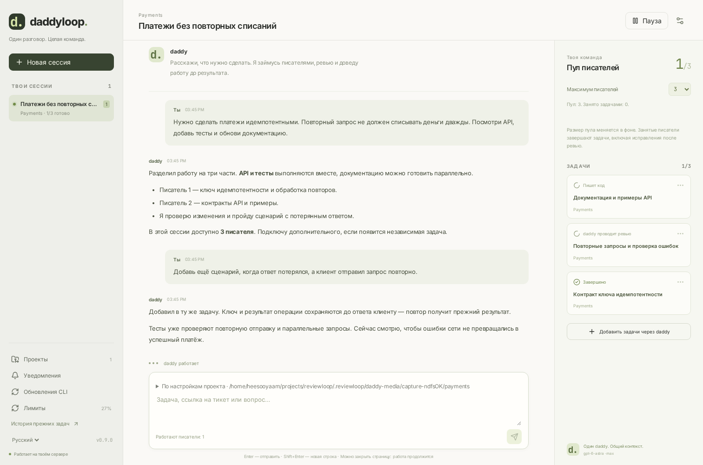
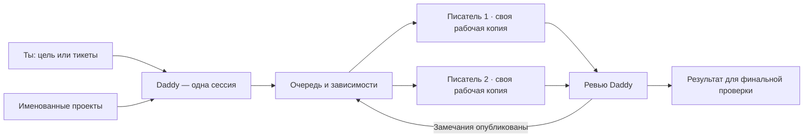
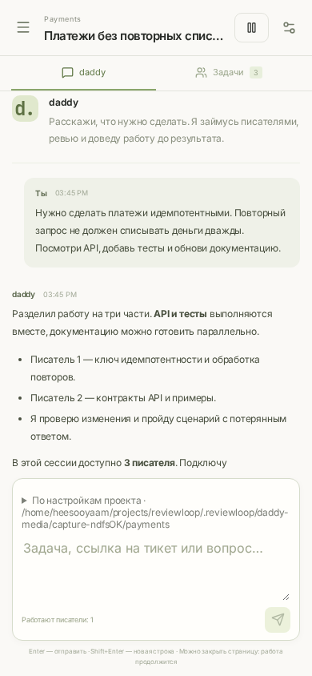
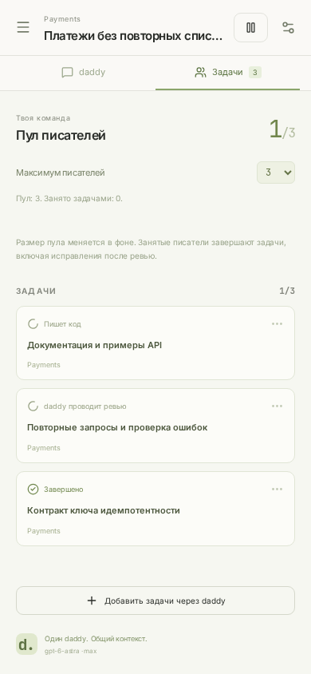
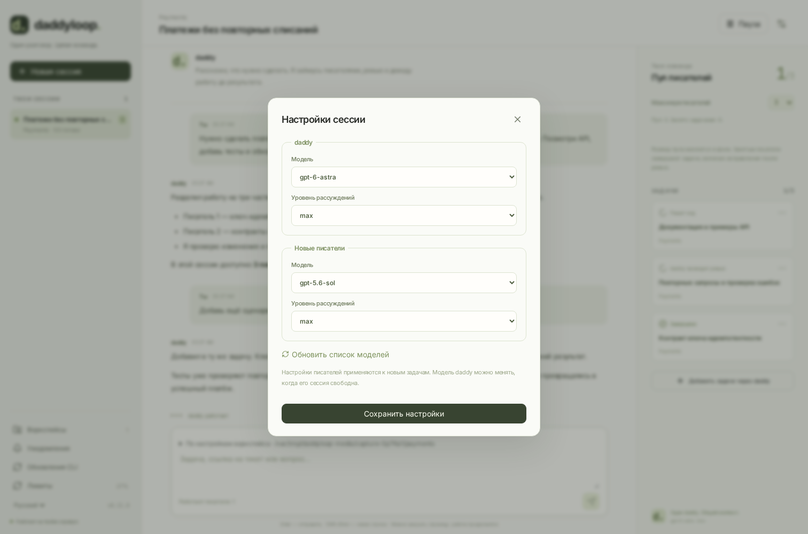

<div align="center">

# daddyloop.

**Один разговор. Целая команда.**

Daddy принимает задачи, распределяет работу между писателями и проверяет результат.
Ты обсуждаешь цель с Daddy — в терминале, браузере или теме Telegram.

[Начать](#начать) · [Telegram](#telegram-с-темами) · [Проекты и папки](#проекты-и-папки) · [English](docs/quickstart-en.md)



</div>

> Скриншоты показывают настоящий интерфейс с демонстрационными данными. Daddyloop вырос из Reviewloop; прежние данные и команда `reviewctl` поддерживаются при обновлении.

## Как это работает

1. **Зарегистрируй проект.** Например, `Work` для Arcadia или `Payments` для GitHub. Проект запоминает папку на сервере, базовую ветку и стартовую подпапку.
2. **Создай сессию Daddy.** Отправь цель, GitHub issue, тикет Tracker или ссылку на PR/MR. Можно начать с обсуждения.
3. **Daddy распределит работу.** Он создаёт задачи, выбирает порядок и выдаёт инструкции писателям. Новые тикеты отправляются в тот же разговор.
4. **Посмотри результат.** Daddy получает отчёты, проводит ревью и продолжает исправления. Готовые PR/MR остаются для твоей финальной проверки и слияния.



Пул по умолчанию допускает **одного писателя**. Можно выбрать до восьми одновременно работающих писателей. Daddy решает, какие задачи независимы и когда использовать дополнительные слоты. Снижение лимита даёт текущим ходам закончить работу.

Каждая задача хранит свою историю писателя и свою рабочую копию. Задач может быть больше, чем слотов: остальные ждут в очереди. Зависимости определяют порядок запуска; ветки не объединяются автоматически. Для тесно связанных изменений Daddy должен использовать одну задачу или согласованный план интеграции.

Прямой чат с писателями закрыт. Их отчёты доступны только для чтения; вопросы и новые требования отправляются Daddy.

## Начать

На Linux x64 или ARM64:

```bash
curl -fsSL https://github.com/heesooyaam/daddyloop/releases/download/v0.8.0/install.sh | bash
```

Пакет содержит Node, Codex CLI и GitHub CLI. Установщик создаёт постоянный systemd-сервис и команды `daddy`, `daddyloop`, `reviewctl`. Для приватного репозитория сначала скачай релиз через авторизованный `gh release download`; публичный `curl` требует публичного доступа к релизу.

Подключи аккаунты и зарегистрируй проект:

```bash
daddy auth codex
daddy auth github

daddy projects add ~/projects/payments --name Payments
daddy
```

В интерактивной консоли: **`/new` → проект → сообщение Daddy**.

Или одной командой после настройки:

```bash
daddy new --project Payments "https://github.com/acme/payments/issues/42"
daddy sessions
daddy talk SESSION_ID "Добавь ещё https://github.com/acme/payments/issues/43"
daddy pool SESSION_ID 3
```


В CLI доступны `/new`, `/sessions`, `/projects`, `/pool`, `/repo`, `/models`, `/notifications`, `/updates`, `/language`, `/pause`, `/resume`. `Ctrl+N` создаёт сессию, `Ctrl+T` выбирает сессию, `Tab` переключает разговор и список задач, `Ctrl+Q` закрывает клиент. Работа продолжается на сервере.

## Проекты и папки

**Проект — настройки по умолчанию на конкретном сервере.** На рабочей машине `Work` может указывать на `~/arcadia2`, а на другой — на `~/arcadia`. У каждой установки свой список проектов; пути между серверами не синхронизируются.

| Уровень                | Что сохраняется                                          | На что влияет изменение              |
| ---------------------- | -------------------------------------------------------- | ------------------------------------ |
| Проект `Work`          | Исходный репозиторий, начальная подпапка, базовая ветка  | На новые сессии этого сервера        |
| Сессия Daddy           | Снимок настроек проекта при создании, разговор и очередь | На новые запросы этой сессии         |
| Запрос / тикет         | Выбранный для него репозиторий и подпапка                | Только на задачи из этого запроса    |
| Рабочая копия писателя | Отдельная копия кода и история его работы                | Только на закреплённую за ним задачу |

Например: открываешь `Work`, создаёшь сессию «Починить поиск» и отправляешь тикет. Обычно Daddy использует настройки Work. Если именно этот тикет нужен в другой папке, выбираешь **«Репозиторий для следующей задачи»** и другую папку сервера. Отправляешь тикет — выбор сохраняется вместе с ним. Следующее сообщение снова использует настройки сессии. У одного Daddy могут быть задачи с разными репозиториями; уже начатые задачи остаются в своих рабочих копиях.

**Исходная папка и рабочая копия писателя — разные вещи.** Для Git создаются управляемые worktree, для Arcadia выделяется отдельный mount через настроенный helper. Писатель работает с выбранной базовой ревизией. Незакоммиченные правки исходной папки в его копию не переносятся. Исходная папка, её ветка и локальные изменения сохраняются. Начальная подпапка задаётся относительно корня и применяется внутри рабочей копии.

На сайте **Проекты** позволяет задать или изменить настройки по умолчанию. При создании сессии и рядом с полем сообщения есть выбор репозитория, подпапки и базы. В Telegram выбирай проект → настройки репозитория → **Начать сессию**. Для следующего тикета используй кнопку **Репозиторий для следующей задачи**: папки можно просматривать кнопками; `/repo /полный/путь` позволяет ввести путь текстом, `/repo default` сбрасывает разовый выбор. Выбор в боте действует десять минут; при истечении бот просит повторить выбор и не отправляет задачу в другую папку молча.

```bash
# Один раз на каждой машине: путь именно этой машины.
daddy projects add ~/arcadia --name Work --base trunk

# Изменить дефолт для будущих сессий. Существующие сессии сохраняют настройки.
daddy projects set Work ~/arcadia2 --base trunk

# Переопределить репозиторий всей новой сессии, сохранив дефолт Work.
daddy new --project Work --repo ~/arcadia --scope alice "Почини поиск"

# Другой репозиторий только для этого сообщения существующему Daddy.
daddy talk SESSION_ID "Возьми следующий тикет" --repo ~/arcadia2 --scope alice
```

В интерактивном CLI: `/repo ~/arcadia2`, затем сообщение с задачей. `/repo default` отменяет выбор. Для существующего тикета уже выбранная рабочая копия не переносится.

## Размер пула без прерывания работы

Пул по умолчанию содержит одно место для писателя. Daddy сам распределяет задачи в пределах выбранного размера и ресурсов сервера. `/pool 3` или `daddy pool SESSION_ID 3` **запрашивает** новый размер; планировщик применяет его в фоне.

При уменьшении `3 → 1` занятые писатели заканчивают **весь цикл задачи**, включая ревью, исправления и необходимые проверки. Освобождающиеся лишние места удаляются; новые задачи ждут места в оставшемся пуле. Пауза, ошибка или ожидание человека сохраняют место за незавершённой задачей. Изменение размера не прерывает агентов и не удаляет рабочие копии.

Интерфейс показывает текущий и запрошенный размер, число выполняющихся ходов и занятых задачами мест. Новый запрос размера заменяет предыдущий. Запросы изменения и закреплённые задачи сохраняются при перезапуске сервиса.

## Telegram с темами

Подключи отдельного бота один раз:

```bash
daddy telegram setup
```

В личном чате с ботом отправь **`/workspace`**. Создай группу в Telegram, включи «Темы» и выбери её кнопкой бота. Боту нужны права администратора с управлением темами. Bot API не создаёт группу от имени пользователя; после подключения группы темы создаются автоматически.

**Одна тема = одна сессия Daddy.** Все тикеты, писатели и результаты этой сессии остаются внутри её темы. Отправляй обычный текст или ссылки. Новая ссылка добавляет работу к текущему Daddy; `/pool 3` изменяет предел писателей, `/models` позволяет выбрать модели Daddy и будущих писателей.

Управление сообщениями и кнопками ограничено привязанным пользователем. Система не транслирует сырые сообщения писателей: Daddy собирает их результаты. По умолчанию автоматические уведомления приходят для важных событий, а ответы на твои сообщения — всегда.

<table><tr><td></td><td></td></tr></table>

Если ответ Telegram на создание темы потерялся, система сохраняет неопределённый результат и не создаёт дубликат. Существующую тему можно связать с сессией командой `/attach SESSION_ID` внутри темы.

[Подробно о Telegram](docs/telegram.md)

## Модели и обновления

Модели Daddy и писателей настраиваются отдельно. Например: Daddy — `gpt-6-astra / max`, писатель — `gpt-5.6-sol / max`. Настройки писателя по умолчанию действуют на новые задачи; Daddy также может выбрать модель для отдельной ещё не выполняющейся задачи.

Каталог приходит от выбранного **Codex app-server `model/list`**, включая доступные уровни рассуждений. Список не поддерживается вручную. В интерфейсах есть принудительное обновление каталога.



Codex обновляется с телефона: **`/updates` → «Обновить Codex» → «Подтвердить»**. Сервер скачивает конкретную официальную версию, проверяет контрольную сумму, протокол и сохранённые профили. Работающие ходы завершаются на прежней версии; последующие используют новую. Есть откат.

Для управляемого обновления приходит один итог операции. Отдельное уведомление об изменении версии используется для внешних обновлений CLI.

```bash
daddy runtime update --yes
daddy runtime update-status
daddy runtime rollback --yes
```

Сейчас рабочий движок — Codex. Claude виден в диагностике установленных CLI; его агентский runtime пока не реализован. [Языки, модели и версии](docs/models-and-updates.md)

## Сервер продолжает работу

Консоль, браузер и Telegram — клиенты постоянного сервиса. Закрытие ноутбука, окна SSH или вкладки не останавливает задания. Для браузера на телефоне нужен постоянный HTTPS-адрес сервера:

```bash
daddy web tailscale
# либо свой постоянный адрес
daddy web origin https://daddy.example.com
daddy phone
```

Telegram работает через исходящее соединение сервера и не требует туннеля с ноутбука.

Очереди, задачи, история, профили, рабочие копии и журнал операций сохраняются. При перезапуске Daddy проверяет прерванную работу; неопределённые native-записи восстанавливаются через журнал. Неполное ревью не считается успешным.

## Ресурсы и контроль

Сервис проверяет доступную память и место на диске перед запуском и во время работы. Для systemd настраивается ограничение памяти; новая установка использует 8 ГиБ. Лимит писателей дополняет эти проверки.

```bash
daddy cache status
daddy cache prune           # сначала покажет кандидатов
daddy cache prune --apply   # удалит только проверенные допустимые данные
daddy cache auto on
```

Очистка не удаляет авторские изменения, учётные данные и историю. Arcadia использует обычный GC и проверенные аренды; рабочие копии с неотправленными или непроверенными изменениями сохраняются.

Native-комментарии сохраняют исходный Markdown. Перед передачей писателю замечания публикуются. Daddy обсуждает работу в отдельном контексте от приватного native review, чтобы черновик не стал инструкцией писателю до публикации. Политики привязаны к точной ревизии; автоматического слияния PR нет.

## Разработка

```bash
npm ci
npm run check
npm run test:e2e
node scripts/capture-daddy.mjs
```

Обычные тесты автономны и не пишут в реальные PR. Живые проверки моделей запускаются отдельно. Медиа снимаются с настоящих UI и CLI на изолированном сервере с демонстрационными данными.

[CI](https://github.com/heesooyaam/daddyloop/actions) · [Релиз 0.8.0](https://github.com/heesooyaam/daddyloop/releases/tag/v0.8.0) · [Ревью изменений](docs/review-v0.7.md) · [Исследование решения](docs/research-daddyloop.md)
