<p align="center">
  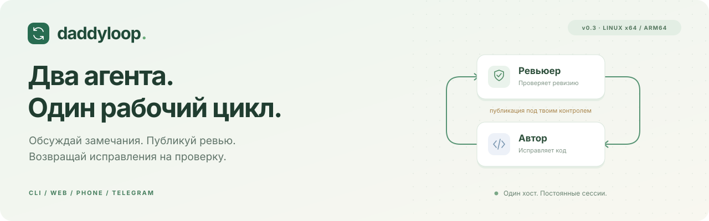
</p>

<p align="center">
  <a href="#cli">CLI</a> ·
  <a href="#demo">Демо</a> ·
  <a href="#install">Установка</a> ·
  <a href="#phone">Телефон и Telegram</a> ·
  <a href="docs/getting-started.md">Документация</a>
</p>

**Reviewloop связывает автора и ревьюера с твоим PR.** Обсуждай замечания в постоянной сессии ревьюера, публикуй результат и наблюдай, как автор возвращает исправления на повторную проверку. Работает с GitHub, GitLab и, при наличии корпоративных инструментов, Аркадией.

Сервер и оба агента живут на одной Linux-машине. Можно закрыть терминал и отключить ноутбук: работу продолжает systemd. Создавать tmux-сессии руками не нужно.

<a id="cli"></a>

## Всё начинается с `reviewctl`

Одна команда открывает полноценный интерфейс в терминале: задачи слева, переписка справа, поле ввода снизу. Есть меню команд, оформление Markdown, индикатор работы и раздельные черновики для каждой задачи и роли.

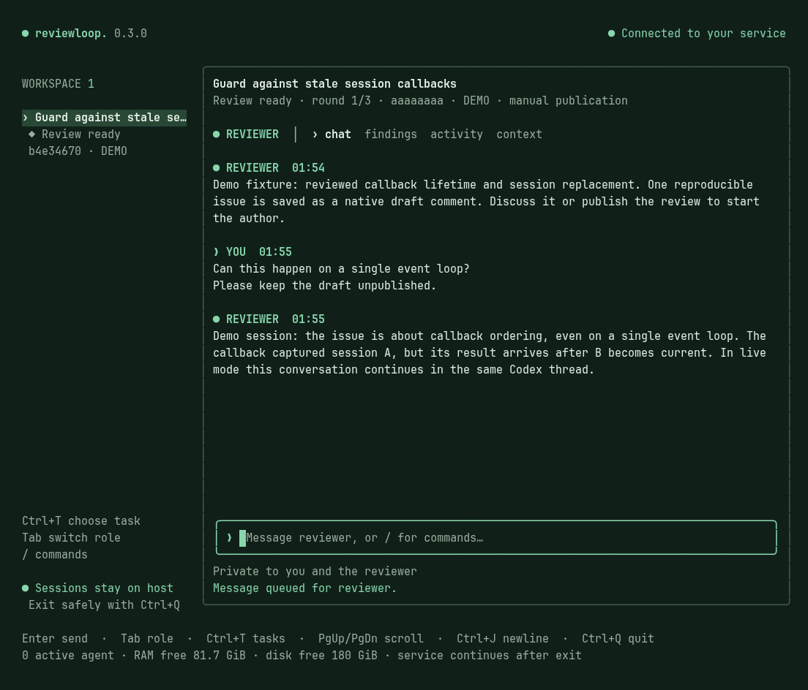

```text
/use <id-prefix>       выбрать задачу
/role reviewer        поговорить с ревьюером
/role author          переключиться на автора
/publish              опубликовать готовое ревью
/quit                 закрыть консоль — работа продолжится
```

<details>
<summary><b>Меню команд, светлая тема и компактное окно</b></summary>

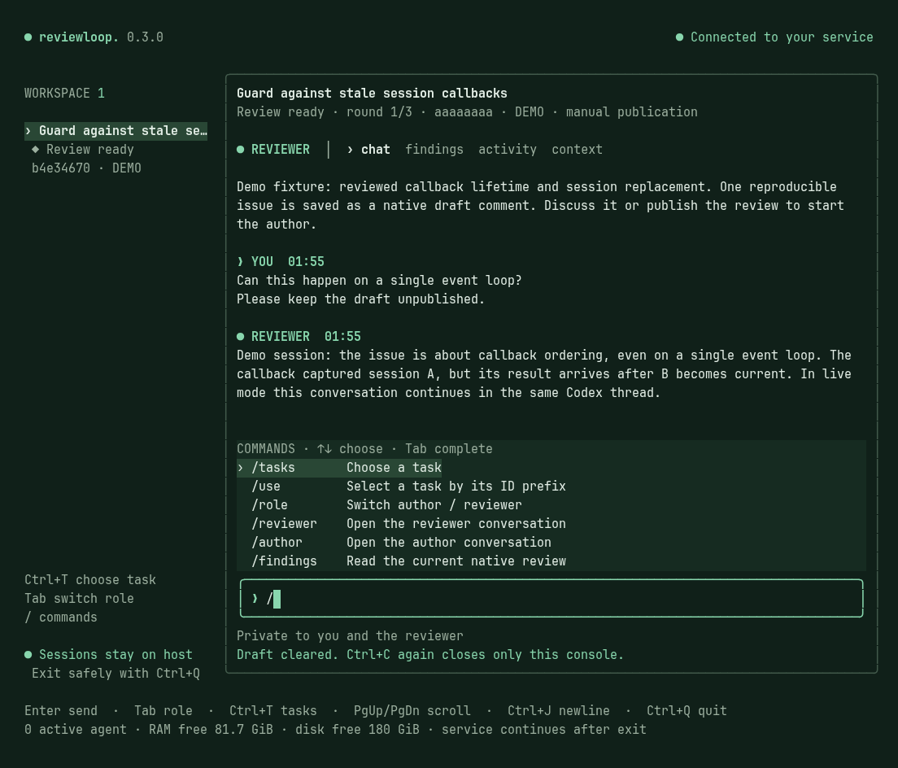

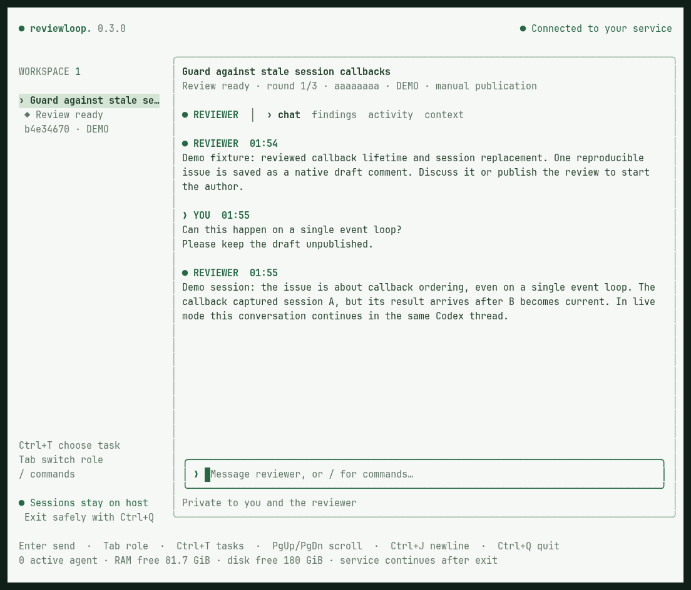

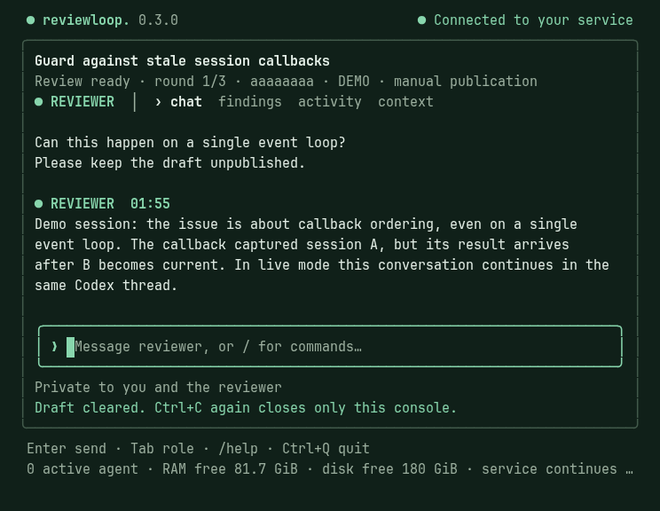

Есть и отдельные команды для скриптов: `reviewctl list`, `reviewctl chat`, `reviewctl publish`, `reviewctl pause`, `reviewctl resume` и `reviewctl logs <id> --follow`. Полные примеры — в [руководстве](docs/getting-started.md#cli).

</details>

**Tab** переключает роль, **Ctrl+T** открывает задачи, **PgUp/PgDn** прокручивают переписку, **Ctrl+J** добавляет строку. Вставленный текст отправляется только после Enter. Светлая тема: `reviewctl --theme light`. Старый режим: `reviewctl --plain`. [Все клавиши и команды →](docs/terminal.md)

<a id="demo"></a>

## Один цикл — от замечания до исправления

[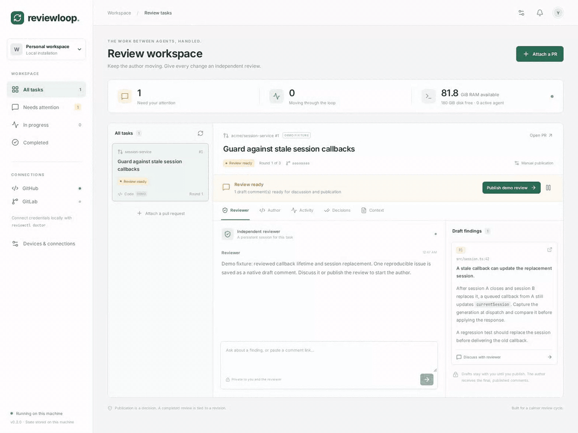](docs/media/reviewloop-demo.mp4?raw=1)

**[Открыть видео в полном разрешении · MP4 · около 20 секунд](docs/media/reviewloop-demo.mp4?raw=1)** · [Статичный обзор рабочего пространства](docs/media/workspace.png)

На записи — встроенный **demo-режим**: интерфейс и переходы состояний настоящие, агентские ответы и PR имитируются. Запись без звука.

1. **Ревьюер находит проблему** и сохраняет замечание к конкретной ревизии.
2. **Ты обсуждаешь его с ревьюером.** Черновик и приватный разговор остаются в его сессии.
3. **Ты публикуешь ревью.** Автор получает точный опубликованный Markdown.
4. **Автор вносит исправления.** Новая ревизия возвращается на проверку, решения сохраняются в истории.

<table>
  <tr>
    <th width="50%">Обсуждение и замечания</th>
    <th width="50%">Ответ автора после публикации</th>
  </tr>
  <tr>
    <td valign="top"><a href="docs/media/reviewer.png">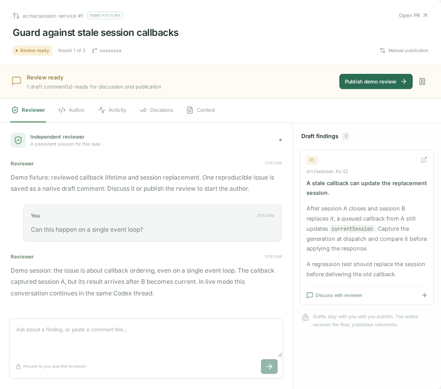</a></td>
    <td valign="top"><a href="docs/media/author.png">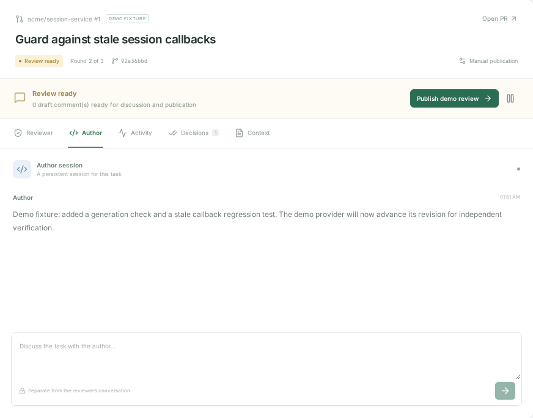</a></td>
  </tr>
</table>

<details>
<summary><b>Ещё экраны: история действий и проверенные замечания</b></summary>

**Activity** показывает события и подтверждённые результаты инструментов.

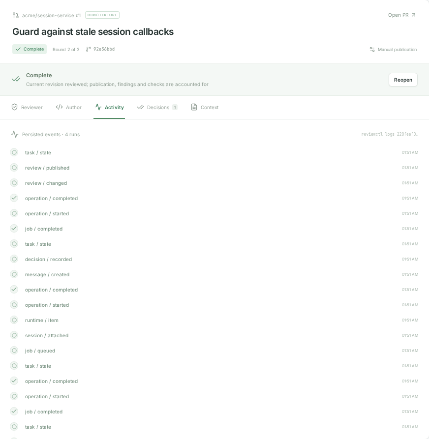

**Decisions** сохраняет результат проверки замечания и ревизию, к которой он относится.

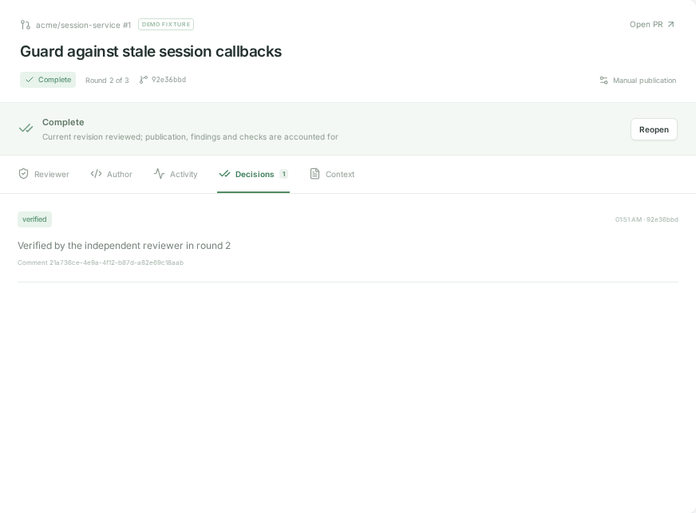

</details>

<a id="install"></a>

## Установка одной командой

Выполни на хосте, где будут работать агенты:

```bash
curl -fsSL https://github.com/heesooyaam/reviewloop/releases/download/v0.3.0/install.sh | bash
```

**Linux x64 / ARM64 · systemd · curl и tar.** В архиве уже есть Node 24, Codex CLI, GitHub CLI и сайт. Установщик проверит контрольную сумму и настроит постоянный сервис; для системных действий может понадобиться sudo. `reviewctl` появится в `~/.local/bin`.

Подключи аккаунты и открой консоль:

```bash
reviewctl auth codex       # вход по коду устройства, подходит для SSH
reviewctl auth github     # либо reviewctl auth gitlab
reviewctl                 # /demo для знакомства, /attach для своего PR
```

Уже авторизованный Codex продолжает использовать свой аккаунт на хосте. Demo работает без внешних аккаунтов. Сайт доступен локально на **http://127.0.0.1:4317**; токен входа выдаёт `reviewctl token`.

[Подробная установка, права токенов и первый PR →](docs/getting-started.md)

<details>
<summary>Установщик возвращает 404 или команда reviewctl не найдена?</summary>

Публичная команда скачивания требует публичного доступа к релизу GitHub. Пока репозиторий приватный, скачай архив через авторизованный `gh` или сделай репозиторий публичным.

Если `~/.local/bin` отсутствует в PATH, добавь в профиль shell:

```bash
export PATH="$HOME/.local/bin:$PATH"
```

</details>

<a id="phone"></a>

## Продолжай с телефона

Телефон подключается к серверу напрямую через постоянный HTTPS-адрес. Ноутбук для этого соединения не нужен.

<table>
  <tr>
    <th width="50%">Та же задача на телефоне</th>
    <th width="50%">Подключения и доступ устройств</th>
  </tr>
  <tr>
    <td align="center" valign="top"><a href="docs/media/mobile.png">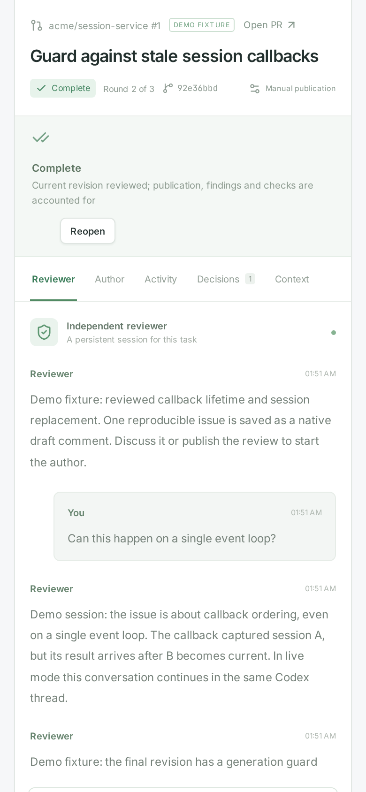</a></td>
    <td align="center" valign="top"><a href="docs/media/connections.png">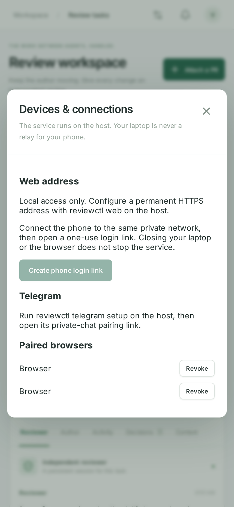</a></td>
  </tr>
</table>

**Через браузер:** запусти `reviewctl web tailscale`, войди в Tailscale на сервере и телефоне, затем получи одноразовую ссылку через `reviewctl phone`. Можно использовать и свой домен с HTTPS-прокси. [Настройка доступа →](docs/operations.md#permanent-website-access)

**Через Telegram:** создай отдельного бота в BotFather и выполни `reviewctl telegram setup`. После привязки личного чата доступны статусы, ответы агентов и команды:

```text
/tasks
/reviewer <id> Объясни первое замечание
/author <id> Добавь проверку этого сценария
/publish <id>
/web
```

Публикация через бота требует отдельного подтверждения. Кнопка привязана к текущему ревью: после изменения текста или ревизии нужно новое подтверждение.

## Что остаётся под контролем

|                    | Поведение                                                                                                  |
| ------------------ | ---------------------------------------------------------------------------------------------------------- |
| **Публикация**     | Ручная по умолчанию. Автоматическую публикацию можно включить для задачи.                                  |
| **Рабочие копии**  | Сервис создаёт отдельные копии автора и ревьюера, сохраняя исходную рабочую копию пользователя.            |
| **План**           | Markdown-план проходит ревью в отдельном PR; реализация получает конкретную одобренную ревизию.            |
| **Ресурсы**        | Один активный агент по умолчанию, лимит сервиса 8 ГиБ, проверки RAM и свободного диска.                    |
| **Восстановление** | После прерванного запуска сохраняются состояние и рабочие файлы; продолжение требует `retry` или `resume`. |
| **Завершение**     | Учитываются проверенная ревизия, опубликованные замечания и CI. Автоматического merge нет.                 |

### Кеш и память

```bash
reviewctl cache status
reviewctl cache prune          # сначала показать, что можно удалить
reviewctl cache prune --apply  # очистить проверенные старые артефакты
```

Очистка сохраняет авторские изменения, активные копии, историю и токены. Доступна автоматическая очистка своих артефактов при нехватке диска. [Лимиты и правила удаления →](docs/operations.md#resource-controls-and-cleanup)

### Аркадия

```bash
reviewctl arcadia setup --workspace ~/arcadia2
reviewctl attach https://a.yandex-team.ru/review/11111111 \
  --repo ~/arcadia2 --requirements /path/to/requirements.md
```

Нужны локальные корпоративные `arc`, `arcanum-cli` и helper аренды mounts. Автор и ревьюер используют отдельные свободные mounts; исходный mount пользователя сохраняется. [Подключение Аркадии →](docs/getting-started.md#arcadia--arcanum)

## Проверки и документация

**v0.3 — prerelease.** Проверены 88 тестов, браузерные сценарии, установка на x64/ARM64 и работа сервиса после настоящего разрыва SSH. Чтение Arcanum PR и CI проверено на живом сервисе. Полный цикл публикации и push на реальных провайдерах ещё требует отдельной проверки; Telegram и внешний доступ с телефона — настройки аккаунтов владельца.

[CI](https://github.com/heesooyaam/reviewloop/actions/workflows/ci.yml) · [Релиз](https://github.com/heesooyaam/reviewloop/releases/tag/v0.3.0) · [Ревью терминального интерфейса](docs/review-v0.3.md)

| Документ                                 | Что внутри                                                         |
| ---------------------------------------- | ------------------------------------------------------------------ |
| [Начало работы](docs/getting-started.md) | Установка, аккаунты, CLI, PR и планы                               |
| [Эксплуатация](docs/operations.md)       | HTTPS, Telegram, лимиты, очистка, восстановление и резервные копии |
| [Архитектура](docs/architecture.md)      | Состояния задач, сессии, ревизии и инструменты ревью               |
| [Медиа для README](docs/media/README.md) | Сценарий видео и воспроизводимая запись UI/CLI                     |

<details>
<summary><b>Разработка из исходников</b></summary>

```bash
./scripts/bootstrap.sh
./scripts/reviewctl.mjs serve --demo
npm run check
npx playwright install --with-deps chromium
npm run test:e2e
```

Для обычной установки используй готовый релиз. Исходники нужны для разработки самого Reviewloop.

</details>
