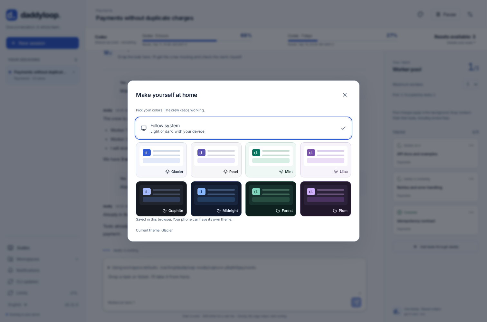

# daddyloop

**English** · [Русский](README.ru.md) · [Documentation](docs/index/en.md)

**Your task. My crew.**

Give daddy a goal or a ticket. He splits the work, assigns workers, follows up and reviews the result. You keep one conversation; the service keeps working on your server after you close the laptop.


## Start

Run this **on the Linux server**:

```bash
curl -fsSL https://github.com/heesooyaam/daddyloop/releases/download/v0.12.0/install.sh | bash
```

Choose modules using arrows and Space. Codex and GitHub are selected initially; GitLab and Arcadia are optional. The installer downloads the selected CLI packages, bundles Node and speech recognition, and starts a persistent service. No manual tmux sessions.

```bash
daddy auth agent codex
daddy auth github
daddy workspaces add ~/work/app --name App
daddy
```

In the console: **`/new` → App → your task**. Or:

```bash
daddy new --workspace App "Fix duplicate payments and cover retries with tests"
```

[Full installation guide](docs/start/en.md) · [Workspace paths and overrides](docs/workspaces/en.md)

## Open the site on your computer

Run this **on your laptop**, using your usual SSH destination:

```bash
ssh -N -L 4317:127.0.0.1:4317 user@server
```

Open [http://127.0.0.1:4317](http://127.0.0.1:4317) in the laptop browser. Run `daddy token` **on the server** and paste it into the login form. Closing the tunnel disconnects the browser; it does not stop the workers.

For access that also works on your phone with the laptop off, configure `daddy web tailscale` or your own HTTPS proxy. [Computer and phone instructions](docs/web/en.md).

## Make it yours

Eight themes, including four dark palettes. Usage is always visible: quota windows, percentage remaining, reset times and available resets. Colors are a browser preference; tasks and models keep running.




[Themes and usage](docs/appearance/en.md) · [CLI](docs/terminal/en.md)

## One daddy, a crew of workers

- Add more tickets in the same conversation to keep the same daddy.
- Set the pool with `/pool 3`. Reductions wait for whole tasks to finish, including review and fixes.
- Choose independent engine/model profiles for daddy and workers. Model lists come from the selected engine.
- Work in named server workspaces. Each task uses an isolated copy; one-request folder overrides preserve defaults.
- Chat in Telegram forum topics or send voice messages. Recognition is local, in English or Russian.
- Native reviews publish automatically by default. Exact revisions, incomplete work, CI and explicit decisions still gate completion. There is no automatic merge.

```bash
daddy agents defaults \
  --worker-engine codex --worker-model gpt-5.6-sol --worker-effort max \
  --daddy-engine codex --daddy-model gpt-6-astra --daddy-effort max
```

Use models your `daddy models --refresh` response offers. The currently shipped agent module is Codex; Claude is not a working adapter yet.

[Tasks and pools](docs/tasks/en.md) · [Models and updates](docs/agents/en.md) · [Telegram](docs/telegram/en.md) · [Voice](docs/voice/en.md)

## Built to extend

Agents and repositories have explicit module contracts. daddy dispatches a worker through `AgentRegistry`, without interpreting its model or speaking its CLI protocol. Repository modules own native review and PR submission; the common workflow owns policy, revision checks and recovery.

[Module selection and interfaces](docs/modules/en.md) · [Architecture](docs/architecture/en.md) · [Contributing](docs/contributing/en.md)

Every documentation topic has `en.md` and `ru.md`; both are checked along with their local links. Screenshots use isolated illustrative data. [How the images are made](docs/media-guide/en.md).

daddyloop started as **reviewloop**, an author/reviewer loop. It grew into a coordinator with a worker pool.

[Release 0.12.0](https://github.com/heesooyaam/daddyloop/releases/tag/v0.12.0) · [CI](https://github.com/heesooyaam/daddyloop/actions) · [Operations and cleanup](docs/operations/en.md)
