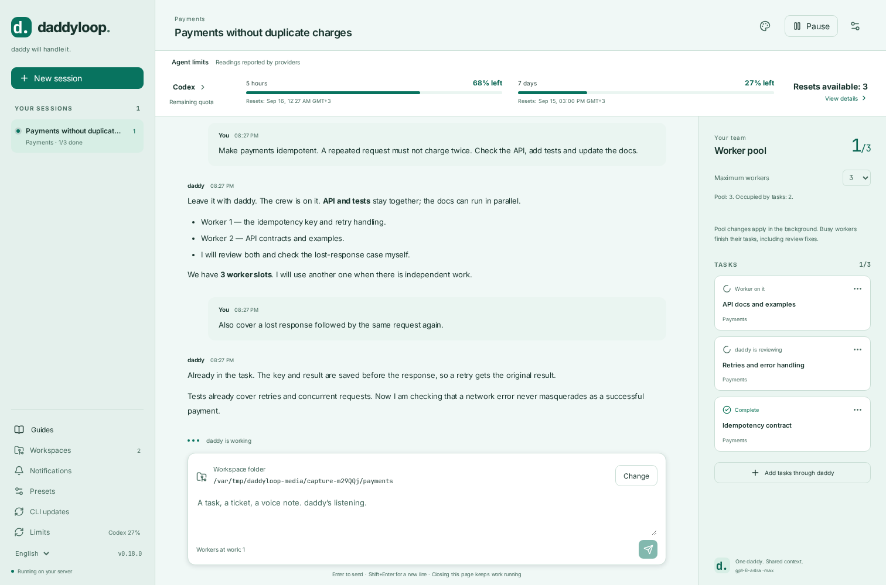
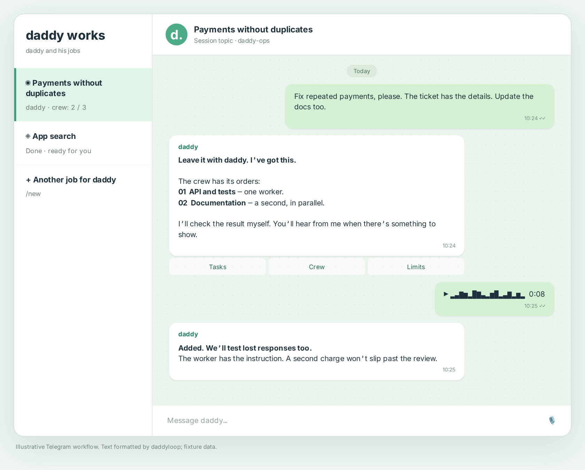
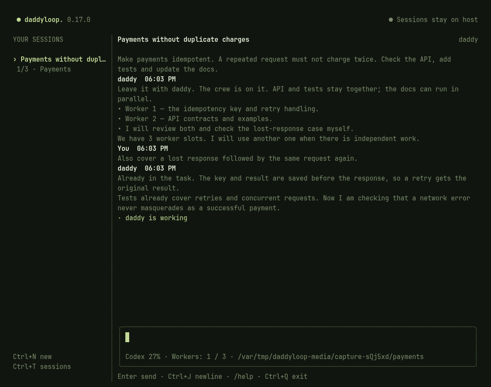
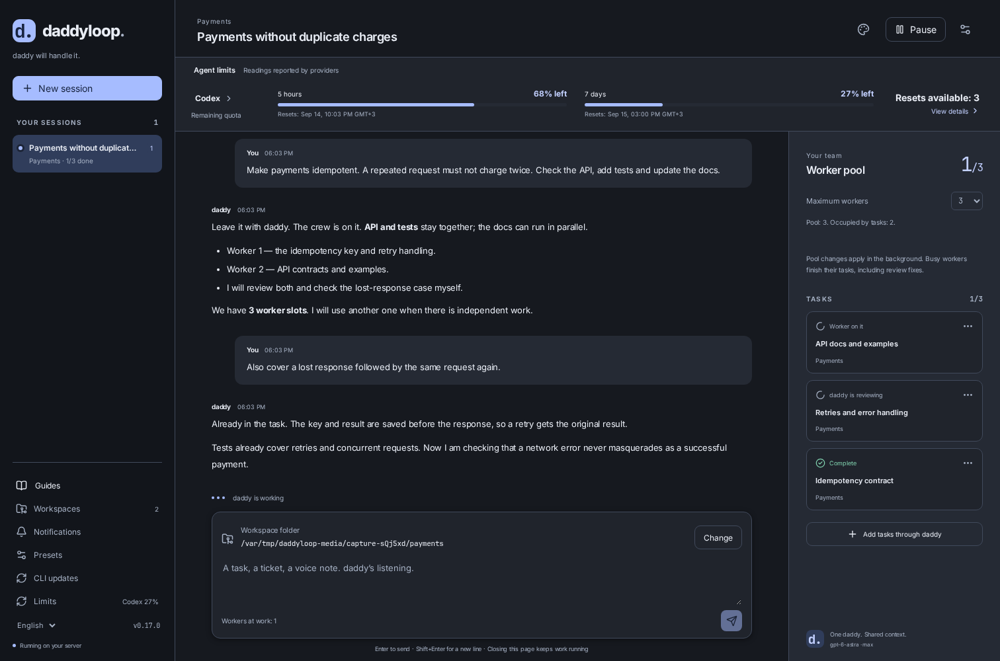

# daddyloop

**English** · [Русский](README.ru.md) · [All guides](docs/index/en.md)

**Leave the job with daddy. He’ll handle the crew.**

A ticket landed. A bug surfaced. The deadline got closer. Hand it to daddy: he assigns the work, keeps everyone moving, checks the result and brings it back to you. Talk in the terminal, on the web or in Telegram. Close the laptop — daddy’s still on duty.



[Install](#put-daddy-to-work) · [Telegram](#daddy-in-telegram) · [Laptop access](#open-the-website-from-your-laptop) · [Models](#pick-your-crew) · [Backups](#moving-house-take-daddy-with-you)

## Put daddy to work

You need a **Linux server** with access to your repositories and an account for your chosen agent. Run this on that server:

```bash
curl -fsSL https://github.com/heesooyaam/daddyloop/releases/download/v0.13.1/install.sh | bash
```

Arrows select a module; Space checks it. Codex and GitHub start checked. Add Claude, GitLab or Arcadia if you need them. The installer provides the selected engines, the `daddy` CLI, local voice recognition and a persistent background service. No manual tmux setup.

For Codex and GitHub:

```bash
daddy auth agent codex
daddy auth github
daddy workspaces add ~/work/app --name App
daddy
```

In the CLI: **`/new` → App → your task**. Or hand it over directly:

```bash
daddy new --workspace App "Fix duplicate charges. Test repeated requests."
```

A **workspace** is a familiar repository folder, such as App. A **session** is one job for daddy: one conversation with its own crew. You can create many sessions in App. Workers receive separate working copies; choosing another folder for one task keeps your workspace defaults intact.

[Installation walkthrough](docs/start/en.md) · [Workspaces and folders](docs/workspaces/en.md) · [Your first task](docs/tasks/en.md)

## daddy in Telegram

Don’t feel like opening a terminal? Drop the ticket in chat. Tired of typing? Send a voice note. daddy will hear you out and put the crew to work.



1. Create a dedicated bot with **@BotFather**.
2. Run `daddy telegram setup` on the server, paste the token into the hidden prompt and open the resulting link.
3. Press **Start** to pair the bot with your Telegram account.
4. For separate conversations, create a group with **Topics**, add the bot as an administrator with Manage Topics permission, then send **`/group`** in the private bot chat and select that group.

**One job, one topic.** `/new` creates a daddy session and its topic. Send more tickets inside that topic to add work to the same crew. daddy handles the worker conversations.

| You want to…                               | Send the bot…                            |
| ------------------------------------------ | ---------------------------------------- |
| Hand over work                             | Text, a ticket link or a voice note      |
| Start a separate daddy session             | `/new`                                   |
| Choose daddy and worker models             | `/models`                                |
| Grow the crew to three                     | `/pool 3`                                |
| Check remaining usage and available resets | `/limits`                                |
| Receive only results and questions         | `/notifications` → quiet mode            |
| Open the website on your phone             | `/web` in private chat after HTTPS setup |

The bot runs on the server. Your laptop, SSH tunnel and browser tab can all be closed. Voice recognition runs locally, in English and Russian.

[Telegram walkthrough](docs/telegram/en.md) · [Voice notes](docs/voice/en.md)

## Open the website from your laptop

**On the server:** `daddy up`.

**On your laptop**, in its local terminal:

```bash
ssh -N -o ExitOnForwardFailure=yes -L 4317:127.0.0.1:4317 user@server
```

Use your usual SSH destination. Leave the command running and open **[http://127.0.0.1:4317](http://127.0.0.1:4317) in your laptop’s browser**. Run `daddy token` on the server and paste the token into the login form.

Disconnect SSH and the browser loses its connection. Reconnect and pick up the conversation. daddy and the crew keep running on the server throughout.

**For a phone and a permanent address:** run `daddy web tailscale` on the server, complete sign-in and connect the phone to the same Tailscale network. Then `daddy phone` generates a login link. The laptop isn’t part of that connection.

[Connection diagrams, alternate ports and troubleshooting](docs/web/en.md)

## Pick your crew

**Codex and Claude** use the same agent contract. Pick an engine, model and effort independently for daddy and workers, through `/models` or the CLI:

```bash
daddy models --refresh
daddy agents defaults \
  --worker-engine codex --worker-model gpt-5.6-sol --worker-effort max \
  --daddy-engine codex --daddy-model gpt-6-astra --daddy-effort max
```

To use Claude, select its module during installation and run `daddy auth agent claude` to save an API key through the hidden prompt. Then choose a model from its catalogue. The integration drives Claude Code CLI through the official Agent SDK; API access is billed separately from a Claude subscription.

Models and effort levels come from the CLI, not a hand-maintained daddyloop list. Quotas belong to the adapters too: Codex reports account windows, extra model buckets and available resets; Claude provides usage observations through events. If a provider hasn’t reported a remaining allowance, daddy won’t make up a percentage.



[Agents, limits and updates](docs/agents/en.md) · [CLI commands](docs/terminal/en.md) · [Claude setup](docs/claude/en.md)

## What daddy takes off your hands

- Assigning work and following up with workers. You have one conversation with daddy.
- Importing GitHub issues, Tracker tickets, PRs/MRs and plain task descriptions.
- Managing the crew. Reducing the pool lets busy workers finish their whole task, including review fixes.
- Publishing review comments automatically by default and checking the fixes. You make the merge decision.
- Checking resources and pruning verified application caches: `daddy cache status`, `daddy cache prune --apply`.

## Moving house? Take daddy with you

```bash
daddy down
daddy backup create ~/daddy-backup.tar.gz
daddy up
```

The archive preserves sessions, messages, decisions, results, local Git commits and working files. On another machine:

```bash
daddy backup inspect ~/daddy-backup.tar.gz
daddy backup restore ~/daddy-backup.tar.gz --to ~/daddy-restored
export DADDYLOOP_CONFIG=~/daddy-restored/restored-config.json
daddy up
```

Restored work starts paused. Authenticate the accounts, check the workspaces, then resume. daddyloop conversations survive; native agent contexts start afresh from the saved task and results. Arcadia transfers patches and changed files that must be applied to a new mount. Application account credentials and device access do not transfer.

[What a backup contains and how to resume work](docs/backups/en.md)

## Make yourself comfortable

Eight themes: Mint, Glacier, Pearl, Lilac, Graphite, Midnight, Forest and Plum. Four dark choices. Remaining quotas sit above the conversation. English and Russian throughout.



[Appearance](docs/appearance/en.md) · [Operations](docs/operations/en.md)

## Bring your own module

Agents share execution, model catalogue and usage contracts. Repository modules own reviews, submissions, tickets and exports of external working copies. daddy delegates through these interfaces without guessing what model powers a worker.

[Module selection](docs/modules/en.md) · [Write an adapter](docs/module-development/en.md) · [Architecture](docs/architecture/en.md) · [Contributing](docs/contributing/en.md)

Every guide has `docs/<topic>/en.md` and `ru.md`. Screenshots use isolated fixtures; the Telegram card illustrates the workflow. [Updating the media](docs/media-guide/en.md).

[Release 0.13.1](https://github.com/heesooyaam/daddyloop/releases/tag/v0.13.1) · [CI](https://github.com/heesooyaam/daddyloop/actions)
