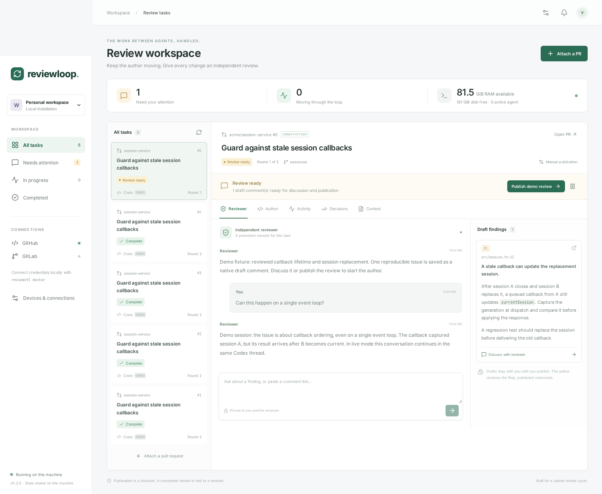

# Reviewloop

Сервис для постоянных сессий автора и ревьюера вокруг GitHub PR, GitLab MR и Arcanum PR. Обсуди замечание с ревьюером, опубликуй проверенное ревью — автор получает опубликованные комментарии, исправляет код и возвращает новую ревизию на проверку.

**Сервер и оба агента работают на одной Linux-машине.** CLI, сайт и Telegram управляют этим сервисом. Закрытие терминала или отключение ноутбука не останавливает работу; tmux не нужен.



## Установить одной командой

На машине, где будут работать агенты:

```bash
curl -fsSL https://github.com/heesooyaam/reviewloop/releases/download/v0.2.0/install.sh | bash
```

Релиз содержит UI, Node 24, Codex CLI и GitHub CLI. Установщик проверяет SHA-256, устанавливает `reviewctl` в `~/.local/bin` и настраивает systemd. Нужны Linux с systemd, curl и tar; отсутствующий Git установится через apt/sudo, если они доступны. Архивы: x64 и arm64. Доступ к приватному релизу ограничен владельцем до изменения видимости репозитория.

При необходимости установщик попросит пароль sudo для настройки постоянного сервиса. Приложение и агенты работают от вашего обычного пользователя. Системный Node не заменяется. Пакеты лежат в `~/.local/share/reviewloop/releases/`, данные — отдельно от версии приложения. Повторная установка сохраняет задачи и рабочие копии.

Если `~/.local/bin` отсутствует в PATH, добавь его в профиль shell:

```bash
export PATH="$HOME/.local/bin:$PATH"
```

Подключи нужные аккаунты:

```bash
reviewctl auth codex        # вход с кодом устройства, подходит для SSH
reviewctl auth github      # вход через браузер; использует SSH для Git
reviewctl auth gitlab       # скрытый ввод личного токена с api
reviewctl doctor
reviewctl
```

Установщик подхватывает существующий GitHub-вход через `gh`. Codex использует авторизацию аккаунта на этом хосте. Внешние аккаунты требуют вашего однократного входа. Для демонстрации авторизация не нужна: в консоли введи `/demo` или нажми **Try a demo loop** на сайте.

## CLI

`reviewctl` без аргументов открывает интерактивную консоль:

```text
/tasks
/use <id-prefix>
/role reviewer
Объясни, при каких условиях воспроизводится первый баг
/publish
/role author
/status
/quit
```

`/attach` спросит ссылку на PR, путь к репозиторию **на сервере** и исходные требования. Отдельные команды подходят для скриптов:

```bash
reviewctl attach https://github.com/owner/repo/pull/42 \
  --repo /absolute/path/to/repo --requirements /path/to/requirements.md
reviewctl list
reviewctl chat <task-id> --role reviewer 'Объясни первое замечание'
reviewctl publish <task-id>
reviewctl pause <task-id>
reviewctl resume <task-id>
reviewctl retry <task-id>
reviewctl logs <task-id> --follow
```

Публикация ручная по умолчанию. `--auto-publish` разрешает автоматическую публикацию завершённых ревью. Автор получает фактически опубликованный Markdown; приватная переписка с ревьюером остаётся отдельно. Исходная рабочая копия пользователя не переключается. Сервис использует собственные рабочие копии и обычный push без force; `--no-auto-push` сохраняет изменения локально.

Для Markdown-плана подключи отдельный PR с `--kind plan`, после ревью и CI выполни `reviewctl approve-plan <id>`. Затем подключи PR реализации с `--plan <id>`: в задачу попадут конкретная принятая ревизия и полный текст плана. Автоматического merge нет.

## Сайт и телефон

Локальный сайт: **http://127.0.0.1:4317**. `reviewctl token` выдаёт локальный административный токен входа.

Для доступа с телефона нужен постоянный маршрут **телефон → сервер**. Настройка через Tailscale:

```bash
reviewctl web tailscale
reviewctl phone
```

Первая команда установит отдельный сетевой сервис на сервере и покажет ссылку для входа в Tailscale. При первом включении HTTPS может потребоваться разрешить сертификаты в аккаунте. Установи Tailscale на телефон и войди в ту же сеть. Вторая команда выдаст одноразовую ссылку входа в Reviewloop на 5 минут. Её также можно получить в **Devices & connections** на сайте.

Tailscale и Reviewloop работают под systemd. Ноутбук не участвует в этом соединении. Сайт доступен, пока сервер включён, его сервисы работают, а телефон подключён к сети Tailscale.

Если уже есть домен и HTTPS-прокси на сервере:

```bash
reviewctl web origin https://review.example.com
reviewctl restart
reviewctl phone
```

Прокси должен передавать исходный Host, поддерживать длительные SSE-соединения и направлять трафик на `http://127.0.0.1:4317`. Пример конфигурации — в [эксплуатации](docs/operations.md). Произвольные Origin не разрешены. Браузеры получают отдельные отзываемые сессии: `reviewctl devices`, `reviewctl revoke-device <id>`.

SSH-туннель пригоден для временного доступа с ноутбука; он перестаёт работать при отключении SSH. Для постоянного доступа телефона используй один из вариантов выше.

## Telegram

Создай отдельного бота через @BotFather, затем на сервере:

```bash
reviewctl telegram setup
```

Команда скрыто спросит токен и выдаст ссылку для привязки личного чата. Также поддерживается `--token-file /path/to/token`; по умолчанию читается `~/.tokens/reviewloop-telegram`. Бот использует long polling: отдельный домен или входящий webhook ему не нужен.

Доступны `/tasks`, `/status <id>`, `/reviewer <id> текст`, `/author <id> текст`, `/pause <id>`, `/resume <id>`, `/retry <id>`, `/publish <id>` и `/web`. Бот присылает ответы агентов и уведомления о задачах. Публикация требует отдельной кнопки подтверждения; смена ревизии или текста ревью делает старую кнопку недействительной. Посторонние чаты и группы не получают данные.

## Память и очистка

По умолчанию одновременно работает один агент, а весь сервис с дочерними процессами ограничен 8 ГБ RAM. Сервис проверяет доступную память хоста, свой лимит и диск; при нехватке ресурсов прерывает работу с сохранением состояния.

```bash
reviewctl status
reviewctl cache status
reviewctl cache prune          # только показать кандидатов
reviewctl cache prune --apply  # удалить проверенные старые артефакты
reviewctl cache auto on
reviewctl restart
```

Очистка удаляет только старые, чистые, зарегистрированные копии ревьюера и помеченные временные файлы Reviewloop. Сохраняются активные копии, авторские изменения, история SQLite, токены и общие хранилища. Для общей Arc-сборки мусора есть `reviewctl cache arcadia-gc` (dry run) и `--apply` (обычный `arc gc`). Очистка `ya`, чужих проектов и `arc gc --truncate` не выполняется.

## Arcadia / Arcanum

На корпоративном хосте нужны уже установленные `arc`, `arcanum-cli`, настроенный `arcadia-mount-lease`, корпоративный CA и авторизация Arc. Эти внутренние инструменты не входят в публичный релиз.

```bash
reviewctl arcadia setup --workspace ~/arcadia2
reviewctl arcadia mounts
reviewctl attach https://a.yandex-team.ru/review/11111111 \
  --repo ~/arcadia2 --requirements /path/to/requirements.md
```

Нужны отдельные свободные чистые mounts для автора и ревьюера. Сервис получает аренды через helper и проверяет общее object store. Исходный mount пользователя остаётся на своей ветке. Ревью привязано к полным SHA и версии diff; публикуются только явно отслеживаемые черновики. После завершения задачи: `reviewctl arcadia release <id> --role reviewer` и аналогично для автора.

Поддержка Arc проверена чтением настоящего PR и CI; записи и изменения рабочих копий проверены на fixtures. Живой цикл публикации/commit/push требует отдельного тестового PR.

## Управление и разработка

```bash
reviewctl service status
reviewctl service logs --follow
reviewctl restart
reviewctl down
reviewctl up
```

Сервис запускается при загрузке хоста. После перезапуска незавершённая агентская работа требует `retry` или `resume`; готовый результат не подменяет прерванный. `reviewctl service uninstall` удаляет сервис, сохраняя данные.

Из исходников:

```bash
./scripts/bootstrap.sh
./scripts/reviewctl.mjs serve --demo
npm run check
npx playwright install --with-deps chromium
npm run test:e2e
npm run release:build
```

[Архитектура](docs/architecture.md) · [Эксплуатация и ограничения](docs/operations.md) · [Ревью 0.2](docs/review-v0.2.md) · [Ревью первой версии](docs/review.md)
