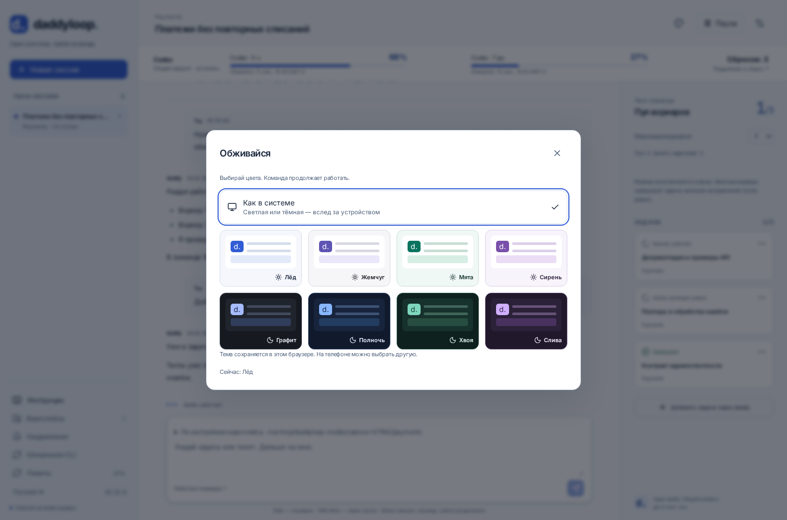

# daddyloop

[English](README.md) · **Русский** · [Документация](docs/index/ru.md)

**Твоя задача. Моя команда.**

Кидаешь daddy цель или тикет. Он разбирает работу, назначает воркеров, спрашивает за результат и проводит ревью. У тебя один разговор; сервис продолжает работать на сервере, когда ноутбук закрыт.


## Начать

Выполни **на Linux-сервере**:

```bash
curl -fsSL https://github.com/heesooyaam/daddyloop/releases/download/v0.12.0/install.sh | bash
```

Выбирай модули стрелками и пробелом. Изначально отмечены Codex и GitHub; GitLab и Arcadia — по желанию. Установщик скачивает выбранные CLI, добавляет Node и распознавание речи, запускает постоянный сервис. Создавать tmux-сессии руками не нужно.

```bash
daddy auth agent codex
daddy auth github
daddy workspaces add ~/work/app --name App
daddy
```

В консоли: **`/new` → App → твоя задача**. Или:

```bash
daddy new --workspace App "Исправь повторные списания и покрой повторы тестами"
```

[Полная установка](docs/start/ru.md) · [Папки воркспейсов и разовые изменения](docs/workspaces/ru.md)

## Открыть сайт на компьютере

Выполни **на ноутбуке**, подставив обычный адрес для SSH:

```bash
ssh -N -L 4317:127.0.0.1:4317 user@server
```

В браузере ноутбука открой [http://127.0.0.1:4317](http://127.0.0.1:4317). Выполни `daddy token` **на сервере** и вставь токен в форму входа. Закрытие туннеля отключает браузер, но не воркеров.

Чтобы сайт работал и на телефоне при выключенном ноутбуке, настрой `daddy web tailscale` или свой HTTPS-прокси. [Инструкция для компьютера и телефона](docs/web/ru.md).

## Обживайся

Восемь тем, четыре из них тёмные. Usage всегда перед глазами: периоды квот, процент остатка, время обновления и доступные сбросы. Цвета сохраняются в браузере; задачи и модели продолжают работать.




[Темы и usage](docs/appearance/ru.md) · [CLI](docs/terminal/ru.md)

## Один daddy, команда воркеров

- Добавляй тикеты в тот же разговор — они останутся у того же daddy.
- Меняй пул через `/pool 3`. Уменьшение ждёт завершения всей задачи, включая ревью и исправления.
- Выбирай независимые движки и модели для daddy и воркеров. Каталоги моделей приходят из выбранного движка.
- Работай в именованных воркспейсах сервера. У задач отдельные копии; разовый выбор папки сохраняет дефолты.
- Общайся в темах Telegram или голосовыми. Распознавание локальное, на русском и английском.
- Нативное ревью публикуется автоматически по умолчанию. Ревизии, незавершённая работа, CI и явные решения по-прежнему проверяются. Автоматического merge нет.

```bash
daddy agents defaults \
  --worker-engine codex --worker-model gpt-5.6-sol --worker-effort max \
  --daddy-engine codex --daddy-model gpt-6-astra --daddy-effort max
```

Используй модели, которые вернул `daddy models --refresh`. Сейчас поставляется модуль Codex; рабочего адаптера Claude пока нет.

[Задачи и пул](docs/tasks/ru.md) · [Модели и обновления](docs/agents/ru.md) · [Telegram](docs/telegram/ru.md) · [Голосовые](docs/voice/ru.md)

## Можно расширять

У агентов и репозиториев явные контракты модулей. daddy обращается к воркеру через `AgentRegistry`, не разбирает его модель и не знает протокол CLI. Модули репозиториев управляют нативным ревью и отправкой PR; общая часть отвечает за политику, ревизии и восстановление.

[Выбор модулей и интерфейсы](docs/modules/ru.md) · [Архитектура](docs/architecture/ru.md) · [Как принести PR](docs/contributing/ru.md)

У каждой темы документации есть `en.md` и `ru.md`; пары и локальные ссылки проверяются автоматически. На скриншотах изолированные примеры. [Как делаются картинки](docs/media-guide/ru.md).

daddyloop вырос из **reviewloop** — цикла между автором и ревьюером. Теперь это координатор с пулом воркеров.

[Релиз 0.12.0](https://github.com/heesooyaam/daddyloop/releases/tag/v0.12.0) · [CI](https://github.com/heesooyaam/daddyloop/actions) · [Эксплуатация и очистка](docs/operations/ru.md)
