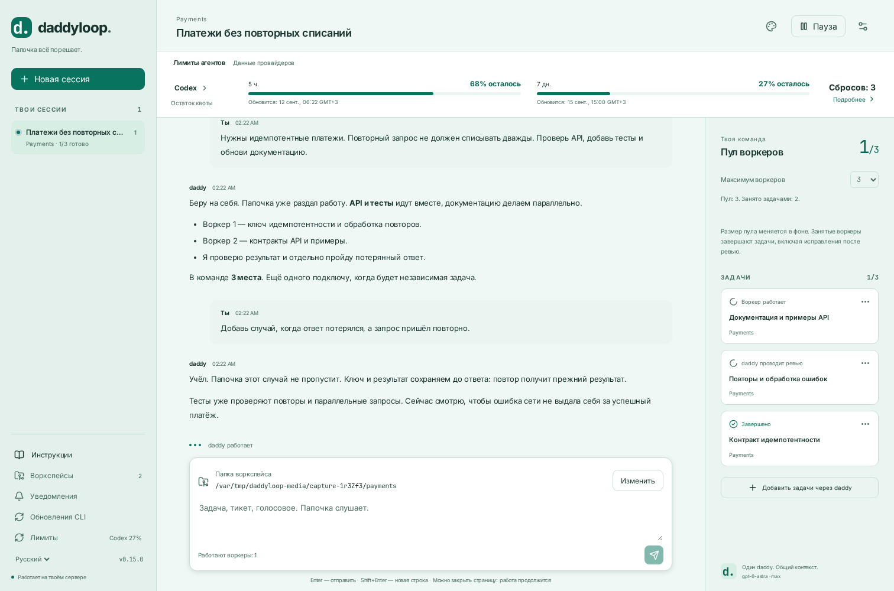
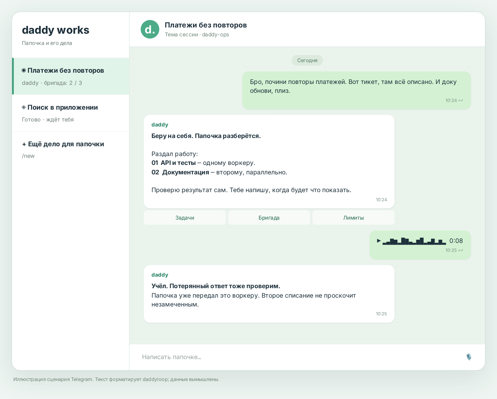
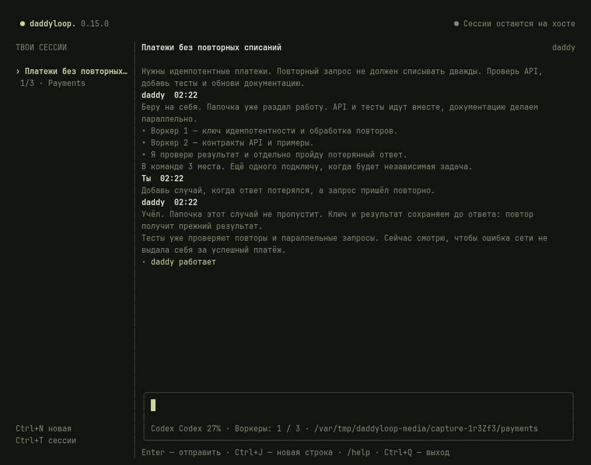
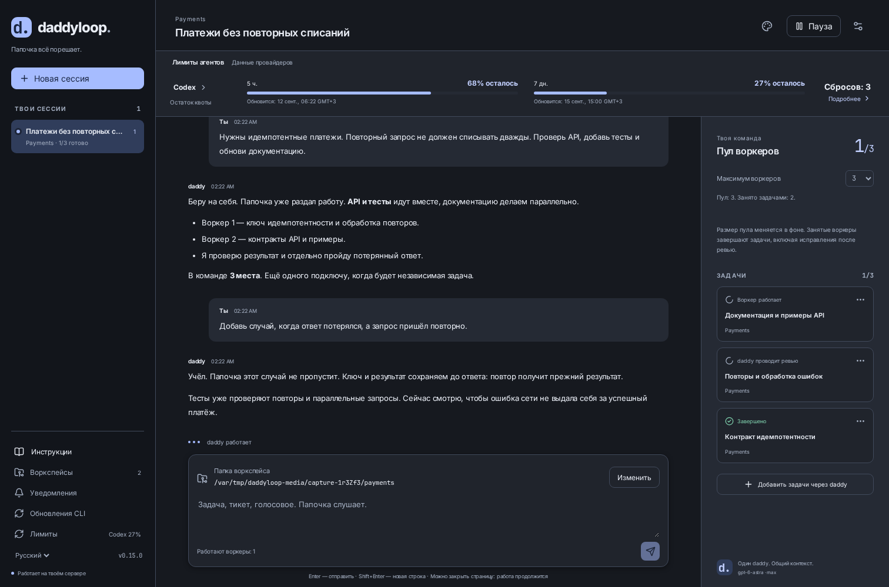

# daddyloop

[English](README.md) · **Русский** · [Все инструкции](docs/index/ru.md)

**Отдавай задачу папочке. Он всё порешает.**

Тикет прилетел, баг вылез, дедлайн подкрался? Кидай daddy задачу — он соберёт бригаду, раздаст работу, спросит с каждого и принесёт результат. Переписывайся с папочкой в терминале, на сайте или в Telegram. Ноутбук можно закрыть: папочка останется за старшего.



[Установить](#позови-папочку) · [Telegram](#папочка-в-телеграме) · [Сайт с ноутбука](#открой-сайт-с-ноутбука) · [Модели](#кто-в-бригаде) · [Бэкапы](#переезжаешь-папочка-с-тобой)

## Позови папочку

Нужен **Linux-сервер** с доступом к твоим репозиториям и аккаунтом выбранного агента. Выполни на нём:

```bash
curl -fsSL https://github.com/heesooyaam/daddyloop/releases/download/v0.15.0/install.sh | bash
```

Стрелки — выбрать модуль, пробел — поставить галочку. Codex и GitHub отмечены сразу; Claude, GitLab и Arcadia можно добавить по желанию. Установщик поставит выбранные движки, CLI `daddy`, локальное распознавание голосовых и фоновый сервис. Вручную поднимать tmux не нужно.

Для Codex и GitHub:

```bash
daddy auth agent codex
daddy auth github
daddy workspaces add ~/work/app --name App
daddy
```

В открывшемся CLI: **`/new` → App → задача**. Или сразу одной строкой:

```bash
daddy new --workspace App "Исправь повторные списания. Проверь повторы запросов."
```

**Воркспейс** — знакомая папка, например App. **Сессия** — отдельное дело папочки: один разговор и своя бригада. В App можно завести сколько угодно разных сессий. Воркеры получают отдельные рабочие копии; папку для очередной задачи можно поменять, сохранив дефолт.

[Установка по шагам](docs/start/ru.md) · [Воркспейсы и папки](docs/workspaces/ru.md) · [Первая задача](docs/tasks/ru.md)

## Папочка в Телеграме

Не хочется открывать терминал? Скинь тикет в чат. Надоело печатать? Запиши голосовое. Папочка прочитает, выслушает и займёт бригаду делом.



1. Создай отдельного бота через **@BotFather**.
2. На сервере выполни `daddy telegram setup`, вставь токен в скрытый ввод и открой выданную ссылку.
3. Нажми **Start** — теперь бот знает, кто здесь главный.
4. Для порядка создай группу с **темами**, добавь бота администратором с правом управления темами. В личке бота отправь **`/group`** и выбери эту группу.

**Одно дело — одна тема.** `/new` заводит новую сессию daddy и отдельную тему. Внутри темы присылай следующие тикеты — папочка добавит их своей бригаде. Воркеров отдельно пинать не придётся.

| Хочется                           | Отправь боту                         |
| --------------------------------- | ------------------------------------ |
| Дать задачу                       | Текст, ссылку на тикет или голосовое |
| Ещё одно дело у другого daddy     | `/new`                               |
| Выбрать модели daddy и воркеров   | `/models`                            |
| Увеличить бригаду до трёх         | `/pool 3`                            |
| Узнать остаток и доступные сбросы | `/limits`                            |
| Получать только итоги и вопросы   | `/notifications` → тихий режим       |
| Открыть сайт на телефоне          | `/web` в личке после настройки HTTPS |

Бот работает на сервере. Ему не нужны включённый ноутбук, SSH-туннель или открытая вкладка. Голосовые распознаются локально, на русском и английском.

[Подробно про Telegram](docs/telegram/ru.md) · [Голосовые](docs/voice/ru.md)

## Открой сайт с ноутбука

**На сервере:** `daddy up`, затем `daddy web`.

Скопируй команду из вывода в локальный терминал ноутбука: пользователь, хост и порты уже подставлены. Рядом будет адрес сайта. Если daddy установлен и на ноутбуке, команда `daddy web --ssh` сама поднимет туннель и откроет браузер. Для входа выполни `daddy token` на сервере.

Отключился от SSH — браузер потерял связь. Подключился снова — продолжил разговор. Папочка всё это время оставался на сервере с бригадой.

**Для телефона и постоянного адреса:** выполни `daddy web tailscale` на сервере, заверши вход, подключи телефон к той же Tailscale-сети. Затем `daddy phone` выдаст ссылку входа. Ноутбук в этом соединении вообще не участвует.

[Схемы подключения, другой порт и проверка ошибок](docs/web/ru.md)

## Кто в бригаде

**Codex и Claude** работают через общий интерфейс агентов. Выбирай движок, модель и effort отдельно для daddy и воркеров — через `/models` или CLI:

```bash
daddy models --refresh
daddy agents defaults \
  --worker-engine codex --worker-model gpt-5.6-sol --worker-effort max \
  --daddy-engine codex --daddy-model gpt-6-astra --daddy-effort max
```

Для Claude выбери его модуль при установке и выполни `daddy auth agent claude`: команда сохранит API-ключ через скрытый ввод. Затем выбери модель из его каталога. Интеграция использует Claude Code CLI через официальный Agent SDK; доступ через API оплачивается отдельно от подписки Claude.

Модели и effort приходят из CLI, а не из вручную составленного списка daddyloop. Квоты тоже принадлежат адаптерам: Codex отдаёт окна аккаунта, дополнительные квоты моделей и доступные сбросы; Claude передаёт наблюдения в событиях. Если провайдер не сообщил остаток, папочка не станет рисовать цифру с потолка.



[Агенты, лимиты и обновления](docs/agents/ru.md) · [Команды CLI](docs/terminal/ru.md) · [Настройка Claude](docs/claude/ru.md)

Папочка подстроится под задачу: задай ему один набор инструкций, а всем его воркерам — другой. Можно сочетать свои промпты с навыками из GitHub, локальных файлов или вставленного Markdown. Тексты относятся только к этой сессии и переезжают вместе с бекапом. [Инструкции и навыки](docs/instructions/ru.md).

## За что отвечает папочка

- Сам раздаёт задачи и общается с воркерами. Ты разговариваешь с одним daddy.
- Принимает GitHub issues, тикеты Tracker, PR/MR и обычные описания задач.
- Управляет размером бригады. При уменьшении пула занятый воркер сначала доводит задачу через ревью и исправления.
- Публикует замечания ревью автоматически по умолчанию и проверяет исправления. Merge остаётся за тобой.
- Следит за ресурсами и умеет чистить свои проверенные кэши: `daddy cache status`, `daddy cache prune --apply`.

## Переезжаешь? Папочка с тобой

```bash
daddy down
daddy backup create ~/daddy-backup.tar.gz
daddy up
```

Архив сохраняет сессии, сообщения, решения, результаты, локальные Git-коммиты и рабочие файлы. На другой машине:

```bash
daddy backup inspect ~/daddy-backup.tar.gz
daddy backup restore ~/daddy-backup.tar.gz --to ~/daddy-restored
export DADDYLOOP_CONFIG=~/daddy-restored/restored-config.json
daddy up
```

После восстановления дела стоят на паузе. Подключи аккаунты и проверь воркспейсы, затем продолжай. Разговоры daddyloop сохраняются; внутренний контекст агента начинается заново по сохранённой задаче и результатам. У Arcadia переносятся патчи и изменённые файлы — их нужно применить в новом маунте. Пароли и токены подключения не переезжают.

[Что входит в бэкап и как восстановить работу](docs/backups/ru.md)

## Обустройся

Восемь тем: Mint, Glacier, Pearl, Lilac, Graphite, Midnight, Forest и Plum. Четыре тёмные. Остаток лимитов сразу виден над разговором. Язык — русский или английский.



[Темы](docs/appearance/ru.md) · [Эксплуатация](docs/operations/ru.md)

## Принеси свой модуль

У агентов общий контракт выполнения, каталога моделей и usage; у репозиториев — ревью, отправки изменений, тикетов и экспорта внешних рабочих копий. daddy делегирует работу через этот интерфейс, не угадывая модель внутри воркера.

[Выбор модулей](docs/modules/ru.md) · [Как написать свой адаптер](docs/module-development/ru.md) · [Архитектура](docs/architecture/ru.md) · [Как принести PR](docs/contributing/ru.md)

Все инструкции ведём парами `docs/<тема>/en.md` и `ru.md`. Картинки показывают изолированные примеры; Telegram-карточка — иллюстрация сценария. [Как обновить медиа](docs/media-guide/ru.md).

[Релиз 0.15.0](https://github.com/heesooyaam/daddyloop/releases/tag/v0.15.0) · [CI](https://github.com/heesooyaam/daddyloop/actions)
