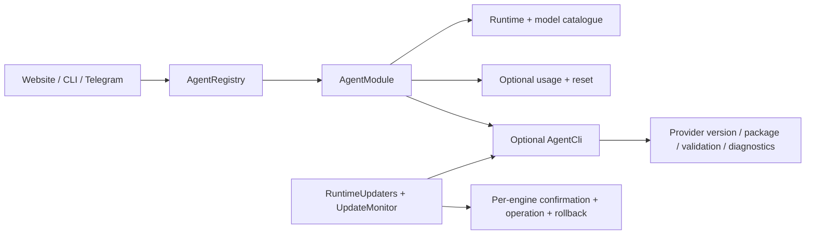

[English](en.md) · [Русский](ru.md) · [All guides](../index/en.md)

# Agent adapter review, 2026-09-14

This review follows agent and model dependencies across the repository: execution, model discovery, usage/reset, configuration, updates, recovery, CLI, Telegram, browser, backup exclusions, packaging and their tests. It is a review of those boundaries, not a claim that every possible workflow or security defect has been excluded.

The incident was a Claude Code update notification that offered to install Codex. Execution and usage already dispatched through registries, but CLI management did not implement the same boundary.

## Findings and changes

| Priority  | Finding before the change                                                                                                          | Implemented resolution and evidence                                                                                                                                                                                                                                                                      |
| --------- | ---------------------------------------------------------------------------------------------------------------------------------- | -------------------------------------------------------------------------------------------------------------------------------------------------------------------------------------------------------------------------------------------------------------------------------------------------------- |
| Important | A Claude notification used Codex installation copy; bundled installation was treated as proof of an updater.                       | [Telegram cards](../../src/integrations/telegram-meta.ts) use the adapter's name and explicit managed-update capability. Providers without installers link to release instructions.                                                                                                                      |
| Important | The background monitor required the Codex module, so Claude-only installations never checked updates.                              | [Server composition](../../src/server/app.ts) enumerates registered CLI capabilities; the Claude-only startup test covers it.                                                                                                                                                                            |
| Important | Update/rollback, config activation, API endpoints and bot callbacks only supported Codex.                                          | [RuntimeUpdater](../../src/core/runtime-updater.ts) keeps independent confirmations, operation ledgers and rollback per engine. Browser, Telegram and CLI route by engine ID.                                                                                                                            |
| Important | An in-flight check revalidated only the Codex executable; managed-notification deduplication also only understood Codex.           | [UpdateMonitor](../../src/core/updates.ts) rechecks every selected path and symlink target and accounts for each engine's completed operation.                                                                                                                                                           |
| Important | `doctor` always started Codex; the terminal could label Claude quota data as Codex.                                                | Diagnostics use `AgentCli.diagnose`; quota labels remain provider data. [CLI](../../src/cli.ts), [terminal](../../src/terminal/daddy.tsx).                                                                                                                                                               |
| Important | Codex discovery and runtime rejected `ultra` locally even when advertised by the CLI.                                              | [Catalogue](../../src/modules/agents/codex/models.ts) preserves returned effort values; runtime passes the frozen profile. The installed 0.154.0 schema defines effort as a non-empty string advertised by the model. Native worker delegation remains disabled independently.                           |
| Important | Missing profile/executable data could silently select Codex; a job without a profile could inherit new defaults at execution time. | Profile engine is required, the generic executable resolver rejects absence, and the queue requires a frozen profile. The installer recommendation remains an explicit catalogue default. [Profiles](../../src/core/agents.ts), [queue](../../src/core/store.ts), [worker](../../src/runtime/worker.ts). |
| Minor     | Native Codex transport lived in shared runtime code; native credential exclusions lived in the backup implementation.              | Protocol/runtime/packaging live under the Codex adapter. Factories declare `privatePaths()`; backups exclude them for all known modules, including disabled ones.                                                                                                                                        |

## Resulting contract

The source of truth is [contracts.ts](../../src/modules/contracts.ts). The [module guide](../module-development/en.md) describes implementation and registration. A new engine must not require edits to the scheduler, update monitor or notification templates.

Provider-specific constants still belong inside providers: protocol method names, native package layouts, authentication filenames and source URLs. Release CLI/SDK pins are intentional for reproducible packaging. Model names in examples and offline fixtures do not choose a production engine. The Arcadia helper's `.agents`, `.codex`, `.claude` and `.cursor` search paths discover local skills; they do not route agent requests.

## Verification

- Offline tests cover third-engine install/rollback, audience and expiry fences, failure recovery, cancellation, path changes, read-only capabilities, Claude-only startup, per-engine notices, profiles and existing execution/usage invariants.
- Browser scenarios cover actual update/rollback API calls for Claude and a third fixture engine, confirmation, independent selections and mobile width. Preset creation preserves the task draft and role instructions; multiple presets/components still use frozen copies.
- Real Claude Code 2.1.270 was downloaded from its official native npm package, checksum-verified, installed into a task-owned directory and queried through SDK 0.3.268. Version and model discovery passed without a paid model turn or a change to the live selected CLI.
- Codex protocol evidence came from `app-server generate-json-schema` on the installed 0.154.0 CLI; [official app-server documentation](https://learn.chatgpt.com/docs/app-server) describes native catalogue discovery.

Paid agent execution is not part of this validation. Compatibility checks cannot prove every behavior of a future CLI release; transport failures must keep work unfinished and report the error. Final CI and release checks are recorded on the pull request and release.

## Website issue #19, item 11

The instruction editor explains what a preset contains, loads choices when **Add presets** opens, and provides **Create preset → Save and use in this session** in place. Role instructions remain separate. Import/export is folded into its own section. There is no ambiguous “Refresh list” button. This addresses [item 11](https://github.com/heesooyaam/daddyloop/issues/19).
