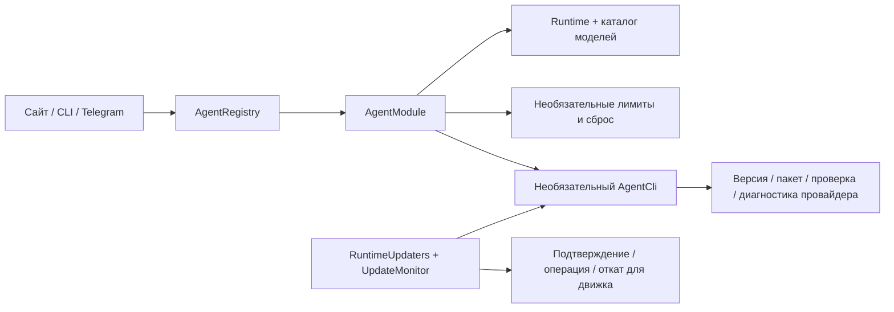

[English](en.md) · [Русский](ru.md) · [Все инструкции](../index/ru.md)

# Ревью адаптеров агентов, 14 сентября 2026

Проверены зависимости от агентов и моделей по всему репозиторию: выполнение, каталог моделей, лимиты и сброс, конфигурация, обновления и восстановление, CLI, Telegram, браузер, исключение секретов из бекапов, сборка и тесты. Это ревью этих границ, а не обещание отсутствия всех возможных ошибок workflow или безопасности.

Поводом стало уведомление об обновлении Claude Code с предложением установить Codex. Выполнение задач и лимиты уже использовали реестры, но управление CLI оставалось отдельной реализацией для Codex.

## Найденные проблемы и исправления

| Приоритет     | До изменения                                                                                                                            | Решение и подтверждение                                                                                                                                                                                                                                                                  |
| ------------- | --------------------------------------------------------------------------------------------------------------------------------------- | ---------------------------------------------------------------------------------------------------------------------------------------------------------------------------------------------------------------------------------------------------------------------------------------- |
| Важно         | В уведомлении Claude был текст про Codex; встроенная установка считалась признаком доступного обновления.                               | [Карточки Telegram](../../src/integrations/telegram-meta.ts) используют имя адаптера и явную возможность управляемого обновления. Без установщика предлагаются инструкции из релиза.                                                                                                     |
| Важно         | Фоновая проверка требовала модуль Codex: установка только с Claude не проверяла обновления.                                             | [Сервер](../../src/server/app.ts) перебирает CLI включённых адаптеров; отдельный тест проверяет запуск только с Claude.                                                                                                                                                                  |
| Важно         | Обновление, откат, переключение конфигурации, API и кнопки бота работали только с Codex.                                                | [RuntimeUpdater](../../src/core/runtime-updater.ts) хранит независимые подтверждения, операции и откат для каждого движка. Браузер, Telegram и CLI выбирают движок по ID.                                                                                                                |
| Важно         | После сетевого запроса перепроверялся только путь Codex; удаление повторных уведомлений тоже знало только Codex.                        | [UpdateMonitor](../../src/core/updates.ts) проверяет путь и цель симлинка каждого движка и отдельно учитывает его завершённые операции.                                                                                                                                                  |
| Важно         | `doctor` всегда запускал Codex; терминал мог подписывать квоты Claude словом Codex.                                                     | Диагностика идёт через `AgentCli.diagnose`; названия квот остаются данными провайдера. [CLI](../../src/cli.ts), [терминал](../../src/terminal/daddy.tsx).                                                                                                                                |
| Важно         | Каталог и runtime Codex запрещали `ultra`, даже если CLI возвращал его в списке.                                                        | [Каталог](../../src/modules/agents/codex/models.ts) сохраняет полученные уровни усилий, runtime передаёт профиль задания. Схема установленного 0.154.0 определяет усилие как непустую строку из каталога модели. Нативное создание воркеров отключено независимо от этого параметра.     |
| Важно         | Отсутствующий движок или исполняемый файл мог незаметно подставить Codex; задание без профиля получало новые дефолты перед выполнением. | Движок обязателен, общий выбор исполняемого файла отклоняет отсутствие, а очередь требует зафиксированный профиль. Дефолт установщика явно задан рекомендацией каталога. [Профили](../../src/core/agents.ts), [очередь](../../src/core/store.ts), [воркер](../../src/runtime/worker.ts). |
| Незначительно | Нативный транспорт Codex лежал в общем runtime, пути его секретов — в коде бекапа.                                                      | Протокол, runtime и пакет находятся внутри адаптера. Фабрики объявляют `privatePaths()`; бекап исключает секреты всех известных модулей, включая отключённые.                                                                                                                            |

## Получившийся контракт

Источник истины — [contracts.ts](../../src/modules/contracts.ts). Реализация и регистрация описаны в [руководстве по модулям](../module-development/ru.md). Новый движок не должен требовать правок планировщика, проверки обновлений или шаблонов уведомлений.

Внутри провайдеров остаются их константы: методы протокола, раскладка пакетов, имена файлов авторизации и URL. Версии CLI и SDK фиксируются для воспроизводимой сборки. Модели в примерах и тестах не определяют движок в рабочем приложении. Пути `.agents`, `.codex`, `.claude`, `.cursor` у Arcadia нужны для поиска локальных навыков, а не выбора модели.

## Проверка

- Изолированные тесты проверяют установку и откат третьего движка, владельца и срок подтверждения, ошибки и восстановление, отмену, смену пути, отсутствие необязательных возможностей, запуск только с Claude, отдельные уведомления и существующие ограничения выполнения и лимитов.
- Браузерные сценарии вызывают настоящий API обновления и отката для Claude и третьего тестового движка: подтверждение, независимый выбор версий, ширина телефона. Создание пресета сохраняет черновик задачи и инструкции ролей; несколько наборов и выбор компонентов продолжают работать со снимками.
- Реальный Claude Code 2.1.270 скачан из официального нативного npm-пакета, проверен по контрольной сумме, установлен в папку этой проверки и опрошен через SDK 0.3.268. Версия и каталог прочитаны без платного обращения к модели и смены рабочего CLI.
- Протокол Codex проверен через `app-server generate-json-schema` установленного 0.154.0; [официальная документация](https://learn.chatgpt.com/docs/app-server) описывает чтение каталога через app-server.

Платные запуски агентов в эту проверку не входят. Проверка совместимости не доказывает всё поведение будущего CLI; ошибки транспорта должны оставлять работу незавершённой. Итоговые CI и проверки релиза фиксируются в PR и релизе.

## Сайт: issue #19, пункт 11

Редактор объясняет смысл пресетов, загружает варианты при нажатии **Добавить пресеты** и позволяет пройти **Создать пресет → Сохранить и подключить к сессии** на месте. Инструкции ролей остаются раздельными. Импорт и экспорт свёрнуты в свой раздел. Неоднозначной кнопки «Обновить список» больше нет. Это исправляет [пункт 11](https://github.com/heesooyaam/daddyloop/issues/19).
