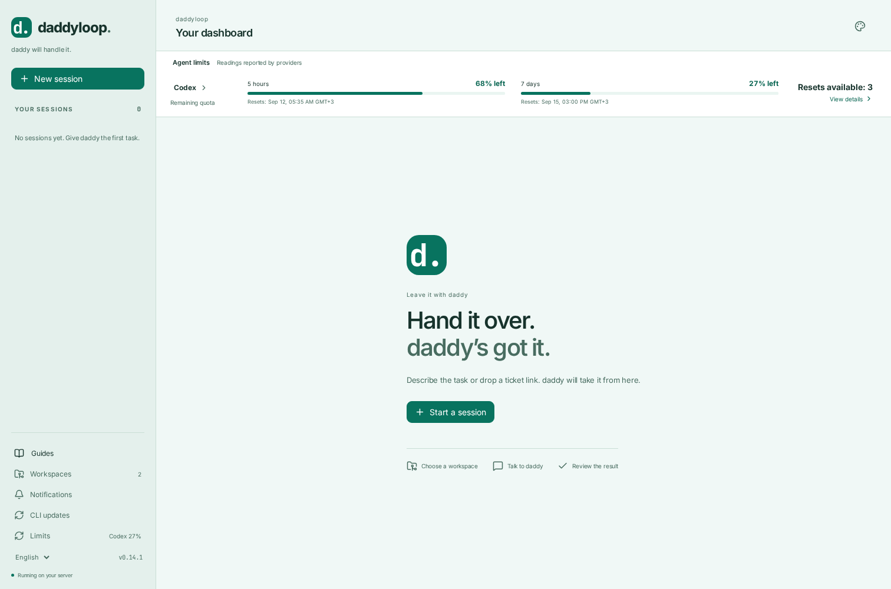

[English](en.md) · [Русский](ru.md) · [All guides](../index/en.md)

# Themes and live usage

Click the **palette icon** in the top bar, or on the login screen. Eight themes are available:

| Light   | Dark     |
| ------- | -------- |
| Glacier | Graphite |
| Pearl   | Midnight |
| Mint    | Forest   |
| Lilac   | Plum     |

**Follow system** uses Glacier for light mode and Graphite for dark mode. An explicit choice is saved in this browser, survives reloads, and synchronizes across its tabs. Your phone can use a different theme. Choosing colors does not change tasks, drafts, models or server settings.

The web palettes cover the conversation, task board, dialogs, forms and login screen. The terminal separately supports `daddy --theme dark` and `daddy --theme light`.

## Usage stays visible

The panel below the header shows each enabled adapter separately: quota windows, remaining allowance, credits and resets. Claude can also report tokens and the estimated cost of its last API turn. It is visible on desktop and phone, including before you open a session. The account quota is shared by the Codex agents on this server.

Window names come from their returned durations, so a weekly quota is not mislabeled as a five-hour quota. Cached, unreachable or stale readings are labeled; missing usage is never shown as zero remaining. Codex reads are cached for one minute. Claude displays event observations when available; refreshing does not invent a fresh quota response. Opening details allows an explicit refresh.

**View details**, the provider name or a period card opens that provider’s limits. Preparing a reset does not spend it: a separate confirmation is required. Retries use the same request ID. The app does not buy credits or automatically consume earned resets, and it does not infer permission to resume an agent from a percentage alone.

```bash
daddy limits
daddy limits reset
daddy limits reset --request REQUEST_ID --yes
```

Existing conversations and files remain in place after an account quota reset.

Zero additional credits stay in the detailed view with an explanation instead of occupying space beside quota percentages. Credits are a separate provider payment balance; zero credits do not mean the included quotas are exhausted. A provider reporting only a credit balance keeps that balance visible in the main panel.

The home page uses **Your dashboard**, separate from the **Agent limits** section. Providers without readings occupy a compact row with a details action. Quota percentages remain visible without extra clicks.


