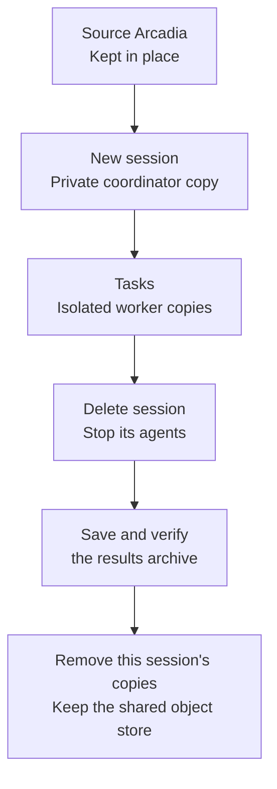
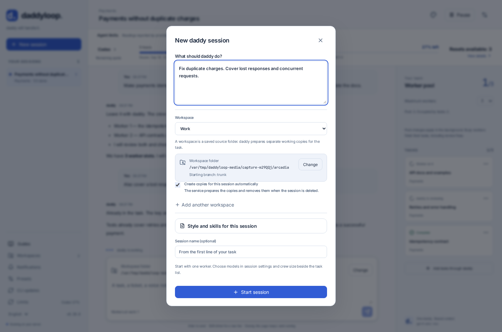

[English](en.md) · [Русский](ru.md) · [All guides](../index/en.md)

# Arcadia and Tracker

Choose `arcadia` during installation. Arc, Arcanum and the corporate lease helper must already be available and authenticated on the server.

```bash
daddy arcadia setup
daddy workspaces add ~/arcadia --name Work --base trunk --copies session
daddy new --workspace Work "TEAM-123"
```

Already have Work? Update its defaults with `daddy workspaces set Work ~/arcadia --copies session`. Existing sessions keep their settings.

## Automatic copies

**Choose the source once. The service creates the working copies.** An Arcadia source must be mounted; it can use an older, separate object store. New copies always use the shared object store from `arcadia-mount-lease` configuration.



The session copy is prepared even before its first message. Independent workers have separate copies. The service owns the leases and switches branches; the agents use their supplied folders. You do not need to find a free `arcadia2`, `arcadia3`, etc.

On the website, **Create copies for this session automatically** is enabled by default. Telegram shows the mode before **Start session**. `--copies pool` selects the existing numbered mount pool instead; those copies are retained, and borrowed leases must be released separately.

Owned copies live under `<data-dir>/arcadia-sessions/<session-id>/`. Finished tasks can have their FUSE processes stopped to save memory; their stores and changes remain and are mounted again when needed. Source folders and copies owned by other sessions are not changed.



## Delete a session

Use **Delete session** on the website or session card in Telegram. The terminal has `/delete`; the plain CLI shows a confirmation before the destructive step:

```bash
daddy delete SESSION_ID
daddy delete SESSION_ID --yes
```

Deletion runs in the background:

1. Cancel and wait for this session's agent runs.
2. Save conversation, task data, patches and changed files in `<data-dir>/session-archives/<session-id>/g<generation>/`.
3. Verify the archive and ownership, then unmount and forget only the session's copies.

If export or ownership verification fails, deletion stops with the remaining copies preserved. Retry from the session card after addressing the reported problem. The source repository and shared object store remain. Telegram closes the session topic while keeping its messages.

The readable archive contains `session.json` and `arcadia/<task>/<role>/` with patches, file contents and `state.json`. It is also included in a full [backup](../backups/en.md). The service never force-unmounts or truncates the shared store.

## Tickets and reviews

Tracker credentials come from `TRACKER_OAUTH_TOKEN`, `TRACKER_TOKEN` or `~/.tokens/tracker`. Import reads the ticket; it does not post comments to Tracker. Native reviews use Arcanum and Arc tools.

```bash
daddy talk SESSION_ID "Also take TEAM-124"
daddy arcadia mounts
```

Tasks follow [the same review cycle](../tasks/en.md). Submission checks the lease owner, branch and exact revision. Use [operations](../operations/en.md) for cache management.
