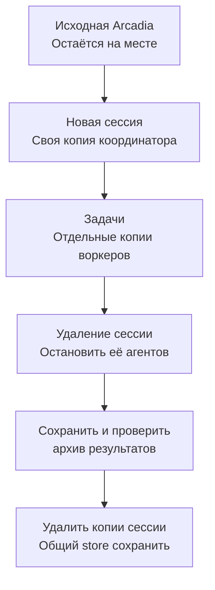
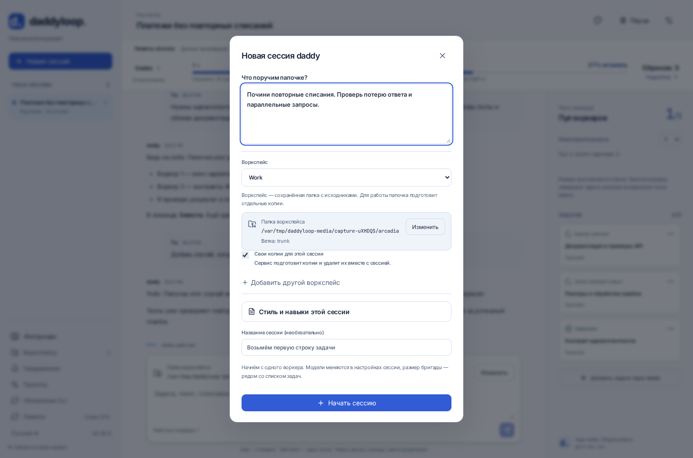

[English](en.md) · [Русский](ru.md) · [Все инструкции](../index/ru.md)

# Arcadia и Tracker

При установке выбери `arcadia`. На сервере уже должны быть установлены и авторизованы Arc, Arcanum и корпоративный helper для аренды копий.

```bash
daddy arcadia setup
daddy workspaces add ~/arcadia --name Work --base trunk --copies session
daddy new --workspace Work "TEAM-123"
```

Work уже есть? Обнови дефолты: `daddy workspaces set Work ~/arcadia --copies session`. Существующие сессии сохранят свои настройки.

## Автоматические копии

**Выбери исходную папку один раз. Рабочие копии создаст сервис.** Исходная Arcadia должна быть подключена; она может использовать старое отдельное хранилище. Новые копии всегда используют общий store из конфигурации `arcadia-mount-lease`.



Копия сессии готовится ещё до первого сообщения. Независимые воркеры получают отдельные копии. Сервис занимает их и переключает ветки; агенты работают в выданных папках. Искать свободную `arcadia2`, `arcadia3` и так далее не нужно.

На сайте по умолчанию включена опция **Свои копии для этой сессии**. В Telegram режим показан перед кнопкой **Начать сессию**. `--copies pool` выбирает прежний пул нумерованных копий: они сохраняются, а занятые копии нужно освобождать отдельно.

Копии лежат в `<data-dir>/arcadia-sessions/<session-id>/`. У завершённых задач сервис может остановить процессы FUSE, чтобы освободить память. Хранилища и изменения остаются; при необходимости копии подключаются снова. Исходная папка и копии других сессий сохраняются.



## Удалить сессию

Нажми **Удалить сессию** на сайте или в карточке Telegram. В терминале есть `/delete`; обычный CLI сначала показывает, что будет удалено:

```bash
daddy delete SESSION_ID
daddy delete SESSION_ID --yes
```

Удаление проходит в фоне:

1. Отменить запуски этой сессии и дождаться их остановки.
2. Сохранить разговор, данные задач, патчи и изменённые файлы в `<data-dir>/session-archives/<session-id>/g<generation>/`.
3. Проверить архив и владельца копий, затем отключить и удалить только копии этой сессии.

Если сохранить данные или проверить владельца не удалось, удаление остановится. Оставшиеся копии сохранятся. После решения указанной проблемы можно повторить удаление из карточки сессии. Исходный репозиторий и общий store остаются. Тема Telegram закрывается, сообщения в ней сохраняются.

В архиве лежат `session.json` и `arcadia/<task>/<role>/`: патчи, содержимое файлов и `state.json`. Этот архив также входит в полный [бекап](../backups/ru.md). Сервис не отключает занятые копии принудительно и не обрезает общий store.

## Тикеты и ревью

Токен Tracker читается из `TRACKER_OAUTH_TOKEN`, `TRACKER_TOKEN` или `~/.tokens/tracker`. Импорт читает тикет; комментарии в Tracker не публикуются. Ревью работает через Arcanum и Arc.

```bash
daddy talk SESSION_ID "Возьми ещё TEAM-124"
daddy arcadia mounts
```

Задачи проходят [обычный цикл ревью](../tasks/ru.md). Перед отправкой проверяются владелец копии, ветка и точная ревизия. Управление кешем описано в [обслуживании](../operations/ru.md).
