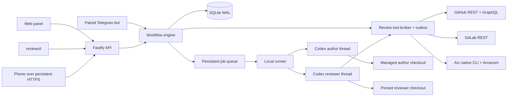
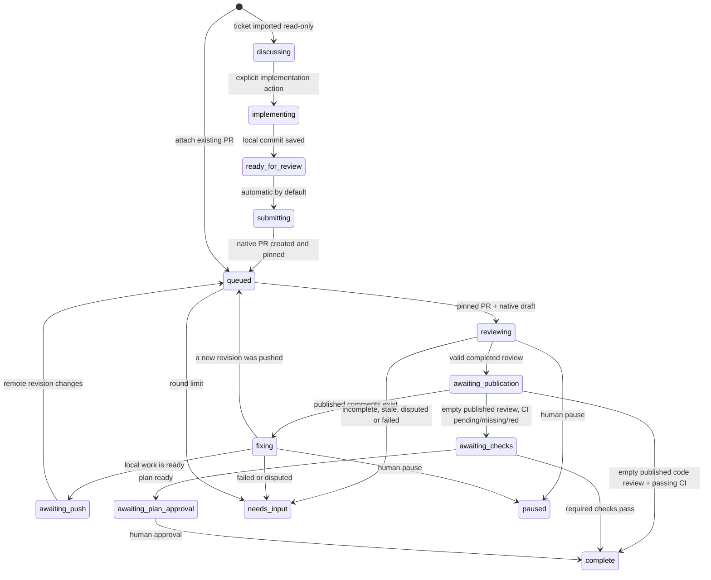

# Architecture

Reviewloop is a local, single-user service. Workflow decisions are deterministic code. Models supply code, review comments, reasoning summaries and explicit outcomes. Native review systems remain the source of truth for the published feedback.

The installed service packages API, engine, poller and scheduler in one process under systemd. Both agents run on this same host. Each agent run starts a separate `codex app-server` subprocess over stdio and closes it at the end of the turn. Thread IDs persist, so this does not discard the conversation. Runner code is separated behind `AgentRuntime` and `Workspaces`; remote workers are out of scope. CLI and browser disconnects do not stop the service.

## Module boundaries

| Component            | Responsibility                                                                   |
| -------------------- | -------------------------------------------------------------------------------- |
| `src/core/engine.ts` | State transitions, publication and plan gates, revision fencing, retry and pause |
| `src/core/store.ts`  | Durable state, job claim, events, decisions, messages and transactions           |
| `src/core/broker.ts` | Role-bound dynamic tools, exact Markdown, operation identity, head checks        |
| `src/core/outbox.ts` | Write intent, confirmed result and reconciliation after ambiguity                |
| `src/providers/`     | Provider-specific PR/check/draft/publication contracts                           |
| `src/runtime/`       | Workspace preparation, Codex transport, context and job execution                |
| `src/server/`        | Local API, auth, CSRF/Origin checks, static assets and event stream              |
| `src/ui/`            | Task list, role conversations, findings, history, decisions and context          |

`ReviewProvider` has GitHub, GitLab and optional Arcadia implementations, plus a visibly labeled persistent demo implementation. It does not know which agent runtime is used. `AgentRuntime` receives scoped tools and never needs platform tokens. SQLite contains no provider credentials. Arcadia uses existing corporate tools and leased shared-store mounts; it pins both full revisions and the native diff ID. Browser access and Telegram publication confirmations use separate scoped, expiring credentials.

The terminal client uses Ink/React with a separate `ConsoleModel`. It owns only display state, task/role drafts and abortable HTTP reads/writes. Changing selections fences late responses; closing the client aborts its network requests and restores terminal modes without sending a task cancellation. The original line-oriented client remains available through `--plain`. Workflow and publication authority stay in the existing server engine.

## State machine

An empty review and an incomplete review are different. `reviewFinished` is set only after a valid completed reviewer result for the pinned revision. Neither a restart nor `resume` can turn a half-written native draft into a completed review. Completed reviews with outstanding historical findings require verification IDs or a recorded disposition.

Every task transition is serialized by a per-task lock. SQLite job claiming is transactional and has a unique running-job constraint per task. The worker defaults to one active agent, with a configurable limit of 1–8. Reviewer jobs in one group share a persistent thread and are serialized across tasks; each author keeps its own session and working copy. Jobs freeze the role profile when queued. Long asynchronous preparation re-reads the task generation before saving any state, so a late operation cannot overwrite a user's pause. Generation fencing also covers tools and session callbacks.

## Comment authority and identity

The reviewer invokes `add_comment`, `edit_comment`, `remove_comment`, `set_summary` and `record_decision` directly. `read_review` always re-reads the native review. The broker rejects author edits and unpublished reads. A `read_review` result is not itself a grant to publish.

The workflow has **no merge tool**. GitHub submission uses `COMMENT`, which also works for a PR owned by the authenticated user. It does not claim formal approval or override branch protection.

GitHub pending-review IDs and GraphQL node IDs identify the draft as a native review. The adapter uses `addPullRequestReviewThread` to add comments to that pending review, preserving Markdown and line ranges.

GitLab draft notes are individual objects. The adapter uses a summary note and hidden correlation markers. It publishes only its own notes, with the summary last. It intentionally does not use `bulk_publish`. Partial publication or untracked notes blocks the handoff. Hand-edited notes that remove correlation markers require manual reconciliation; they are never silently excluded from a supposedly complete batch.

Markers support correlation and recovery, not authentication. Recovery checks the provider account identity as well as the marker. GitLab lost-create recovery has no reliable pre-create note baseline and therefore treats untracked notes conservatively.

## Persistent materials

- Requirements and context version are copied into every run context.
- A code task links a specific approved plan commit and immutable Markdown bodies.
- Published feedback is saved exactly, including links, fenced code and suggestion blocks.
- Decisions distinguish verification, withdrawal, rejection, deferral and dispute.
- Job records hold thread/turn IDs, role, generation and execution status.
- Events include task/run identity and confirmed broker operation outcomes.

Private reviewer chat is never replayed into the author's thread. Draft-related decisions are also withheld from the author until they correspond to published feedback. Direct changes to native comments are re-read before handoff.

## Sources checked during implementation

- [Codex app-server protocol](https://learn.chatgpt.com/docs/app-server): stdio JSON-RPC, initialize, thread/start, thread/resume, turn/start, streamed items, dynamic tool requests and structured output.
- Generated TypeScript schema from the installed `codex-cli 0.153.4` was inspected for exact field names. Dynamic tools are experimental; the runtime is validated against this installed version.
- [GitHub pull request reviews](https://docs.github.com/en/rest/pulls/reviews): pending review creation, reading comments and submission.
- [GitLab draft notes](https://docs.gitlab.com/api/draft_notes/): author-only drafts, note positions and individual publication.
- [Node SQLite](https://nodejs.org/api/sqlite.html): built-in synchronous SQLite database API.

Original product discussion: [shared conversation](https://chatgpt.com/share/6a9f5293-9640-83eb-b9ed-a45f371041a2). The later clarifications in that discussion take precedence over its early sketches: the reviewer writes comments using tools, discussion stays in the reviewer session, and plan PRs share the same review cycle as code.

## Tickets and profiles

See [ADR 0004](adr/0004-ticket-groups.md). `TicketReader` snapshots GitHub issues or Tracker tickets, including comments, without writing back. `TicketWorkflow` verifies the managed implementation, performs ordinary pushes, creates a native PR through the durable outbox and binds the exact submitted head. A failed or uncertain submission stays recoverable; a conversation cannot erase that intent or authorize a second creation. Native submissions run independently of the scheduling tick so resource checks continue while the provider responds.

Model defaults and Telegram preferences are persisted settings in SQLite. Config-file agent defaults seed a new database; afterwards the CLI/UI settings are authoritative. Old tasks retain their saved policies. New tasks publish completed reviews automatically; incomplete reviews, disputes, revision mismatches, CI and explicit human plan approval still gate completion. Automatic publication does not merge a PR.

## Locales, model catalogue and CLI versions

Workspace preferences store an `en`/`ru` locale and a monotonically increasing version. Browser and terminal clients ignore older preference responses; language changes do not alter task generations, job profiles or conversation drafts. UI strings share a translation catalogue. Telegram translates owned copy before computing native entity offsets, keeping task titles, code and agent Markdown as data.

`ModelCatalogue` reads `model/list` from the configured Codex app-server, follows pagination and caches successful results for five minutes. A forced refresh bypasses the cache. Provenance includes the retrieval/expiry times and the responding CLI version. Models and supported efforts are data-driven; unsupported delegation mode remains excluded.

`UpdateMonitor` probes executable versions and checks package registries every six hours. It records available releases and observed installed-version changes, without installing anything or restarting agents. Telegram update notices use durable deduplication and retain the existing uncertain-delivery rules. Unsupported installed engines are diagnostic only. Explicit `runtime use` validates the selected Codex protocol, checks local installation identity and idle state, then updates configuration and restarts the service. Launcher paths are preserved so external CLI updaters can replace symlink targets.
