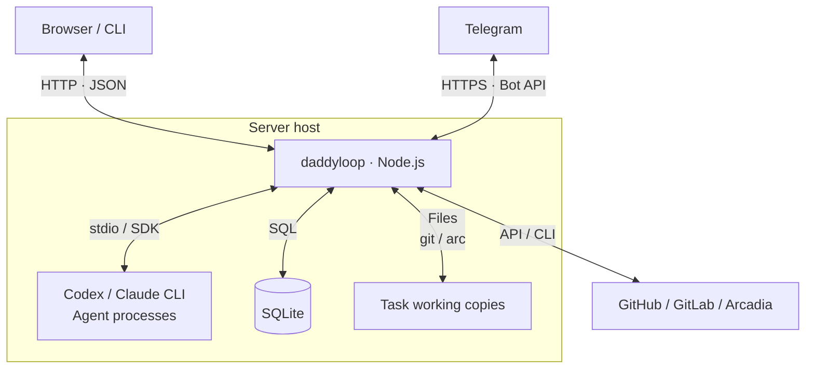

[English](en.md) · [Русский](ru.md) · [All guides](../index/en.md)

# How daddyloop works

Read in order, or jump to [connections and components](#connections-and-components), [data and interfaces](#data-and-interfaces), [the loop](#how-the-loop-runs), [invariants](#invariants) or [concurrency and recovery](#concurrency-and-recovery).

## The big picture

daddyloop is one background Node.js service on your server. **daddy decides what to do and reviews the result; workers carry out tasks.** The service starts agent processes, keeps the queue in SQLite and sends changes to repositories. Closing a browser or laptop does not stop it.

For “Fix search,” daddy creates a task, a worker changes the code, and daddy reviews the PR. Published findings return to the worker. New code goes through review again; the task finishes only when its completion rules pass.



The model chooses actions through tools. **Application code checks those actions and decides whether the next step is allowed.** A model's “done” message cannot itself publish an unfinished review or mark the whole task complete.

## Connections and components

### What crosses a process boundary

| Connection                        | What goes through it                                                                                                                                      |
| --------------------------------- | --------------------------------------------------------------------------------------------------------------------------------------------------------- |
| Browser or terminal → HTTP server | JSON commands such as `POST /api/daddy/sessions/:id/chat`, plus requests for saved state. The shared client polls about every two seconds.                |
| Telegram ↔ Telegram integration   | HTTPS requests to the Bot API. The integration maps a private chat or group topic to a session and calls `Daddy` methods inside the service.              |
| Service ↔ Codex                   | The Codex adapter uses app-server JSON-RPC over stdin/stdout: start or resume a thread, start a turn, handle tool calls and events.                       |
| Service ↔ Claude                  | The Claude adapter calls the Agent SDK's `query()`; application tools are exposed through an in-process MCP server. The SDK manages Claude CLI execution. |
| Service ↔ repositories            | `ReviewProvider` handles reviews; `SubmissionBackend` handles PR creation. GitHub/GitLab adapters use their APIs; Arcadia uses the configured CLI bridge. |
| Service ↔ disk                    | `Store` reads and writes SQLite. Workspace helpers run `git` or `arc` and manage task files. Agent conversation files remain with the selected CLI.       |

Inside the Node.js service, components call ordinary TypeScript methods. The queues are SQLite tables. Saved events also notify local listeners; there is no separate message broker between these components.

Browser access uses device pairing, a session cookie and request-origin/CSRF checks. A remote browser reaches this same service through a tunnel or configured network access; see [web access](../web/en.md).

### What each server component owns

Read this table from the incoming request down to execution and storage. Names link to the implementation.

| Component                                                                                                      | Responsibility and main connections                                                                                                                                                                                          |
| -------------------------------------------------------------------------------------------------------------- | ---------------------------------------------------------------------------------------------------------------------------------------------------------------------------------------------------------------------------- |
| [HTTP handlers](../../src/server/daddy.ts) / [Telegram handlers](../../src/integrations/telegram-workspace.ts) | Validate a request, find its session and call `Daddy.chat()`, settings or task actions. They do not run models themselves.                                                                                                   |
| [Daddy](../../src/core/daddy.ts)                                                                               | Saves a message and queues a `DaddyJob`. Its scheduler calls `AgentRegistry.runSession()`. Tool callbacks such as `create_task` and `dispatch` go through checked methods in `Daddy`, then `TicketWorkflow` or `Engine`.     |
| [Engine](../../src/core/engine.ts)                                                                             | Owns task transitions. `review()` queues a review, `completeJob()` checks an agent result, and `reconcile()` compares saved state with the current PR. It writes through `Store` and uses `Broker` for native reviews.       |
| [Worker](../../src/runtime/worker.ts)                                                                          | The scheduler for **both worker and reviewer runs**. `tick()` calls `Store.claim()`, prepares a working copy, invokes `AgentRegistry.run()`, then passes the result to `Engine.completeJob()`.                               |
| [AgentRegistry](../../src/modules/agents/registry.ts)                                                          | Selects an enabled adapter by `profile.engine`. The adapter translates the shared runtime interface into Codex or Claude calls and returns tool calls, events and a structured result.                                       |
| [TicketWorkflow](../../src/core/ticket-workflow.ts)                                                            | Imports a ticket or local task description. After implementation, prepares submission through a repository module, creates or recovers the PR, then calls `Engine.linkPR()`.                                                 |
| [Broker](../../src/core/broker.ts) + [Outbox](../../src/core/outbox.ts)                                        | `Broker.call()` checks review-tool arguments, role and revision before a native operation. `Outbox.perform()` records write intent and its confirmed result. PR submission and daddy's mutating tools also use this journal. |
| [RepositoryRegistry](../../src/modules/repositories/registry.ts)                                               | Selects the repository module. Its `ReviewProvider` reads and edits native reviews; its `SubmissionBackend` prepares, creates and finds PRs.                                                                                 |
| [Workspaces](../../src/runtime/workspaces.ts) / [ArcWorkspaces](../../src/runtime/arc-workspaces.ts)           | Prepare isolated copies, preserve local changes, commit and submit worker changes. They own the VCS commands, rather than delegating publication to the model.                                                               |
| [Store](../../src/core/store.ts)                                                                               | Saves sessions, tasks, both queues, messages, decisions, events and operation receipts. A transaction claims a job and assigns its worker slot together; events notify listeners after commit.                               |

[buildApp()](../../src/server/app.ts) constructs these objects and connects their callbacks. This is the starting point for reading how the application is assembled.

A named workspace describes the source repository and allowed scope. The session keeps a copy of those settings. Workers and reviewers get managed copies; [DaddyWorkspace](../../src/runtime/daddy-workspace.ts) prepares a separate read-only copy for coordination.

## Data and interfaces

### Session, task and run are different objects

| Object                            | What it keeps                                                                                                                   |
| --------------------------------- | ------------------------------------------------------------------------------------------------------------------------------- |
| `ReviewGroup` — a session         | Your conversation with daddy, workspace settings, daddy/worker profiles, task list and pool size.                               |
| `Task` — one unit of work         | Its ticket or PR, working copies, current revision, review, policy, dependencies and state.                                     |
| `Job` — one task run              | Task ID, kind (`implement`, `review`, `fix`, `chat`), role, a copy of model settings and instructions, and a generation number. |
| `DaddyJob` — one coordinator turn | Session ID, triggering message or event, copied settings and its own queue status. It is separate from the task-run queue.      |

In code, the `author` role means a worker; `reviewer` means daddy doing a native PR review. A task can have many runs. `Job.status = completed` ends one run; `Task.state = complete` means the workflow's completion rules passed.

Two fields prevent old work from becoming current:

- **Revision** identifies the exact code and diff: `head`, `base`, `start` and optional provider `revisionId`. Comparing only the latest commit would miss changes to the comparison base.
- **Generation** is a cancellation counter. Pausing or invalidating work increases it. A job with an older counter cannot advance the current task. Sessions have a separate counter for daddy's turns.

SQLite stores the current state; the event log records what happened and wakes listeners. Recovery reads saved objects and checks the repository again. It does not rebuild the application by replaying every event. See [types](../../src/core/types.ts) and [Store](../../src/core/store.ts).

### The common agent interface

The scheduler and daddy use these two interfaces from [runtime/agent.ts](../../src/runtime/agent.ts):

```ts
export interface AgentRuntime {
  run(input: AgentInput): Promise<AgentResult>;
}
export interface SessionRuntime {
  runSession(input: SessionInput): Promise<AgentResult>;
}
```

`run()` receives a task and its queued job. `runSession()` receives a conversation request directly. Both provide a folder, prompt, cancellation signal and callbacks:

- `onSession` saves the native conversation ID so a later turn can resume it.
- `onEvent` records progress; progress messages do not change task state on their own.
- `onTool` returns an application tool call to `Daddy` or `Broker` for validation and execution.

The adapter returns `AgentResult`: a status (`completed`, `needs_input`, `incomplete`), summary, `checkedHead`, and IDs of verified or disputed findings. For task runs, `Engine` checks it against the task and live repository. For coordination, `Daddy` checks that the session and turn are still active.

An [AgentModule](../../src/modules/contracts.ts) supplies the runtime and model catalogue, with optional usage and CLI-update interfaces. A repository module supplies ticket reading, review and submission interfaces. The main loop selects a module by its ID; model names and native API details belong in the adapters. See [Write a module](../module-development/en.md) for the complete contracts and registration steps.

## How the loop runs

There are two connected loops: daddy decides which tasks to start; the task loop executes and reviews them.

### 1. From a message to assigned work

`HTTP / Telegram → Daddy.chat() → saved message + DaddyJob → Daddy.tick() → AgentRegistry.runSession()`

daddy receives the goal, task board and recent conversation. It can read older messages or task details through tools. A `create_task` or `import_ticket` call creates a task; `dispatch` queues implementation once dependencies allow it.

The worker scheduler claims that job and runs the selected agent in the task's copy. After successful implementation, it commits the files. `TicketWorkflow.submit()` submits the saved work and links the resulting PR to the task. The task enters `queued`, ready for review. An attached existing PR starts here directly.

### 2. From a PR through review and fixes

Suppose revision **H1** still has a search bug. The table shows the automatic path; manual publication or push settings introduce waits at the corresponding step.

| Step                     | Calls and checks                                                                                                                                                                                                   | Saved outcome                                                                                                                            |
| ------------------------ | ------------------------------------------------------------------------------------------------------------------------------------------------------------------------------------------------------------------ | ---------------------------------------------------------------------------------------------------------------------------------------- |
| Start review             | `Worker.tick()` sees `queued` and calls `Engine.review()`. The engine reads the live PR and creates or finds its native draft through `Broker.ensureReview()`.                                                     | Task → `reviewing`; queue a `reviewer/review` job for H1.                                                                                |
| Run review               | `Store.claim()` selects the job. The adapter runs in a read-only code copy. Review-tool callbacks reach `Broker.call()` and the selected `ReviewProvider`.                                                         | Findings are native draft comments. The worker cannot read them yet.                                                                     |
| Accept the review result | `Worker` calls `Engine.completeJob()`. The engine checks the generation, revision, result and native draft. An empty review must also account for earlier findings.                                                | `reviewFinished = true`; task → `awaiting_publication`.                                                                                  |
| Publish and assign fixes | `Worker.tick()` calls `Engine.publish()`. `Broker` publishes through the outbox; `Engine.reconcile()` reads the published snapshot.                                                                                | Findings present, within retry limits → `fixing` and an `author/fix` job containing published feedback. No findings → completion checks. |
| Apply fixes              | The worker receives H1 and its published findings. After a successful result, `Workspaces.submit()` saves changes and pushes H2 when policy allows. `Engine.completeJob()` accepts the result for the starting H1. | The old review is invalidated; task → `queued` for H2. With a pending manual push: `awaiting_push`.                                      |
| Review H2                | The next scheduler pass starts another review. daddy verifies earlier findings against the new code.                                                                                                               | Repeat if findings remain. An empty, completed, published review proceeds to CI and any required plan approval; then `complete`.         |

**The return path is in `Engine` and `Worker`:** published findings queue a fix; a submitted fix makes the task eligible for a new review. The model does not need to remember to restart the loop. The [worker tests](../../tests/worker.test.ts) exercise this path with automatic and manual publication.

Earlier findings cannot simply disappear from a clean review. For each old comment ID, `Engine.completeJob()` requires verification on the current revision or a recorded decision to withdraw, defer or reject it. Without that, an empty review leaves the task in `needs_input`.

Task events also call `Daddy.onEvent()`, which can queue a coordinator turn to inspect results, ask you a question or dispatch more work. Coordination and native review use the same daddy profile but separate conversation histories. Within one session they do not run at the same time.

## Invariants

These are rules enforced by the application. Each row points to the check, not just an instruction in a prompt.

| Rule                                                                         | Where it is enforced / what happens otherwise                                                                                                                                                                                                                                                                 |
| ---------------------------------------------------------------------------- | ------------------------------------------------------------------------------------------------------------------------------------------------------------------------------------------------------------------------------------------------------------------------------------------------------------- |
| **At most one running task job per task.**                                   | [Store.claim()](../../src/core/store.ts) uses a transaction and the `one_running_per_task` unique index. Per-task locks in `Engine` serialize transitions.                                                                                                                                                    |
| **Results and actions belong to the current generation and exact revision.** | [Engine](../../src/core/engine.ts) rejects old results; [Broker](../../src/core/broker.ts) checks the live revision before review writes. Changed code invalidates the review and approvals. A stale draft requires inspection. A fix reports its starting head; the submitted new head needs its own review. |
| **An unfinished review cannot feed the worker.**                             | `Engine.publish()` requires `reviewFinished` and an idle task. `reconcile()` holds missing, partial, stale or prematurely published reviews.                                                                                                                                                                  |
| **Workers see published feedback and cannot approve their own fixes.**       | [Broker](../../src/core/broker.ts) checks roles: workers can read published findings and accept or dispute them, but cannot edit review comments or mark fixes verified. [Daddy's task view](../../src/core/daddy.ts) also hides private review discussion. Native comment Markdown is preserved.             |
| **A successful run is not a completed task.**                                | `Engine.completeJob()` checks the result and earlier findings; `finish()` requires applicable CI and plan-approval rules. A human CI waiver is recorded for that revision. There is no merge tool in daddy's tool set.                                                                                        |
| **Queued work keeps its settings.**                                          | [Store.enqueue()](../../src/core/store.ts) and [Daddy.enqueue()](../../src/core/daddy.ts) copy the profile and role instructions into the job. Changing defaults does not silently change a waiting run.                                                                                                      |
| **A lost write response is not permission to repeat the write.**             | [Outbox.perform()](../../src/core/outbox.ts) records `pending` before a write and `done` after confirmation. The same operation ID must have the same arguments. A retry looks for the native result; an uncertain result raises `ambiguous_write`.                                                           |
| **Managed copies preserve existing work.**                                   | [Workspaces](../../src/runtime/workspaces.ts) refuses destructive replacement of dirty or diverged work and uses ordinary pushes. [ArcWorkspaces](../../src/runtime/arc-workspaces.ts) checks copy ownership and protected source mounts. The user's source checkout is not switched for an agent.            |
| **Reducing the pool does not interrupt an assigned task.**                   | [worker-pool.ts](../../src/core/worker-pool.ts) keeps its slot through review, fixes, checks and pauses. The scheduler releases it only after the task is complete and has no queued or running jobs.                                                                                                         |

The outbox cannot make a remote API write and SQLite update one atomic transaction. Its guarantee is to preserve uncertainty and stop blind retries, not to promise that every external effect happens exactly once. Installed modules are trusted application code; these interfaces are not a sandbox for arbitrary plugins.

## Concurrency and recovery

**Three limits control scheduling.** A session's worker pool limits assigned tasks, normally one. `worker.maxAgents` limits simultaneous task runs across the host, including reviews. The current daddy scheduler separately allows one coordinator turn at a time across the host. Runs also need enough memory and disk space.

Reviews in one session are serialized, and `Worker.reserveGroup()` prevents its coordinator and reviewer from overlapping. Independent workers can run in parallel. A dependency “A before B” controls when B starts; it does not merge A's branch into B.

When the pool changes from three to one, the requested size becomes one immediately. Existing tasks keep their slots. The scheduler reduces the applied size as those tasks finish and holds new tasks until there is room. Even a paused task keeps its slot.

| Situation                                           | What the service does                                                                                                                                                                                                                                   |
| --------------------------------------------------- | ------------------------------------------------------------------------------------------------------------------------------------------------------------------------------------------------------------------------------------------------------- |
| Browser, CLI or SSH connection closes               | Work continues in the background service. Client lifetime does not own agent lifetime.                                                                                                                                                                  |
| Task or session is paused                           | Cancels affected work and invalidates old results. Files and history remain. A remote write already sent may still finish; pause does not undo it.                                                                                                      |
| Service restarts during a run                       | [Engine recovery](../../src/core/engine.ts) records interruption and preserves work. [Daddy recovery](../../src/core/daddy.ts) can queue a turn to inspect it and continue allowed steps. An interrupted run is never silently marked successful.       |
| Memory, disk or working-copy capacity runs low      | [Resource checks](../../src/core/resources.ts) hold new work; memory/disk pressure can interrupt active runs. A temporary workspace-capacity error requeues the job with a delay.                                                                       |
| Reviews repeat, CI fails or clarification is needed | The task stays open. Defaults allow three review rounds and a repeated-feedback threshold of two. Failing CI waits in `awaiting_checks`; it does not itself queue a CI-fix run. Daddy also stops automatic turns when the task board makes no progress. |
| A backup moves to another host                      | Saved application data and managed files move. Restore pauses unfinished work and clears native agent conversation IDs; it does not promise to transfer a live CLI process. See [backups](../backups/en.md).                                            |

Other features feed these same paths: [workspace settings](../workspaces/en.md) choose the source and scope; [instructions and presets](../instructions/en.md) supply each role's saved instructions; [voice messages](../voice/en.md) become text before `Daddy.chat()`; [usage and updates](../agents/en.md) call the selected agent module.
