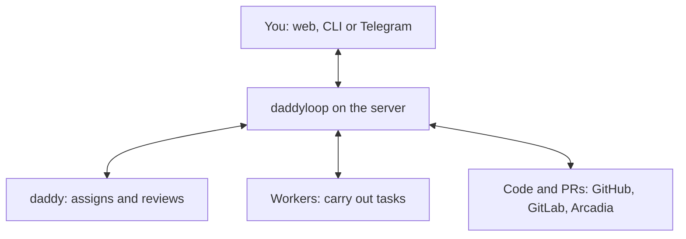

[English](en.md) · [Русский](ru.md) · [All guides](../index/en.md)

# How daddyloop works

## The big picture

daddyloop has two roles: **daddy assigns work and checks the result**, while **workers carry out tasks**. The program on the server starts agents, saves their work and talks to repositories.

You talk to daddy through the website, terminal or Telegram. You can close your laptop: the program and agents keep running on the server.

## How one task goes around the loop

For example, you ask: “Fix search.”

1. daddy defines the task and assigns a worker.
2. The worker fixes the code. The program saves the changes and submits a PR for review.
3. daddy reviews the PR and finds that an empty query still causes an error.
4. The program publishes the finding and sends it back to the worker.
5. The worker fixes it, and daddy checks the new version.
6. Once findings are addressed and required checks pass, the task is ready. The merge decision stays with you.

**The program closes the loop:** it sees a step's result and queues the next one. Fixes need another review; published findings need corrections. You do not have to relay messages between agents.

Submission and comment publication are automatic by default. Manual settings make the program wait for confirmation. If it needs clarification, checks fail or attempts run out, the task stays open.

## A closer look at each part

Open the part you want to understand. Code links are inside each section.

<strong>daddy: how it manages the work</strong>

daddy receives a new request after a user message or a task result. It receives the goal, task list and recent conversation. It can request older messages and detailed reports separately.

daddy uses a set of allowed commands: create a task, assign a worker, read a result or send a follow-up. The program checks each command.

Planning and review use separate conversation histories. This keeps code review apart from work discussion. Tasks in one session share a reviewer, whose reviews run one at a time.

Code: [Daddy](../../src/core/daddy.ts), [commands](../../src/core/daddy-tools.ts).

<strong>The queue: what starts the next step</strong>

When work is needed, the program saves a job in a queue. There are separate queues for daddy's turns and task runs.

About once a second, the scheduler looks for work that has room and resources to run. After a result, it checks what comes next: start a review, pass on findings, wait for tests or stop. This is what keeps the loop moving.

An agent saying “done” ends only its current step. The whole task finishes after review and required checks. An empty queue does not start new model turns.

Code: [Worker — scheduling](../../src/runtime/worker.ts), [Engine — step rules](../../src/core/engine.ts), [Store — queue and data](../../src/core/store.ts).

<strong>Workers: how many run and where they change code</strong>

Each task gets its own working copy. The user's source folder stays in place. Independent tasks can run at the same time.

A worker slot stays occupied until the whole task finishes, including review, fixes and tests. Reducing a pool from three to one lets current tasks finish; new tasks wait for the required room. A pool normally starts with one worker and supports up to eight when resources allow.

A dependency saying “A before B” sets the order of work. It does not copy code between branches. Related changes need one task, or B needs a starting version that already includes A's changes.

Code: [pool](../../src/core/worker-pool.ts), [Git copies](../../src/runtime/workspaces.ts), [Arcadia copies](../../src/runtime/arc-workspaces.ts). Choose folders in [workspaces](../workspaces/en.md).

<strong>Codex and Claude: how different agents connect</strong>

The program gives an agent a task, folder, model settings and allowed commands. It receives a report and a run result in return.

Each engine has an adapter: a module that translates this shared request into commands for its CLI. You can choose Codex or Claude separately for daddy and workers. Models and reasoning levels come from their CLIs.

Settings are copied into a job when it is queued. Later setting changes do not rewrite that waiting job. The next run can resume the agent's saved conversation. Switching from Codex to Claude or back starts a fresh conversation inside that agent.

Code: [adapter selection](../../src/modules/agents/registry.ts), [shared interface](../../src/modules/contracts.ts), [Codex](../../src/modules/agents/codex/runtime.ts), [Claude](../../src/modules/agents/claude/runtime.ts). Developers can follow [Write a module](../module-development/en.md).

<strong>Repositories and comments: what sends changes</strong>

The worker prepares code; the program saves it and creates the PR. An existing PR can go straight to daddy for review.

During review, daddy calls a command such as “add a comment.” The program checks the task and code version, then uses the matching module to contact GitHub, GitLab or Arcadia. The worker receives published findings, without the review's private draft.

Before sending a comment or PR, the program records what it is sending. If the response is lost, it first looks for the result in the repository. This helps avoid a second identical comment or PR. An uncertain outcome stops work for inspection.

Code: [PR creation](../../src/core/ticket-workflow.ts), [comments](../../src/core/broker.ts), [tracking writes](../../src/core/outbox.ts), [repository modules](../../src/modules/repositories/registry.ts).

<strong>Data: what survives between runs</strong>

The program saves conversations, tasks, queues, settings and results in a SQLite database on the server. Working files live separately on disk.

Three things are worth distinguishing:

- **A session** is one conversation with daddy and all its tasks.
- **A task** is one piece of work with its own result.
- **A run** is one agent attempt: write code, review it or fix it.

One task can have many runs. A finished run keeps its history. The next run receives the data it needs from the database and can resume the saved agent conversation.

Code: [Store](../../src/core/store.ts), [data definitions](../../src/core/types.ts). For moving to another host, see [backups](../backups/en.md).

<strong>Stops and errors: why a task may wait</strong>

A review applies to a specific version of the code. Changed code needs another review. After a pause, the program stops accepting results from the cancelled run.

The default limit is three review rounds. Repeated findings or a lack of progress stop the loop and call for a decision. Failing CI — the repository's automated checks — also keeps the task open. It does not itself create another run to repair the failure.

Closing a client leaves work running. Stopping the service interrupts runs while preserving files and history. After startup, daddy can inspect remaining work and continue allowed steps. After a lost connection, it must check what was saved before sending again.

When memory or disk space is low, new runs wait; active ones may be stopped with their changes preserved. Pausing does not remove comments or changes already sent.

Code: [steps and recovery](../../src/core/engine.ts), [limits](../../src/core/types.ts), [resources](../../src/core/resources.ts), [service startup](../../src/ops/service.ts).

<strong>Web, Telegram and the other features</strong>

The website and terminal send commands to the server and read the saved conversation. Telegram uses the same parts of the program; a group topic maps to a session. These clients do not start separate copies of daddyloop.

Other features join the same workflow:

- [Instructions and presets](../instructions/en.md) supply text for daddy and workers; each run gets its saved copy.
- [Limits and CLI updates](../agents/en.md) use agent modules.
- [Voice messages](../voice/en.md) become text before entering the conversation.
- [Backups](../backups/en.md) move saved data and working files; conversations inside the agent CLIs start afresh.

Code: [shared client](../../src/client/daddy.ts), [HTTP commands](../../src/server/daddy.ts), [Telegram](../../src/integrations/telegram-workspace.ts), [application setup](../../src/server/app.ts).

