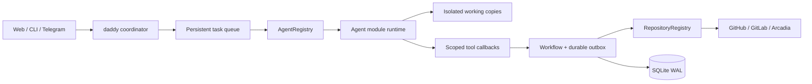

[English](en.md) · [Русский](ru.md) · [All guides](../index/en.md)

# Architecture

daddyloop is a single-user service on one host. The browser, terminal and Telegram send goals to a daddy session. The service owns workflow state and native side effects; models return work and structured outcomes.

## Boundaries

- `core/daddy.ts` plans work, assigns workers, receives reports and presents one conversation.
- `runtime/worker.ts` schedules task turns through the common `AgentRuntime` interface.
- `modules/agents` supplies runtime and catalogue implementations. Routing uses the profile engine; model IDs are opaque.
- `modules/repositories` supplies parsing, matching, ticket import, review and submission behavior. `providers/` contains native review adapters.
- `core/engine.ts` and `ticket-workflow.ts` enforce state transitions, task locks, exact revisions and intent/result separation.
- `runtime/workspaces.ts` and `arc-workspaces.ts` protect source checkouts and prepare isolated copies.
- `core/store.ts` persists tasks, conversations, jobs, decisions, workspace snapshots, worker slots and receipts.
- `client/daddy.ts` owns session selection, per-session drafts, reconnects and request idempotency for browser and terminal.

Module selection is persisted in config. Disabled repositories cannot accept a source or create work; disabled engines cannot receive an agent turn. The composition root registers modules, while the queue and daddy use contracts. [Module development](../modules/en.md) explains extension points.

## Workflow authority

The same daddy profile has separate coordinator and native-review contexts. They are serialized per session. Coordination sees worker reports and published feedback, not private review drafts. Workers receive the published snapshot. Native comment Markdown is kept intact.

Every job freezes its profile and task/session generation. Preparation, callbacks and tool writes recheck the generation. Native review, CI and decisions bind to an exact revision. A paused or replaced session cannot accept a late success. An empty finished review is different from an incomplete review.

Reviews use scoped add/edit/remove/summary/decision tools. Native systems remain the source of truth. GitHub review IDs and GitLab/Arc markers aid recovery; markers do not authenticate an actor. GitLab publishes only owned notes and does not use bulk publication. Ambiguous or partial writes stay unresolved until verified.

The durable outbox records intent separately from a confirmed result. Retrying PR creation first checks for the original native result using identity, repository/branch and marker. Pushes are ordinary pushes; user changes are preserved. No merge tool is exposed. Policy-controlled publication and required checks still gate completion.

## Pools and isolation

`workerLimit` is applied capacity, `requestedWorkerLimit` the target, and `workerTasks` the persisted slot ledger. Assignment happens transactionally with job claim. A task keeps its slot through worker turns, review, fixes, CI, pauses and errors. Only complete idle tasks release it. Shrink applies as occupied slots finish; new tasks cannot claim retiring capacity.

A workspace is a source registry entry. A session pins its defaults. A one-message repository override is saved on that message and job; compatible adjacent input may coalesce. Existing tasks retain their source and working copy. Arc allocation excludes registered/session/task sources and verifies shared-store lease ownership.

## Clients and recovery

A client disconnect does not stop the service. Systemd owns its lifetime and resource cgroup. Graceful shutdown records interrupted turns; restart never invents a completed result. Session handles are bound to engines, and explicit engine changes preserve prior handles as events while opening a new native context.

The browser uses an HttpOnly cookie, CSRF headers and Host/Origin checks. Phone pairing links expire and are single-use. Telegram validates the paired owner, group and topic before processing input. Voice staging is durable and ordered with following text; recognition is a bounded local child process and stale destinations are rejected.

Browser themes are local preferences. Usage reads do not mutate tasks; resets are separately confirmed and idempotent. Current data formats are config 3 / SQLite 7, with no runtime migration or retired command aliases.

Session instruction sets are separate from global model profiles. Daddy and worker/review jobs copy the relevant role's text when enqueued; new instructions do not mutate pending or running jobs. `withInstructions` and `taskSession` compose the shared runtime input for all engines. Skill sources are attribution; the stored text is authoritative for that snapshot and travels in backups. Imports do not execute plugins or grant tools. See [instructions](../instructions/en.md).

## Portable state and provider usage

Agent modules own quota reads and optional resets. The UI receives independent provider readings, including unknown and stale states. Claude uses the Agent SDK with scoped MCP tools and a required command sandbox; API billing observations do not imply a subscription quota. See [module development](../module-development/en.md).

Portable backups require the service lock, preserve SQLite workflow evidence and managed working copies, and restore into a fresh directory. Device/account identity is excluded. Restored incomplete work is paused; native context handles are cleared and workflow state is never promoted to success by recovery. See [backups](../backups/en.md).

Instruction presets are versioned library records stored under `instructions.presets`. Session selections embed their own snapshots and omitted component keys. `effectiveInstructions` combines selected components before queuing; agent adapters receive the frozen role text. Preset edits use revision checks, and library changes never update session copies. Browser folder imports stage selected text files atomically in the client before changing the draft.
