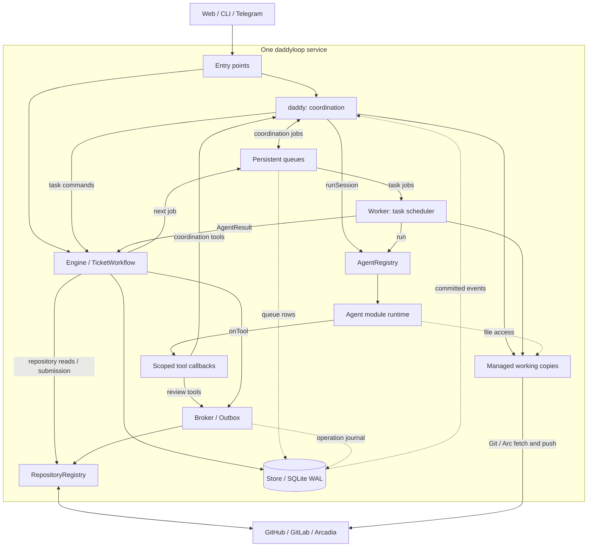
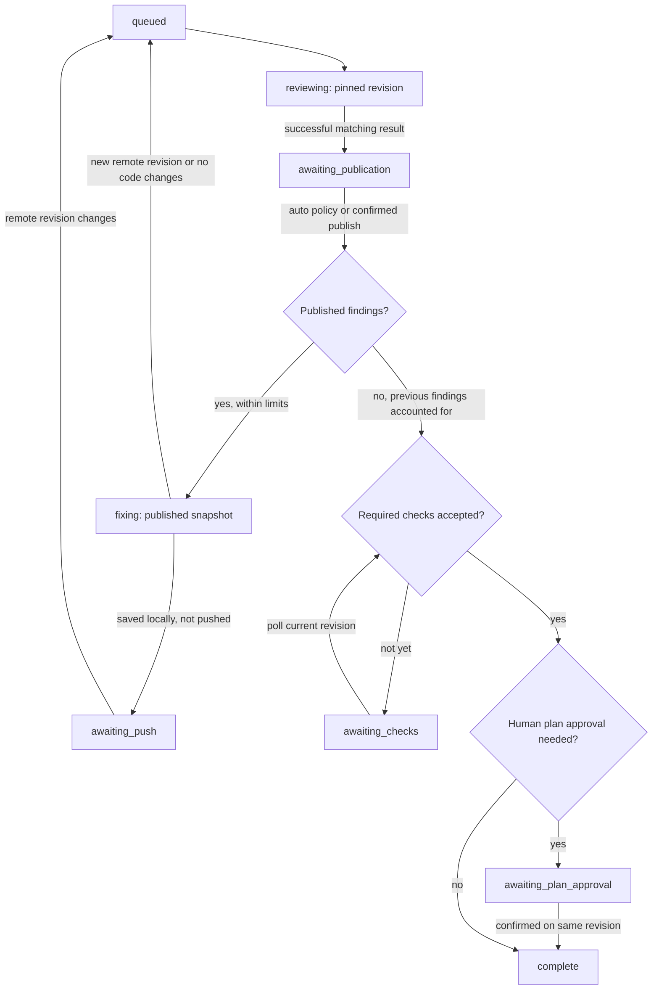
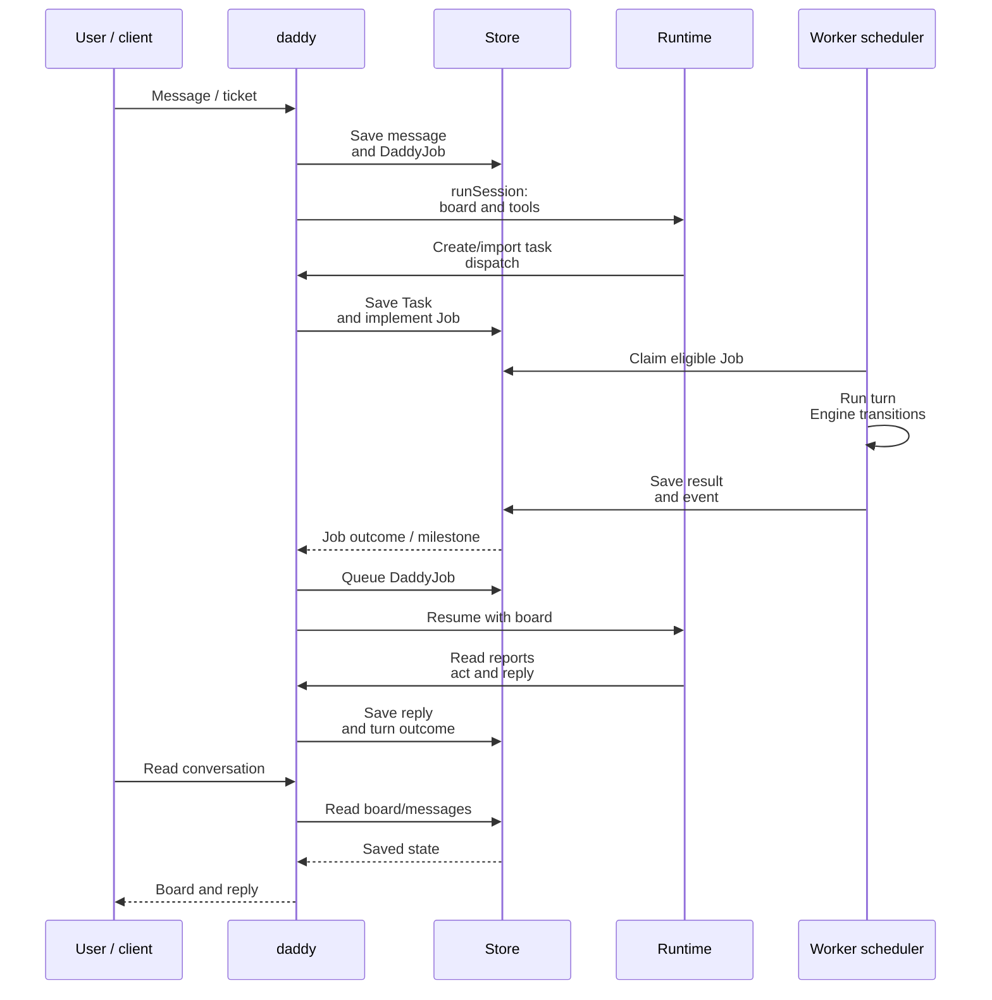

[English](en.md) · [Русский](ru.md) · [All guides](../index/en.md)

# Architecture and the review/fix loop

daddyloop runs one persistent service on one host. A model chooses which tasks to dispatch and reviews code; the service records jobs, enforces permissions, publishes feedback and decides which workflow transition is allowed. **The loop continues because completed jobs and observed repository changes produce the next queued job.** It does not depend on an open browser or a model keeping one endless conversation alive.

There are two connected loops:

- **Coordination:** user input or a worker event → a daddy turn → scoped task commands → worker reports → another daddy turn when needed.
- **A task's review/fix cycle:** pinned PR revision → independent review → publication → worker fixes → another pinned review → completion or an explicit waiting state.

This guide describes the implementation. For installation and commands, start with [the user guides](../index/en.md); for implementing an adapter, see [module development](../module-development/en.md).

## Contents

- [Component graph](#component-graph)
- [Persistent objects and native contexts](#persistent-objects-and-native-contexts)
- [What each component does](#what-each-component-does)
- [From a goal to the first PR](#from-a-goal-to-the-first-pr)
- [How the review/fix cycle advances](#how-the-reviewfix-cycle-advances)
- [How results wake daddy](#how-results-wake-daddy)
- [States and stopping conditions](#states-and-stopping-conditions)
- [Concurrency and worker pools](#concurrency-and-worker-pools)
- [Revision checks, retries and recovery](#revision-checks-retries-and-recovery)
- [Supporting services](#supporting-services)
- [Where to follow the code](#where-to-follow-the-code)

## Component graph



Arrows show the main call/data paths. `Persistent queues` are tables inside `Store`, not a separate message-broker process. Several controllers read and write Store; those connections are abbreviated in the graph. Repository modules select native implementations; review calls use the selected `ReviewProvider` interface. Blocks describe responsibilities, not independent microservices.

The host boundary contains Fastify, controllers, timers and SQLite in one Node process. Codex/Claude execution and local speech recognition use child processes. [ServiceManager](../../src/ops/service.ts) installs systemd ownership, logout persistence, a memory limit and process-group shutdown. The CLI's [serve entry point](../../src/cli.ts#L79) holds `server.lock` for the data directory.

## Persistent objects and native contexts

The definitions are in [core/types.ts](../../src/core/types.ts), with persistence in [Store](../../src/core/store.ts).

| Object                            | Meaning and lifetime                                                                                                                                                               |
| --------------------------------- | ---------------------------------------------------------------------------------------------------------------------------------------------------------------------------------- |
| `Workspace`                       | A named source repository, base and optional subdirectory on this host. It is a place to work, not a task.                                                                         |
| `ReviewGroup`                     | One daddy conversation: requirements, workspace snapshot, daddy/worker profiles, pool settings and task IDs. User-facing sessions have `orchestrated: true`.                       |
| `Task`                            | One work item. It begins as a ticket/local requirement or an attached PR. It owns state, policy, revision, review evidence and working-copy references.                            |
| `Job`                             | One queued task turn: `implement`, `review`, `fix` or `chat`. It freezes the configured profile, role instructions and generation.                                                 |
| `DaddyJob`                        | One coordination turn, triggered by `user`, `worker` or `recovery`, with its own profile, instruction and workspace snapshot.                                                      |
| `ReviewHandle` / `ReviewSnapshot` | Native review identity plus a read of its Markdown, comments, publication status and revision. A cached snapshot is evidence to recheck, not authority over the provider.          |
| `Decision` / `operations`         | Decisions about findings and the journal of side-effect intent/results. They survive individual model turns.                                                                       |
| `messages` / `events`             | Saved conversation/report text and an ordered history of workflow activity. Current state also lives in task/group rows; recovery does not rebuild everything by replaying events. |

One session normally has **two daddy contexts**: `daddyThreadId` for coordination and `reviewerThreadId` for native review. They use the same daddy profile, but have different tool sets and histories. The native reviewer context is shared across the session's child tasks; each turn is scoped to one child. Each worker task keeps its own `authorThreadId`.

The internal `Job.role` names are `author` (the task worker) and `reviewer` (daddy's review role). They are not extra user-facing agents. A persisted native context does not mean a CLI process stays alive between turns: the adapter can start a new process and resume the saved context ID.

## What each component does

### Web, CLI and Telegram

The browser and Ink terminal use [DaddyClient](../../src/client/daddy.ts): selected session, separate drafts, request IDs and board refreshes. It polls approximately every two seconds; stopping the client cancels its requests and refresh timer. It does not pause the service's tasks.

[Telegram](../../src/integrations/telegram.ts) is another transport to the same controllers. [TelegramWorkspace](../../src/integrations/telegram-workspace.ts) maps a paired owner's private chat or forum topic to a daddy session. The user sends instructions to daddy; worker reports are exposed for inspection, with explicit workflow actions where appropriate.

### Entry points

[server/app.ts](../../src/server/app.ts#L79) is the composition root: it loads configuration, opens Store, registers enabled agent/repository modules and constructs Engine, TicketWorkflow, Worker and Daddy. It also starts/stops background services.

[server/daddy.ts](../../src/server/daddy.ts) validates HTTP inputs and dispatches session/workspace actions. HTTP access checks, cookies, CSRF and Host/Origin checks live in [server/access.ts](../../src/server/access.ts) and app setup. Telegram checks its own paired-owner/topic identity. A request for a session is acknowledged after it has been recorded; it does not wait for the model to finish.

### daddy: the coordination controller

[Daddy](../../src/core/daddy.ts) stores the user's message, enqueues a `DaddyJob`, claims it when eligible and builds the coordination context. That context contains the selected workspace, requirements, task board, capacity and recent conversation. Older messages and detailed worker reports can be read through tools.

The model receives [daddy tools](../../src/core/daddy-tools.ts), such as `create_task`, `import_ticket`, `dispatch`, `read_task` and `message_worker`. Their implementation in `Daddy.call` checks the current session/generation, task ownership, dependencies and policy. Mutating calls need a stable call ID and use Outbox. The model chooses actions; the controller validates and executes them.

Coordination's `read_task` exposes worker messages and published review content. For a private review it returns status/finished metadata rather than the draft or private reviewer conversation. This is how one user-facing daddy keeps independent review separate from coordination.

### Persistent queues

[Store.enqueue / Store.claim](../../src/core/store.ts#L137) manage `jobs`; `Daddy.enqueue / tick` manage `daddy_jobs`. A job contains its input, status, profile, frozen instructions and generation. A `notBefore` timestamp supports delayed retries, such as waiting for a workspace lease.

Claiming a task job happens in a `BEGIN IMMEDIATE` transaction. The scheduler tests eligibility, reserves its logical worker slot and marks the job running together. A unique index prevents two running jobs for the same task. Stale generations are cancelled instead of being executed. There is no Redis/Celery-style external queue in this implementation.

### Worker: the task scheduler

The class [Worker](../../src/runtime/worker.ts#L62) schedules **both worker and native-review turns**; it is not itself a model worker. Its roughly one-second tick checks resources, reconciles repository state periodically, submits ready tickets, starts queued reviews, publishes finished automatic reviews, reconciles pool slots and claims eligible jobs.

`Worker.run` prepares the working copy, builds context, invokes `AgentRegistry.run`, captures native IDs/events and hands the result to `Engine.completeJob`. After a successful implementation/fix it also asks Workspaces to save commits and apply push policy. Failed or interrupted work retains its files and becomes an explicit task/job state.

### AgentRegistry

[AgentRegistry](../../src/modules/agents/registry.ts) routes `run` and `runSession` by `profile.engine`. It does not infer the provider from a model name. The catalogue validates model/effort choices through the chosen adapter; disabled engines and missing profiles are rejected.

Native context IDs are stored as `engine:native-id`. The registry unwraps them only for the matching engine and wraps IDs reported through `onSession`. Changing engines starts a new native context rather than trying to resume a foreign one. The registry also exposes the optional usage and CLI-management capabilities consumed by supporting services. Modules are trusted application code; their implementations must enforce the runtime contract.

### Agent module runtime

A runtime translates the common [AgentInput / SessionInput](../../src/runtime/agent.ts) into its provider's protocol: working directory, profile, instructions, tools, cancellation and a required `AgentResult`.

[Codex](../../src/modules/agents/codex/runtime.ts) uses an app-server JSON-RPC connection over stdio, starts/resumes a thread, then starts a turn. [Claude](../../src/modules/agents/claude/runtime.ts) uses the official Agent SDK and an in-process MCP server for the supplied tools. Adapters configure native filesystem/command sandboxes and restrict native delegation; daddyloop owns worker allocation.

The result reports `completed`, `needs_input` or `incomplete`, a summary, the starting `checkedHead`, and verified/disputed comment IDs. **`AgentResult.status = completed` means the requested turn finished.** Engine still decides whether its evidence can advance the task; even a completed `Job` can leave the task waiting for input.

### Managed working copies

[WorkspaceRegistry](../../src/core/workspace-registry.ts) validates source paths and registered defaults. [Workspaces](../../src/runtime/workspaces.ts) prepares actual copies and owns commit/push operations. [DaddyWorkspace](../../src/runtime/daddy-workspace.ts) prepares the coordinator's private read-only repository context; it is not a user work item.

For Git, each task gets an owned directory under `dataDir/workspaces/<task-id>/`, a private `objects.git`, a persistent worker checkout and revision-specific reviewer worktrees. A ticket worker uses its managed branch; the reviewer gets the pinned revision. Dirty or divergent worker copies are preserved, not force-reset. GitHub and GitLab share this Git machinery.

Arcadia uses [ArcWorkspaces](../../src/runtime/arc-workspaces.ts) and leases from [ArcBridge](../../src/integrations/arcadia.ts). Allocation verifies ownership/object-store suitability and excludes source/user-reserved mounts. A lack of capacity delays a job; an unverified lease or unsaved work is preserved for inspection. `scope` chooses a subdirectory inside the managed copy, without switching the user's source checkout.

### Scoped tool callbacks

The runtime does not give a model a direct Engine or repository-client reference. It reports a tool name, arguments and call ID through `onTool`. Coordination calls enter `Daddy.call`; task review calls enter `Broker.call`. The receiving controller validates the input schema and role before executing the action.

The fixed job/session context supplies the authorized task. Models cannot pick another session's task by changing an argument. A worker can read published feedback and record acceptance/dispute; only the review role can edit native draft comments. Publication, CI waivers and plan approval are separate controller actions, not unrestricted model tools. See [Broker schemas and role checks](../../src/core/broker.ts#L17).

### Engine and TicketWorkflow

[Engine](../../src/core/engine.ts) implements task state transitions under per-task asynchronous locks. It checks generations, live PR revisions, review completion, publication, findings and policy. Its important paths are `review`, `completeJob`, `reconcile`, `publish` and `finish`. It enqueues the next task turn after the corresponding conditions are satisfied.

[TicketWorkflow](../../src/core/ticket-workflow.ts) handles the part before a PR exists: import a ticket or local requirement, describe the selected repository, and submit the saved implementation. It delegates native submission to a repository module, journals PR creation through Outbox, then asks `Engine.linkPR` to attach the resulting PR at the expected head. Existing PRs enter Engine directly and skip implementation/submission setup.

### Broker and Outbox

[Broker](../../src/core/broker.ts) turns review tools into native review operations. It rereads the current review, checks the live revision and draft status, validates comment ownership/location and preserves Markdown. A stable marker identifies the task/review/comment across retries. `Broker.publish` is invoked by workflow policy or a confirmed user action after a successful review.

[Outbox](../../src/core/outbox.ts) journals operations in SQLite. For a new key it saves `pending` and the argument hash **before** attempting the side effect, then saves the confirmed result as `done`. A repeated key with the same input returns the saved result; changed input is an idempotency conflict. A pending operation invokes its operation-specific recovery function. If native evidence cannot confirm the result, it stops with `ambiguous_write`.

Outbox has no generic background pump that blindly resends pending writes. The workflow calls it again when retrying/reconciling a step. This protects native comment creation, edits, publication, PR creation and mutating coordination tools; Git pushes separately use ordinary non-force semantics.

### RepositoryRegistry

[RepositoryRegistry](../../src/modules/repositories/registry.ts) selects an enabled [RepositoryModule](../../src/modules/contracts.ts): ticket/PR parsing, repository matching, review provider, submission backend and optional working-copy export.

The [ReviewProvider interface](../../src/providers/provider.ts) exposes reads of PR/review state and native draft/comment/publication operations. Provider implementations live in [providers](../../src/providers/). Submission uses `owner`, `prepare`, `create` and `find`. The generic workflow retains scheduling, policy and revision checks; platform-specific API/Arc details remain behind these interfaces.

### GitHub, GitLab and Arcadia

These systems own remote revision, native comments, publication and CI facts. Store keeps references and snapshots and rereads them before important transitions. A human can change the PR outside daddyloop; the next reconciliation must account for that change.

Native semantics differ: GitHub review objects, GitLab notes/discussions and Arcadia review state are mapped into the common contract. For example, GitLab publishes only tracked owned notes instead of a broad bulk publication. Markers help locate operations, but are not a substitute for native actor/ownership checks.

### Store / SQLite WAL

[Store](../../src/core/store.ts#L25) persists task/group JSON plus indexed job status, messages, events, decisions, operation receipts, workspaces and settings. SQLite uses WAL, `synchronous=FULL`, a busy timeout and transactional claims. Native files/working copies live on disk, not inside the JSON rows.

Committed events notify the in-process `EventEmitter`; transactional notifications are queued only after COMMIT. These wake daddy and feed client notifications. Event delivery itself is not a durable message bus: task/job rows survive a process crash, and startup reconciliation handles interrupted work. Current formats are configuration 3 and SQLite schema 7.

## From a goal to the first PR

For an orchestrated session, the initial path is:

1. The entry point resolves the workspace and records a `ReviewGroup`, user message and `DaddyJob`. A request ID prevents a client retry from creating another session/message.
2. `Daddy.tick` claims the coordination turn. The runtime receives the board and scoped tools in a read-only repository context.
3. Daddy imports a GitHub issue/Tracker ticket or creates a local task. `TicketWorkflow` saves its source, requirements and repository/base snapshot. The task starts `discussing`; importing it does not start implementation in an orchestrated session.
4. Daddy calls `dispatch`. The controller validates prerequisites and `Engine.implement` queues an `implement` job. Actual slot admission happens when Worker claims it.
5. The worker edits/tests its managed copy. On a completed result for the expected starting head, the service commits the implementation. A new local commit moves the task to `ready_for_review`; no new committed change requires input.
6. With `autoPush: true`, Worker calls `TicketWorkflow.submit`. The repository backend prepares/pushes the branch and creates or recovers the PR. `Engine.linkPR` verifies the repository and submitted head, then moves the task to `queued` for review. Manual policy waits for the explicit submit action.

Attaching an existing PR starts at step 6's `queued` state. The core cycle below is the same for both entry paths.

## How the review/fix cycle advances

The task scheduler's shape is approximately this; the source is [Worker.tick](../../src/runtime/worker.ts#L62):

```text
every ~1 second:
    check resources; interrupt active work if necessary
    every ~15 seconds: reconcile active PR/review/check state
    submit eligible completed ticket implementations
    start review for idle tasks in queued
    publish idle completed reviews with automatic publication
    apply pool resize / release completed task slots
    claim and run eligible jobs while capacity and resources allow

when a task runtime returns:
    save implementation/fix through Workspaces when applicable
    Engine.completeJob(job, result)
    persist final job status and emit its event
```

The crucial return path is **`completeJob → task state → the next tick/reconcile → enqueue → claim`**. The correction cycle can continue without another coordination turn: Engine and Worker already know how to process a published review and a new revision.



This is the successful path; failure, stale-revision and pause branches are listed below. In particular, an incomplete review never enters this publication/fix path.

### One concrete pass through two revisions

`H1` and `H2` below stand for real commit hashes; `R1` denotes the comment ID returned by the provider, not the `add_comment` tool’s `key` argument. Assume a code PR, automatic publication/push and passing CI on the final revision.

| Step                   | What actually happens                                                                                                                                                                                                                                                  |
| ---------------------- | ---------------------------------------------------------------------------------------------------------------------------------------------------------------------------------------------------------------------------------------------------------------------- |
| Review `H1`            | `Engine.review` pins the full revision, increments the round, creates/recovers the native draft and enqueues `Job(kind=review, role=reviewer)`.                                                                                                                        |
| Finding `R1`           | The runtime calls `add_comment`. Broker/Outbox create the actual native draft comment and retain its ID and complete Markdown.                                                                                                                                         |
| Finish the review turn | The runtime returns `completed`, `checkedHead=H1`. `Engine.completeJob` rereads the PR/draft and records `reviewFinished=true`, `awaiting_publication`. A summary alone does not publish it.                                                                           |
| Release feedback       | Worker applies automatic publication. Engine/Broker verify `H1` again, publish, then reread the native published snapshot. `Engine.reconcile` queues a `fix` job containing access to that feedback.                                                                   |
| Fix                    | The worker receives published `R1` and recorded decisions, edits/tests its copy and returns a result against starting head `H1`. Before running it, Worker rereads the native review and requires published status.                                                    |
| Save `H2`              | Workspaces commits and ordinarily pushes. `pendingAuthorHead` records the saved commit. `Engine.completeJob` reads the remote PR and queues another review when the revision has changed.                                                                              |
| Verify `H2`            | A new review is bound to `H2`; the shared reviewer resumes its context but rereads this child's revision and previous findings. It reports `R1` in `verifiedCommentIds`, or records an allowed decision about it.                                                      |
| Finish                 | A successfully completed empty review is published. With prior findings accounted for, current-revision checks accepted and any required plan approval present, `Engine.finish` sets the task to `complete`. Its event wakes daddy to report or schedule further work. |

An empty draft is not automatically a clean result. Before accepting an empty completed review, Engine checks that previous published comment IDs have been verified or have an applicable recorded disposition. A worker can dispute a finding, but cannot verify its own correction. See [Engine.completeJob](../../src/core/engine.ts#L399).

## How results wake daddy

[Daddy.onEvent](../../src/core/daddy.ts#L371) listens for task `job.completed`, `job.failed`, `ticket.imported` and selected `task.state` milestones (`complete`, `awaiting_push`, `awaiting_plan_approval`). It only enqueues follow-up coordination for an active orchestrated group. Importing a task inside an already-running daddy action avoids a redundant wake-up.



This sequence abbreviates adapter and native-review calls, which belong to the task cycle above. Events prompt reevaluation; they do not grant permission to skip review, publication or dependencies.

Queued coordination events may coalesce when workspace and frozen instructions match. A user message resets the automatic-turn counter. A follow-up model can read worker reports, dispatch another ready task, retry permitted unfinished work or ask a concrete question. It does not run merely because the client refreshes the board. With no queued work or new relevant event, scheduler ticks do not start a model turn.

## States and stopping conditions

There are three separate state machines: group `daddyState`, task `state` and job `status`. For example, a group can remain active while one child waits for input, and a completed job can leave its task in `awaiting_publication`.

Group states are `active`, `needs_input`, `paused` and `archived`; coordination admission requires `active`. A user message can reactivate `needs_input`, while pausing a session explicitly pauses its unfinished child tasks. Jobs normally move `queued → running → completed`, with `failed` and `cancelled` outcomes; a workspace-capacity wait returns a job to `queued`. Job completion is therefore distinct from both the group and task state.

| Task state               | Meaning and next trigger                                                                                                              |
| ------------------------ | ------------------------------------------------------------------------------------------------------------------------------------- |
| `discussing`             | Ticket/requirements saved; daddy can clarify or dispatch implementation.                                                              |
| `implementing`           | An implementation job is queued/running; its validated saved result moves to `ready_for_review`.                                      |
| `ready_for_review`       | Local implementation exists; automatic policy or explicit submission creates/connects its PR.                                         |
| `submitting`             | Native PR submission is in progress; success links the PR, uncertainty requires reconciliation.                                       |
| `queued`                 | PR revision is ready for an independent review. Worker initiates it when the task is idle.                                            |
| `reviewing`              | The native review is being produced; successful matching completion releases the publication gate.                                    |
| `awaiting_publication`   | A completed native draft awaits automatic or explicit publication.                                                                    |
| `fixing`                 | Worker corrects a published feedback snapshot; completion leads to push waiting or another review.                                    |
| `awaiting_push`          | Local changes await a new remote PR revision; repository polling detects it.                                                          |
| `awaiting_checks`        | Required CI is missing, pending or failing; polling rereads the current revision's checks.                                            |
| `awaiting_plan_approval` | A reviewed plan awaits explicit approval for that revision. This does not apply to every code task.                                   |
| `needs_input`            | A failed/incomplete turn, dispute, uncertain write, stale evidence or budget limit needs inspection and a permitted follow-up action. |
| `paused`                 | Explicitly stopped; generation changes invalidate old work. Resume inspects the saved phase.                                          |
| `complete`               | The reviewed revision has satisfied the workflow gates. The PR may still be open.                                                     |

Default [Policy](../../src/core/types.ts#L17) is automatic publication and push, required CI, human approval for plan tasks, at most **3 review rounds**, and `maxNoProgress=2`. Repeated published comment bodies/locations, excluding service markers, increment `noProgress`; a different set resets it. These are stop limits, not a guarantee the model will fix every issue within that budget. Engine checks workflow evidence; it cannot prove that a model found every defect.

Coordination has separate bounds: at most **24 tool calls per turn**, and it moves to `needs_input` after **8 automatic turns without a change in the task ID/state/head fingerprint**. User input or observed task progress resets that counter. Workspace-capacity waits are requeued with about a **30-second** delay.

Failing CI keeps a task in `awaiting_checks`; the polling loop does not itself synthesize a CI-repair job. Further work needs a permitted coordination/user action. A check waiver requires an explicit reason and matching revision. There is no merge tool: **completion of this loop is not a GitHub/GitLab/Arcadia merge**.

## Concurrency and worker pools

A pool slot represents an assigned **whole task**, not a JavaScript thread or a continuously running CLI process. The slot survives implementation, review, fixes, CI, pauses and waiting for input. Assignment happens when an author-role job is claimed; a native-review turn alone does not allocate a worker slot. [worker-pool.ts](../../src/core/worker-pool.ts) releases it only when the task is complete and has no queued/running jobs.

For a requested shrink `3 → 1`, `requestedWorkerLimit` becomes 1 immediately, while `workerLimit` remains at least the occupied count. Existing tasks keep their slots. No new task can take a retiring slot. As tasks finish, the scheduler reduces applied capacity until it reaches 1. Growth also takes effect on a scheduler tick; a newer request replaces an earlier target.

Three other controls matter:

- `Store.claim` and its unique index allow one running task job per task. Dependencies gate dispatch/claim; waiting jobs are skipped so eligible independent jobs can run.
- Native reviewer jobs in one group are serialized. `Worker.reserveGroup` also makes that group's native review and coordination mutually exclusive, despite their separate native contexts. Worker coding turns can overlap them when capacity permits.
- `worker.maxAgents` limits simultaneous task-runtime calls, including reviews. Pool requests can raise that setting, capped at eight. Current `Daddy.tick` runs at most one coordination turn globally, separately from this task-runtime counter. Resource checks and the systemd cgroup constrain their combined consumption.

Prerequisites order tasks; they **do not merge worker branches**. A dependent task does not automatically receive another task's unmerged changes. Interdependent edits need a shared task or a base that already contains the prerequisite work. See [pool tests](../../tests/daddy.test.ts) and [shared-reviewer tests](../../tests/agent-groups.test.ts).

## Revision checks, retries and recovery

### Evidence belongs to a revision and a generation

A [Revision](../../src/core/types.ts) includes `head`, `base`, `start` and optional native `revisionId`; `sameRevision` compares all of them. `Job.generation` binds it to the current task attempt, and review jobs also retain `groupGeneration`. Pause, invalidation and relevant model changes make old callbacks/results ineligible.

Checks occur after asynchronous workspace preparation, before scoped writes, when native IDs are saved, when a runtime result is accepted and again before publication/approval. If the remote PR changes during an unfinished draft, Engine preserves the native evidence and asks for inspection. With an already published review, a new revision can enter the next review. Passing CI or an approval for an older revision is not reused after invalidation. Cancellation cannot undo an external request already sent; its outcome still needs reconciliation.

### Intent and result are different records

Suppose creating a comment succeeds remotely but the response is lost. The operation stays `pending`. A retry reads the same native review and finds the tracked comment, then stores its result as `done`; it does not create another copy. If it cannot establish the outcome, automatic replay stops. This is conservative reconciliation, not a distributed exactly-once guarantee. See [Outbox tests](../../tests/outbox.test.ts).

Client request IDs, coordination call IDs, native markers and revision guards solve different problems: duplicate requests, duplicate actions, locating native effects and rejecting stale work. A marker alone does not authenticate its author or prove the reviewed revision is current.

### What happens after disconnection or restart

| Event                                            | Behavior                                                                                                                                                                                                     |
| ------------------------------------------------ | ------------------------------------------------------------------------------------------------------------------------------------------------------------------------------------------------------------ |
| Browser/CLI closes or SSH tunnel drops           | Server loops continue. A reconnect rereads saved state; clients do not own agent lifetimes.                                                                                                                  |
| Resource threshold is crossed                    | New runs stop; active work can be interrupted, with copies/results preserved and generations invalidated. Safe cache cleanup is a separate operation.                                                        |
| Service stops during a task run                  | Worker aborts it and records interruption. On startup, unfinished running jobs are failed/reconciled, not marked successful.                                                                                 |
| Service restarts with an active daddy session    | `Daddy.start` can enqueue recovery coordination to inspect the board, saved results and submission intent. It may resume permitted work; ambiguous effects and approval gates still stop automatic progress. |
| Workspace capacity is temporarily exhausted      | The job stays queued with `notBefore`; another task's mount is not taken over.                                                                                                                               |
| Native review was deleted or partially published | Reconciliation stops for inspection; it does not release an incomplete feedback snapshot to a worker.                                                                                                        |
| Portable backup is restored elsewhere            | Conversations and workflow evidence return; unfinished work is paused and native context handles are cleared. Resume starts from saved task material after account/workspace setup.                          |

Startup/task recovery lives in [Engine.recoverInterruptedJobs](../../src/core/engine.ts#L677), [Daddy.start](../../src/core/daddy.ts#L396) and service shutdown hooks. [Backup behavior](../backups/en.md) is deliberately separate from resuming a native CLI context on the same host.

## Supporting services

These features use the same state and adapter boundaries without becoming another owner of the review/fix cycle.

| Component                                                                                                             | Responsibility and connection                                                                                                                                                                          |
| --------------------------------------------------------------------------------------------------------------------- | ------------------------------------------------------------------------------------------------------------------------------------------------------------------------------------------------------ |
| [Instruction presets](../../src/core/instruction-presets.ts) and [composition](../../src/core/instruction-compose.ts) | Versioned library → session copies with selected components → effective role text frozen in jobs. Imports preserve text/source/checksum; they do not install arbitrary executables or grant new tools. |
| [ModuleUsage](../../src/modules/agents/usage.ts)                                                                      | Aggregates provider-reported quota data and routes optional confirmed resets. Unknown/stale data stays labelled. Readings do not themselves authorize workflow transitions.                            |
| [UpdateMonitor](../../src/core/updates.ts) / [RuntimeUpdaters](../../src/core/runtime-updater.ts)                     | Discover versions through `AgentCli`, validate packages/catalogues and switch configured executables per engine. Each running turn keeps its captured executable.                                      |
| [VoiceInbox](../../src/integrations/voice-inbox.ts) / [LocalSpeech](../../src/runtime/speech.ts)                      | Durable voice/text staging, bounded local recognition and delivery into the captured session. Transcripts recheck destination/generation; following text keeps its order.                              |
| [Resources](../../src/core/resources.ts) / [CacheManager](../../src/ops/cache.ts)                                     | Check host/cgroup RAM and disk; identify and prune only eligible application-owned artifacts. They do not erase another working copy to make a run fit.                                                |
| [Access](../../src/server/access.ts) / Telegram pairing                                                               | Validate the single user's requests, expiring device links and topic ownership before controller actions.                                                                                              |
| [Backup implementation](../../src/ops/backup/)                                                                        | Takes a locked snapshot of database evidence and owned working data, excludes account/device credentials, and restores into a fresh directory.                                                         |

## Where to follow the code

For one end-to-end trace, read in this order:

1. [HTTP session creation/chat](../../src/server/daddy.ts) → [Daddy.chat/enqueue](../../src/core/daddy.ts#L205).
2. [Daddy.tick/run](../../src/core/daddy.ts#L438) → [coordination tool definitions](../../src/core/daddy-tools.ts) → [Daddy.call](../../src/core/daddy.ts#L624).
3. [TicketWorkflow](../../src/core/ticket-workflow.ts) → [Engine.implement](../../src/core/engine.ts#L962) → [Store.claim](../../src/core/store.ts#L181).
4. [Worker.run](../../src/runtime/worker.ts#L248) → [AgentRegistry](../../src/modules/agents/registry.ts) → the selected module runtime.
5. [Engine.completeJob](../../src/core/engine.ts#L399) → [publish/reconcile/finish](../../src/core/engine.ts#L235) → [Broker/Outbox](../../src/core/broker.ts).
6. [Daddy.onEvent](../../src/core/daddy.ts#L371) closes the coordination feedback path.

Executable examples: [full automatic/manual review cycles](../../tests/worker.test.ts), [transition edge cases](../../tests/engine.test.ts), [ticket submission](../../tests/tickets.test.ts), [coordination privacy](../../tests/daddy-privacy.test.ts), [frozen instructions](../../tests/instructions.test.ts), [native protocol](../../tests/protocol.test.ts) and [backup restoration](../../tests/backup.test.ts).
