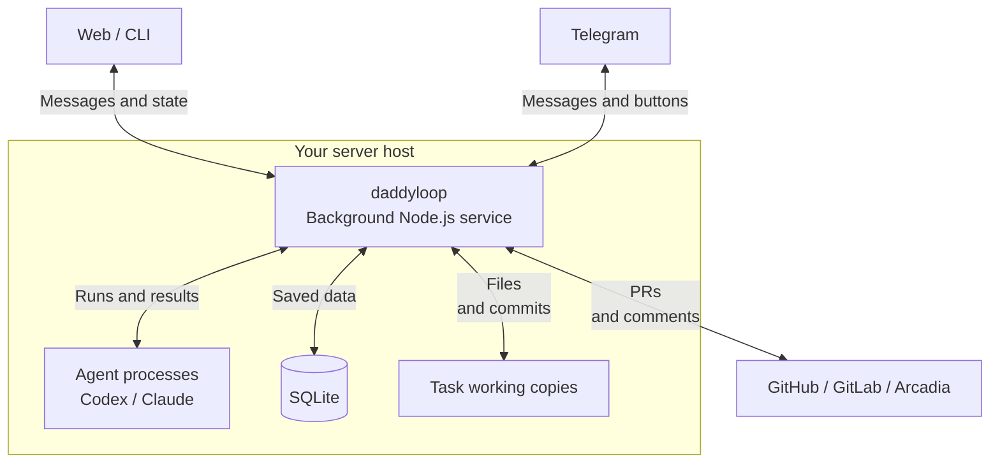
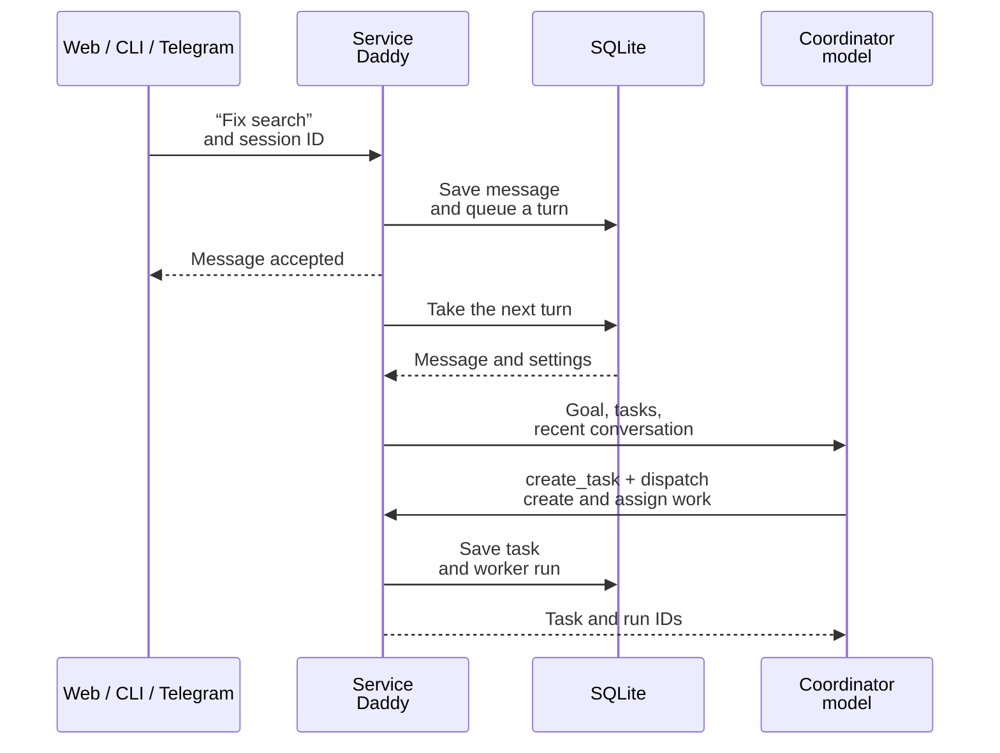
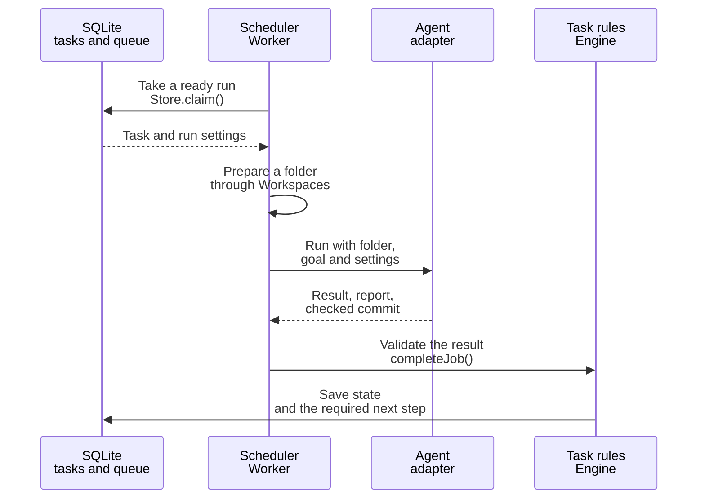
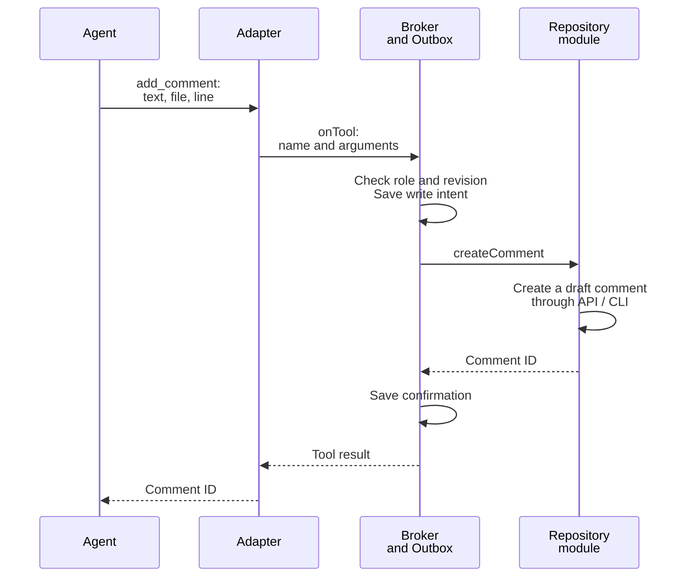
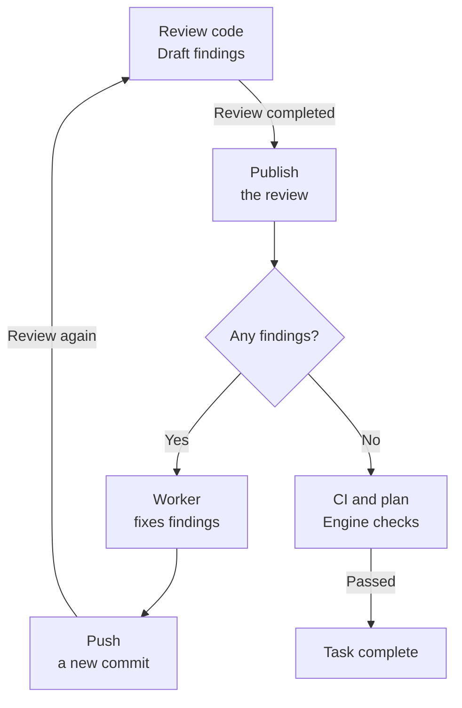
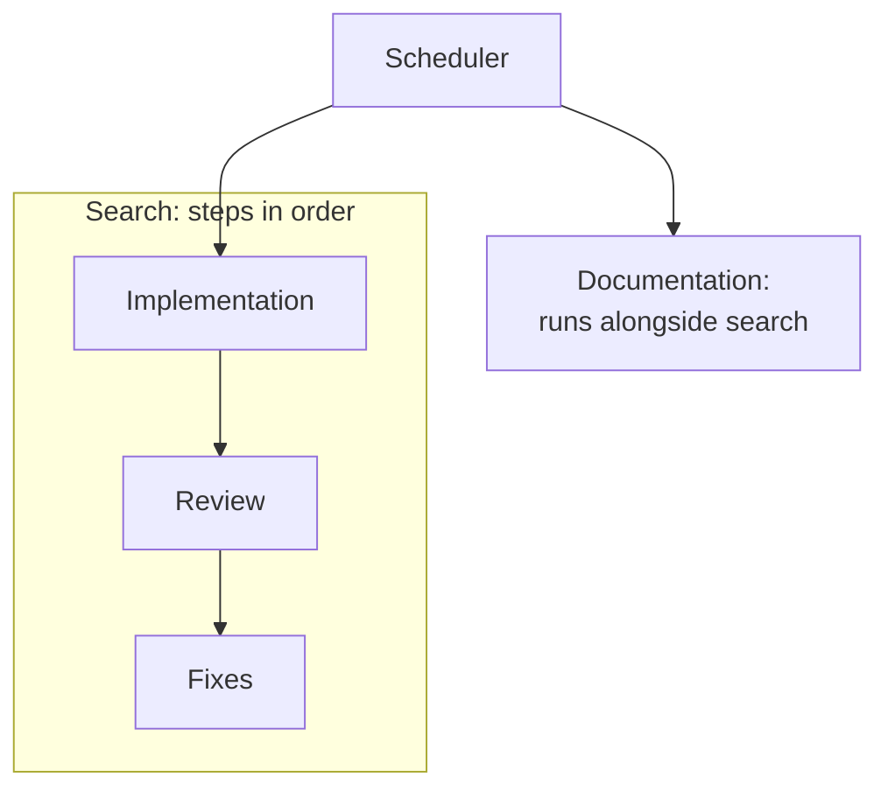
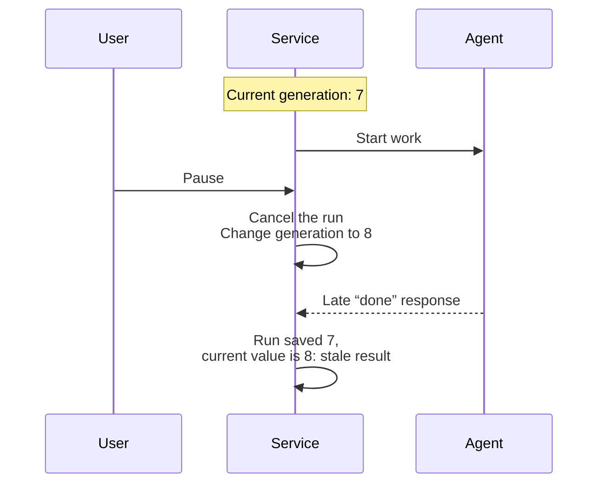

[English](en.md) · [Русский](ru.md) · [All guides](../index/en.md)

# How daddyloop works

Start with the overview, then follow [task creation](#1-how-a-message-becomes-a-task), [agent execution](#2-how-an-agent-starts), [tools and adapters](#3-how-an-agent-calls-tools), [the review loop](#4-how-the-review-loop-closes), [parallel work](#5-which-runs-can-work-in-parallel) and [cancellation and recovery](#6-how-cancellation-blocks-old-results).

## The big picture

You set the goal. daddy assigns work to workers and reviews the result. The application starts agents, saves history and sends findings back for correction.

For example, “Fix search” goes through implementation → review → fixes → another check. Below, we follow that task from the first message to the result.



**The website, CLI and Telegram control one service on the server.** Closing your laptop leaves the service and agents running. Connection options are covered in [web access](../web/en.md).

Inside the service, `Daddy`, `Worker`, `Engine` and the other components are objects in one Node.js process. They call each other's methods. Codex and Claude run as separate processes; adapters handle their protocols.

## 1. How a message becomes a task

The service saves the message first. It then starts one coordinator turn: a model run that handles the request. The model can answer you or assign work.



The website and CLI send text over HTTP. For Telegram, the service receives a message through the Bot API and calls the same `Daddy.chat()`. “Accepted” means the request is saved. The model's answer arrives later; the web client fetches updates about every two seconds.

The coordinator receives the goal, task board and recent messages. It uses tools to read older conversation or task details. For example, `create_task` creates “Fix search” and `dispatch` assigns implementation. The service first checks the selected workspace, the task's session and its dependencies.

When a worker finishes, an event queues another coordinator turn. That is how it learns about the result and can assign more work or ask you a question.

Code: [HTTP request handling](../../src/server/daddy.ts), [Daddy.chat(), tick(), onEvent() and tool checks](../../src/core/daddy.ts), [tasks from text and tickets](../../src/core/ticket-workflow.ts).

## 2. How an agent starts

A **session** is a conversation with daddy and all its tasks. A **task** is one result, such as working search. A **run** is one step: implement it, review it or address findings. One task can have many runs.

The scheduler finds a ready run in the queue, checks capacity and resources, then prepares a folder and calls the agent. This scheduler is named `Worker` in code; it starts models for both roles.



**Folder.** A named workspace points to the source repository and allowed scope. `Workspaces` prepares separate task copies; `ArcWorkspaces` handles Arcadia. In automatic mode the repository module prepares a session copy before the first model turn, then allocates workers their own copies. A worker changes its own copy, while the reviewer reads a pinned code version. Coordination has its own `DaddyWorkspace` copy. The user's source checkout is not switched, and uncommitted changes are preserved.

**Settings.** The agent profile and instructions are saved with the queued run. Changing the default model later leaves that waiting run's settings intact. `AgentRegistry` selects the adapter by `profile.engine`; individual model names do not control scheduler behavior.

**Result.** The agent returns a status, report and the commit it worked against. `Engine` checks these against the task and repository. A “done” message is insufficient: an unfinished review, for example, leaves the task open.

The saved objects are `ReviewGroup` (session), `Task` (task), `Job` (task run) and `DaddyJob` (coordinator turn).

Code: [Worker](../../src/runtime/worker.ts), [Store](../../src/core/store.ts), [data types](../../src/core/types.ts), [Git copies](../../src/runtime/workspaces.ts), [Arc copies](../../src/runtime/arc-workspaces.ts), [coordinator copy](../../src/runtime/daddy-workspace.ts).

## 3. How an agent calls tools

Suppose the reviewer finds a bug and wants to leave a comment. It sends the application a command with the text and code location. This is the command's path:



`Broker` checks that the run is still valid, the code is unchanged and the role may call this command. A worker cannot create review comments or verify its own fix. The response — a comment ID or an error — returns to the agent through the same path. Comment Markdown is preserved.

`Outbox` handles lost responses. **If the provider creates a comment and the connection breaks, creating another comment immediately would be wrong.** The service records the operation ID and arguments before writing, then looks for an existing result. If it cannot establish the outcome, it stops the retry for inspection.

The adapter translates this shared exchange into the selected CLI's protocol. For Codex, JSON requests and responses travel through the process's standard input and output: app-server JSON-RPC. Claude uses Agent SDK `query()` and MCP tools. The rest of the application receives the same calls and results.

The common runtime interface from [runtime/agent.ts](../../src/runtime/agent.ts):

```ts
export interface AgentRuntime {
  run(input: AgentInput): Promise<AgentResult>;
}
export interface SessionRuntime {
  runSession(input: SessionInput): Promise<AgentResult>;
}
```

`run()` performs a task step; `runSession()` performs a coordinator turn. Inputs include a folder, goal, profile, instructions, tools and cancellation signal. The output is a result; `onTool`, `onEvent` and `onSession` callbacks carry commands, progress and the conversation ID for resuming later.

`RepositoryRegistry` selects the repository module: `ReviewProvider` handles comments and `SubmissionBackend` creates PRs. The model catalogue, usage and CLI updates also belong to the agent module. Full contracts and a registration example are in [Write a module](../module-development/en.md).

Code: [AgentRegistry](../../src/modules/agents/registry.ts), [Broker](../../src/core/broker.ts), [Outbox](../../src/core/outbox.ts), [RepositoryRegistry](../../src/modules/repositories/registry.ts).

## 4. How the review loop closes

After implementation, the service saves a commit and creates a PR through `TicketWorkflow`. You can also attach an existing PR directly. Both follow the same loop:



**From review to fixes.** `Engine.review()` queues a review. The reviewer reads the code and leaves draft comments. The service publishes only after the review finishes successfully. If it contains findings, `Engine.reconcile()` creates a fix run. The worker receives the published snapshot; the private draft is unavailable to it.

**From a fix to another review.** Suppose a bug was found in commit H1 and the fix is saved in H2. After H2 is pushed, `Engine.completeJob()` makes the task ready for review. The scheduler starts it on the next pass. This transition closes the loop.

**Finishing.** The reviewer must account for earlier findings: verify the fix or record a decision to withdraw, defer or reject a finding. Completion then needs an empty published review and the task's required checks: CI and, for a plan, approval. Merging the PR remains a separate user action.

Publication and submission are automatic by default; manual mode adds a wait. Incomplete checks, disputes or exhausted attempts leave the task open. The default allows three review rounds. Failing CI also keeps the task waiting and does not itself start a CI-fix run.

Code: [Engine transitions](../../src/core/engine.ts), [Worker scheduler](../../src/runtime/worker.ts), [PR submission](../../src/core/ticket-workflow.ts). The [loop tests](../../tests/worker.test.ts) cover review, fixes and another check.

## 5. Which runs can work in parallel

**One task has at most one active agent run.** While a worker implements “Fix search,” a second run for that task waits. Another task — such as updating documentation — can run alongside it.



This prevents two runs from editing one working copy at once and starts review after the previous step finishes. **A task and a run are different:** a task might go through five runs over its lifetime, with only one active at a time.

`Store.claim()` enforces this by skipping tasks that already have a running job. Selecting a queued job and marking it as running are saved together. The database also rejects a second running job for the same task ID; that is what the `one_running_per_task` index does.

Two other limits apply. Reviews within one session run in order; its coordinator and reviewer cannot overlap either. They share a model profile but have separate conversation histories. A host-wide setting limits simultaneous task runs (`worker.maxAgents`, including reviews); separately, one coordinator turn may run at a time.

**Shrinking the pool waits for tasks to finish.** Changing its size from three to one preserves slots for assigned tasks. Those slots stay occupied through review, fixes and checks, even while paused. New tasks wait for room in the smaller pool. A dependency “A before B” also holds B, but does not transfer changes from A's branch into it.

Code: [job selection and duplicate prevention](../../src/core/store.ts), [worker pool](../../src/core/worker-pool.ts), [shared reviewer](../../src/runtime/worker.ts).

## 6. How cancellation blocks old results

Cancellation can arrive while an agent is already sending its answer. Sending “stop” is therefore insufficient: the service must also check whether that old run may still change the task.



**An old result cannot advance the task.** The generation is a cancellation counter saved with each run. After a pause, the numbers differ. `Engine.completeJob()` ignores that result, and `Broker.call()` prevents that run from changing comments. Files and history are preserved.

Code-version checks solve a related problem: reviewing H1 does not verify a fix in H2. The service compares the full code and comparison-base identity (`head`, `base`, `start`, `revisionId`). Changed code invalidates the old review, plan approval and human CI waiver. A leftover stale draft requires inspection.

Failures follow the same rules:

- **Service restart:** the database keeps tasks, queues and history. Interrupted work is recorded as interrupted; the coordinator can inspect it and continue allowed steps.
- **Low memory or disk:** new runs wait; active ones may be interrupted with their work preserved.
- **A write already reached the repository:** pausing does not remove the comment or undo the push. The service checks the external result before continuing.
- **Backup moved to another host:** application data and working files move, while unfinished tasks restore paused. Conversations inside the CLIs start afresh; see [backups](../backups/en.md).

Deleting a managed session first cancels and waits for its runs. The repository module archives and verifies its results, then removes its owned copies. A failed export keeps the copies. See [the Arcadia lifecycle](../arcadia/en.md).

Code: [cancellation, revision changes and recovery](../../src/core/engine.ts), [coordinator recovery](../../src/core/daddy.ts), [resource checks](../../src/core/resources.ts). [buildApp()](../../src/server/app.ts) assembles all components.
