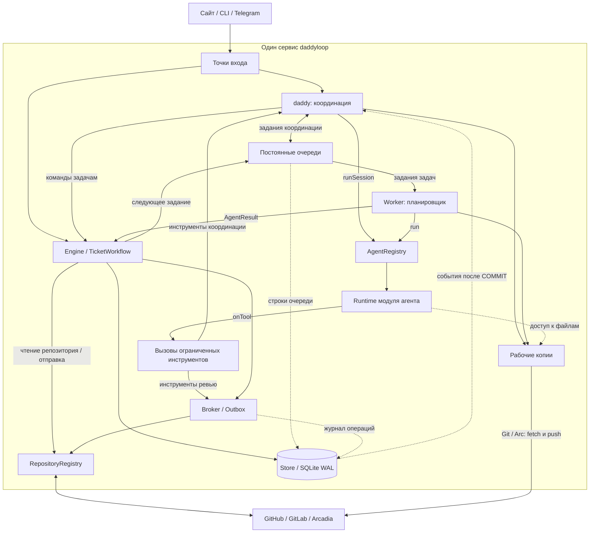
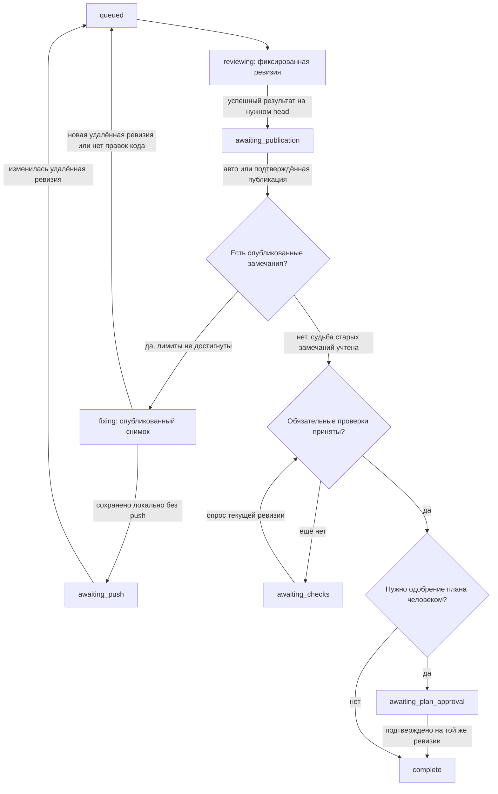
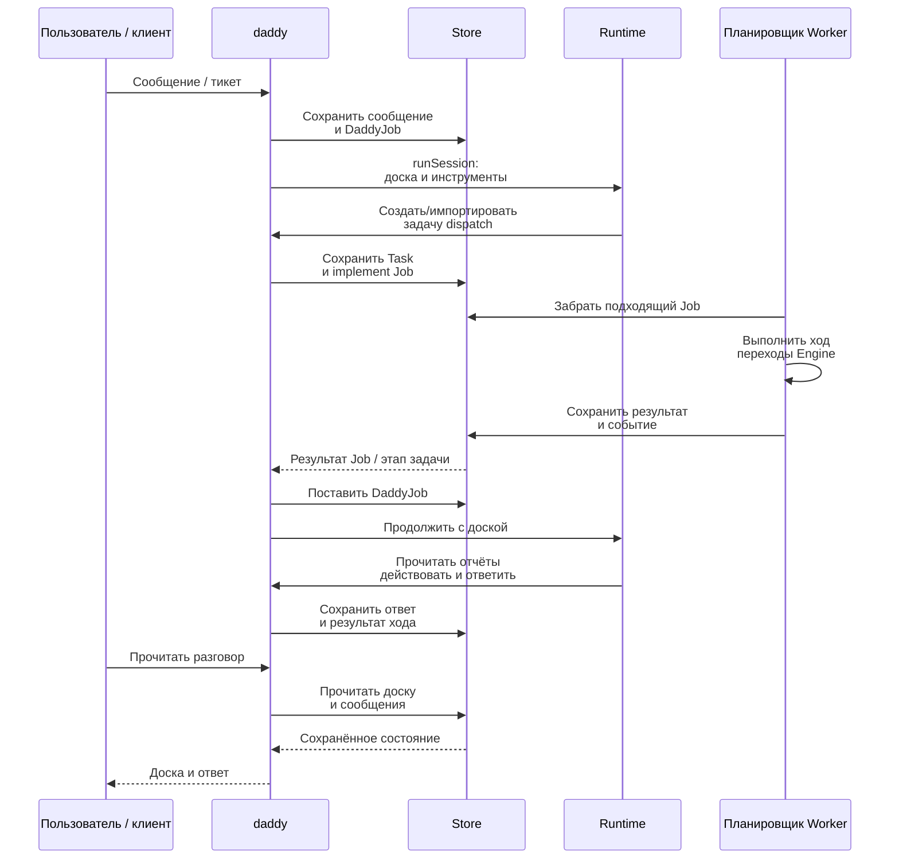

[English](en.md) · [Русский](ru.md) · [Все инструкции](../index/ru.md)

# Архитектура и цикл ревью с исправлениями

daddyloop работает как постоянный сервис на одном хосте. Модель решает, какую задачу назначить следующей, и проверяет код; сервис хранит задания, проверяет права, публикует замечания и разрешает переходы между состояниями. **Цикл продолжается, потому что результат запуска или изменение репозитория приводят к постановке следующего задания в очередь.** Для этого не нужны открытый браузер или один бесконечный разговор с моделью.

Здесь два связанных цикла:

- **Координация:** сообщение пользователя или событие воркера → ход daddy → команды управления задачами → отчёты воркеров → следующий ход daddy при необходимости.
- **Ревью и исправления одной задачи:** зафиксированная ревизия PR → независимое ревью → публикация → правки воркера → ревью новой ревизии → завершение или явное ожидание.

Это описание реализации. Установка и команды находятся в [пользовательских руководствах](../index/ru.md), создание своего адаптера — в [разработке модулей](../module-development/ru.md).

## Содержание

- [Граф компонентов](#граф-компонентов)
- [Сохранённые объекты и контексты агентов](#сохранённые-объекты-и-контексты-агентов)
- [За что отвечает каждый компонент](#за-что-отвечает-каждый-компонент)
- [От цели до первого PR](#от-цели-до-первого-pr)
- [Как продвигается цикл ревью и исправлений](#как-продвигается-цикл-ревью-и-исправлений)
- [Как результаты возвращаются к daddy](#как-результаты-возвращаются-к-daddy)
- [Состояния и условия остановки](#состояния-и-условия-остановки)
- [Параллельность и пул воркеров](#параллельность-и-пул-воркеров)
- [Ревизии, повторы и восстановление](#ревизии-повторы-и-восстановление)
- [Вспомогательные компоненты](#вспомогательные-компоненты)
- [В каком порядке читать код](#в-каком-порядке-читать-код)

## Граф компонентов



Стрелки показывают основные вызовы и передачу данных. `Постоянные очереди` — таблицы внутри Store, а не отдельный брокер сообщений. Store используют несколько контроллеров; часть связей с ним опущена. Модуль репозитория выбирает нативную реализацию, после чего повторные вызовы идут через выбранный `ReviewProvider`. Блоки обозначают обязанности, а не отдельные микросервисы.

Fastify, контроллеры, таймеры и SQLite работают в одном процессе Node. CLI агентов и локальное распознавание речи используют дочерние процессы. [ServiceManager](../../src/ops/service.ts) настраивает systemd, работу после выхода пользователя, лимит памяти и остановку всей группы процессов. [Команда serve](../../src/cli.ts#L79) удерживает `server.lock` каталога данных.

## Сохранённые объекты и контексты агентов

Определения находятся в [core/types.ts](../../src/core/types.ts), хранение — в [Store](../../src/core/store.ts).

| Объект                            | Смысл и время жизни                                                                                                                                                                                 |
| --------------------------------- | --------------------------------------------------------------------------------------------------------------------------------------------------------------------------------------------------- |
| `Workspace`                       | Именованный исходный репозиторий, база и необязательная подпапка на этом хосте. Это место работы, а не задача.                                                                                      |
| `ReviewGroup`                     | Один разговор с daddy: требования, снимок воркспейса, профили daddy/воркеров, настройки пула и связанные задачи. У пользовательских сессий стоит `orchestrated: true`.                              |
| `Task`                            | Одна единица работы: тикет, локальные требования или подключённый PR. У неё свои состояние, политика, ревизия, результаты ревью и рабочие копии.                                                    |
| `Job`                             | Один запуск по задаче: `implement`, `review`, `fix` или `chat`. В нём фиксируются настроенный профиль, инструкции роли и поколение задачи.                                                          |
| `DaddyJob`                        | Один ход координации с причиной `user`, `worker` или `recovery`; у него свой снимок профиля, инструкций и воркспейса.                                                                               |
| `ReviewHandle` / `ReviewSnapshot` | Идентичность нативного ревью и прочитанные Markdown, замечания, статус публикации и ревизия. Снимок нужно перепроверять у провайдера.                                                               |
| `Decision` / `operations`         | Решения по замечаниям и журнал намерений/результатов операций. Они переживают отдельные запуски модели.                                                                                             |
| `messages` / `events`             | Сохранённые разговоры, отчёты и последовательная история работы. Текущее состояние также лежит в строках задач/групп; при восстановлении оно не собирается целиком повторным проигрыванием событий. |

У одной сессии обычно **два контекста daddy**: `daddyThreadId` для координации и `reviewerThreadId` для нативного ревью. Профиль модели общий, инструменты и истории разные. Контекст ревьюера общий для дочерних задач сессии, но каждый ход ограничен одной из них. У каждой задачи воркера свой `authorThreadId`.

Внутренние имена `Job.role`: `author` — воркер задачи, `reviewer` — daddy в роли ревьюера. Дополнительных собеседников для пользователя это не создаёт. Сохранённый контекст не означает постоянно работающий CLI: адаптер может запустить новый процесс и продолжить разговор по сохранённому ID.

## За что отвечает каждый компонент

### Сайт, CLI и Telegram

Браузер и Ink-терминал используют [DaddyClient](../../src/client/daddy.ts): выбранную сессию, отдельные черновики, ID запросов и обновление доски. Клиент опрашивает состояние примерно каждые две секунды. Его закрытие отменяет клиентские запросы и таймер, но не ставит серверные задачи на паузу.

[Telegram](../../src/integrations/telegram.ts) — ещё один транспорт к тем же контроллерам. [TelegramWorkspace](../../src/integrations/telegram-workspace.ts) связывает личку владельца или тему форума с сессией daddy. Инструкции пользователь отправляет daddy; отчёты воркеров можно читать и выполнять предусмотренные явные действия с задачей.

### Точки входа

[server/app.ts](../../src/server/app.ts#L79) собирает приложение: читает конфигурацию, открывает Store, регистрирует включённые модули агентов/репозиториев, создаёт Engine, TicketWorkflow, Worker и Daddy. Там же подключаются запуск и остановка фоновых компонентов.

[server/daddy.ts](../../src/server/daddy.ts) проверяет HTTP-ввод и вызывает операции с сессиями/воркспейсами. Проверки доступа, cookie, CSRF и Host/Origin находятся в [server/access.ts](../../src/server/access.ts) и настройке приложения. Telegram отдельно проверяет владельца и тему. Запрос сессии подтверждается после сохранения данных, без ожидания окончания работы модели.

### daddy: контроллер координации

[Daddy](../../src/core/daddy.ts) сохраняет сообщение пользователя, ставит `DaddyJob` в очередь, забирает его при наличии условий и собирает контекст координации. В нём есть выбранный воркспейс, требования, доска задач, вместимость пула и недавний разговор. Более старые сообщения и подробные отчёты доступны через инструменты.

Модель получает [инструменты daddy](../../src/core/daddy-tools.ts): например, `create_task`, `import_ticket`, `dispatch`, `read_task`, `message_worker`. Реализация в `Daddy.call` проверяет текущую сессию и поколение, принадлежность задачи, зависимости и политику. Для изменяющего вызова нужен стабильный ID; выполнение проходит через Outbox. Модель выбирает действие, контроллер проверяет и выполняет его.

`read_task` в координации показывает сообщения воркера и опубликованное ревью. Для частного ревью он возвращает только состояние и признак окончания, без черновика и личного разговора ревьюера. Так один собеседник daddy сохраняет независимость проверки.

### Постоянные очереди

[Store.enqueue / Store.claim](../../src/core/store.ts#L137) обслуживают `jobs`, а `Daddy.enqueue / tick` — `daddy_jobs`. Задание хранит вход, статус, профиль, зафиксированные инструкции и поколение. `notBefore` позволяет отложить повтор, например при нехватке свободных рабочих копий.

Выдача задания задачи проходит внутри `BEGIN IMMEDIATE`: проверка допуска, резервирование логического места воркера и перевод в `running` происходят вместе. Уникальный индекс запрещает два работающих задания одной задачи. Устаревшее поколение отменяется вместо запуска. Отдельной очереди вроде Redis/Celery здесь нет.

### Worker: планировщик заданий

Класс [Worker](../../src/runtime/worker.ts#L62) запускает **и воркеров, и нативное ревью**; сам он не является моделью-воркером. Примерно раз в секунду он проверяет ресурсы, периодически сверяет состояние репозитория, отправляет готовые реализации, запускает ревью, публикует завершённые автоматические ревью, применяет настройки пула и забирает подходящие задания.

`Worker.run` готовит рабочую копию, собирает контекст, вызывает `AgentRegistry.run`, сохраняет нативные ID/события и передаёт результат в `Engine.completeJob`. После успешной реализации или исправления он также просит Workspaces сохранить коммит и применить политику push. При ошибке или прерывании файлы остаются на месте, а состояние задачи/задания фиксируется явно.

### AgentRegistry

[AgentRegistry](../../src/modules/agents/registry.ts) выбирает реализацию `run` или `runSession` по `profile.engine`, без угадывания провайдера по имени модели. Каталог проверяет модель и effort через выбранный адаптер. Выключенный движок или отсутствующий профиль отклоняются.

ID контекста хранится как `engine:native-id`. Реестр снимает префикс только для подходящего движка и добавляет его к ID из `onSession`. При смене движка создаётся новый нативный контекст. Реестр также предоставляет необязательные возможности чтения лимитов и управления CLI вспомогательным компонентам. Модули — доверенный код приложения; их реализации должны соблюдать контракт runtime.

### Runtime модуля агента

Runtime переводит общие [AgentInput / SessionInput](../../src/runtime/agent.ts) в протокол провайдера: рабочую папку, профиль, инструкции, инструменты, отмену и обязательный `AgentResult`.

[Codex](../../src/modules/agents/codex/runtime.ts) соединяется с app-server по JSON-RPC через stdio, создаёт/возобновляет контекст и начинает ход. [Claude](../../src/modules/agents/claude/runtime.ts) использует официальный Agent SDK и MCP-сервер в процессе для переданных инструментов. Адаптеры настраивают нативные песочницы файлов/команд и ограничивают встроенное делегирование; воркеров распределяет daddyloop.

Результат содержит `completed`, `needs_input` или `incomplete`, отчёт, исходный `checkedHead` и ID проверенных/оспоренных замечаний. **`AgentResult.status = completed` означает окончание запрошенного хода.** Engine ещё должен принять его результат. Даже завершённый `Job` может оставить всю задачу в ожидании ввода.

### Рабочие копии

[WorkspaceRegistry](../../src/core/workspace-registry.ts) проверяет исходные пути и дефолты воркспейса. [Workspaces](../../src/runtime/workspaces.ts) готовит копии и выполняет коммиты/push. [DaddyWorkspace](../../src/runtime/daddy-workspace.ts) выделяет координатору частный контекст репозитория только на чтение; это не пользовательская задача.

Для Git у задачи есть собственная папка `dataDir/workspaces/<task-id>/`, `objects.git`, сохраняемая копия воркера и отдельные worktree ревьюера на конкретных ревизиях. Воркер тикета работает в своей ветке, ревьюер получает зафиксированную ревизию. Незакоммиченные изменения и разошедшиеся коммиты не сбрасываются силой. GitHub и GitLab используют эту общую Git-реализацию.

Для Arcadia есть [ArcWorkspaces](../../src/runtime/arc-workspaces.ts) и аренда маунтов через [ArcBridge](../../src/integrations/arcadia.ts). Проверяются владелец и object store, исключаются исходные и зарезервированные пользователем маунты. Нехватка свободных мест откладывает задание; неподтверждённая аренда или несохранённая работа остаются для проверки. `scope` выбирает подпапку управляемой копии, без переключения исходного checkout пользователя.

### Вызовы ограниченных инструментов

Runtime не выдаёт модели объект Engine или клиент репозитория напрямую. Он передаёт имя инструмента, аргументы и ID вызова через `onTool`. Координация приходит в `Daddy.call`, инструменты ревью задачи — в `Broker.call`. Принимающий контроллер проверяет схему ввода и роль до выполнения действия.

Разрешённая задача определяется сохранённым контекстом запуска/сессии. Подмена аргумента не даёт доступа к чужой сессии. Воркер может читать опубликованные замечания и принимать/оспаривать их; редактировать нативный черновик может только роль ревьюера. Публикация, отказ от обязательных CI-проверок и одобрение плана — отдельные действия контроллера. См. [схемы и проверки ролей Broker](../../src/core/broker.ts#L17).

### Engine и TicketWorkflow

[Engine](../../src/core/engine.ts) выполняет переходы состояния задачи под отдельными асинхронными блокировками. Он проверяет поколения, живые ревизии PR, успешность ревью, публикацию, замечания и политику. Главные пути: `review`, `completeJob`, `reconcile`, `publish`, `finish`. Когда условия выполнены, Engine ставит следующий ход задачи в очередь.

[TicketWorkflow](../../src/core/ticket-workflow.ts) отвечает за работу до появления PR: импорт тикета или локальных требований, описание выбранного репозитория, отправку сохранённой реализации. Нативная отправка делегируется модулю репозитория, создание PR записывается через Outbox, а `Engine.linkPR` подключает результат на ожидаемом head. Уже существующий PR попадает сразу в Engine, минуя начальную реализацию и создание PR.

### Broker и Outbox

[Broker](../../src/core/broker.ts) превращает инструменты ревью в нативные операции. Он перечитывает ревью, проверяет живую ревизию и статус черновика, принадлежность/расположение комментария и сохраняет Markdown. Стабильный маркер позволяет найти задачу, ревью и комментарий при повторе. `Broker.publish` вызывается политикой процесса или подтверждённым действием пользователя после успешного ревью.

[Outbox](../../src/core/outbox.ts) ведёт журнал операций в SQLite. Для нового ключа он сохраняет `pending` и хэш аргументов **до** попытки действия, затем записывает подтверждённый результат как `done`. Повтор с тем же входом возвращает сохранённый результат, другой вход с тем же ключом вызывает конфликт идемпотентности. Для `pending` запускается функция восстановления конкретной операции. Если нативные данные не подтверждают результат, возникает `ambiguous_write`.

У Outbox нет отдельного фонового исполнителя, который вслепую повторяет всё незавершённое. Процесс вызывает его при повторе или сверке конкретного шага. Через него проходят создание/редактирование замечаний, публикация, создание PR и изменяющие команды координации. Git push отдельно использует обычную семантику без force.

### RepositoryRegistry

[RepositoryRegistry](../../src/modules/repositories/registry.ts) выбирает включённый [RepositoryModule](../../src/modules/contracts.ts): разбор тикета/PR, определение репозитория, провайдер ревью, отправку и необязательный экспорт рабочей копии.

[ReviewProvider](../../src/providers/provider.ts) даёт чтение PR/ревью и операции с нативными черновиками, комментариями и публикацией. Реализации находятся в [providers](../../src/providers/). Для отправки есть `owner`, `prepare`, `create`, `find`. Планирование, политика и проверки ревизий остаются в общем процессе; особенности API или Arc — за этими интерфейсами.

### GitHub, GitLab и Arcadia

Эти системы определяют факты об удалённой ревизии, нативных комментариях, публикации и CI. Store хранит ссылки/снимки и перечитывает их перед важными переходами. Пользователь может поменять PR снаружи daddyloop; следующая сверка должна это учесть.

Нативные сущности различаются: объекты ревью GitHub, заметки/обсуждения GitLab и состояние ревью Arcadia приводятся к общему контракту. Например, GitLab публикует только отслеживаемые заметки своего владельца, без общей массовой публикации. Маркеры помогают найти операцию, но не заменяют проверку нативного автора и принадлежности.

### Store / SQLite WAL

[Store](../../src/core/store.ts#L25) хранит JSON задач/групп, индексированные статусы заданий, сообщения, события, решения, квитанции операций, воркспейсы и настройки. SQLite использует WAL, `synchronous=FULL`, ожидание блокировки и транзакционную выдачу заданий. Рабочие файлы лежат на диске, а не внутри JSON-строк.

События уведомляют локальный `EventEmitter`; уведомления из транзакции отправляются только после COMMIT. Так просыпается daddy и обновляются клиентские уведомления. Сам emitter не является надёжной очередью сообщений: после сбоя остаются строки задач/заданий, а прерванную работу разбирает восстановление при запуске. Текущие форматы — конфигурация 3 и SQLite 7.

## От цели до первого PR

Для сессии с координацией начальный путь такой:

1. Точка входа определяет воркспейс и сохраняет `ReviewGroup`, сообщение и `DaddyJob`. ID запроса защищает от создания второго разговора/сообщения при повторе клиента.
2. `Daddy.tick` забирает ход координации. Runtime получает доску и ограниченные инструменты в контексте репозитория только на чтение.
3. Daddy импортирует ишью GitHub/тикет Tracker или создаёт локальную задачу. `TicketWorkflow` сохраняет источник, требования и снимок репозитория/базы. Начальное состояние — `discussing`; импорт в сессию с координацией сам не запускает реализацию.
4. Daddy вызывает `dispatch`. Контроллер проверяет зависимости, `Engine.implement` ставит `implement` в очередь. Место воркера выделяется при фактической выдаче задания планировщиком.
5. Воркер меняет и проверяет свою копию. После завершённого результата на ожидаемом исходном head сервис делает коммит. Новый локальный коммит переводит задачу в `ready_for_review`; отсутствие новых закоммиченных изменений требует ввода.
6. При `autoPush: true` Worker вызывает `TicketWorkflow.submit`. Модуль готовит/отправляет ветку и создаёт или восстанавливает PR. `Engine.linkPR` проверяет репозиторий и отправленный head, затем ставит `queued` для ревью. При ручной политике ожидается явное действие отправки.

Подключение существующего PR начинается сразу с `queued` из последнего шага. Дальнейший цикл у обоих вариантов общий.

## Как продвигается цикл ревью и исправлений

Упрощённо планировщик работает так; реализация — [Worker.tick](../../src/runtime/worker.ts#L62):

```text
примерно раз в секунду:
    проверить ресурсы; при необходимости прервать активную работу
    примерно раз в 15 секунд сверить PR, ревью и CI с провайдером
    отправить подходящие готовые реализации тикетов
    начать ревью свободных задач в queued
    опубликовать завершённые ревью с автоматической политикой
    применить размер пула / освободить места завершённых задач
    забирать и запускать подходящие задания, пока есть места и ресурсы

когда runtime задачи вернул результат:
    сохранить реализацию/исправления через Workspaces, когда это нужно
    Engine.completeJob(job, result)
    сохранить итоговый статус задания и отправить событие
```

Обратная связь замыкается здесь: **`completeJob → состояние задачи → следующий tick/reconcile → enqueue → claim`**. Для очередной правки не обязательно ждать нового хода координатора: Engine и Worker уже знают, что делать с опубликованным ревью и новой ревизией.



На рисунке успешный путь; ошибки, смена ревизии и пауза разобраны ниже. Незавершённое ревью в этот путь публикации и правок не попадает.

### Пример с двумя ревизиями

`H1` и `H2` обозначают реальные хэши коммитов, `R1` — ID замечания, возвращённый провайдером, а не аргумент `key` инструмента `add_comment`. Пусть это PR кода с автоматической публикацией/push и зелёным CI на финальной ревизии.

| Шаг                | Что происходит                                                                                                                                                                                                                                 |
| ------------------ | ---------------------------------------------------------------------------------------------------------------------------------------------------------------------------------------------------------------------------------------------- |
| Ревью `H1`         | `Engine.review` фиксирует всю ревизию, увеличивает номер раунда, создаёт/находит нативный черновик и ставит `Job(kind=review, role=reviewer)`.                                                                                                 |
| Замечание `R1`     | Runtime вызывает `add_comment`. Broker/Outbox создают настоящий нативный комментарий и сохраняют его ID и полный Markdown.                                                                                                                     |
| Окончание ревью    | Runtime возвращает `completed`, `checkedHead=H1`. `Engine.completeJob` перечитывает PR/черновик и записывает `reviewFinished=true`, `awaiting_publication`. Один текстовый отчёт ещё ничего не публикует.                                      |
| Передача замечаний | Worker применяет автопубликацию. Engine/Broker снова проверяют `H1`, публикуют и читают нативный опубликованный снимок. `Engine.reconcile` ставит `fix`, которому доступны эти замечания.                                                      |
| Исправление        | Воркер получает опубликованное `R1` и решения, правит/проверяет свою копию и возвращает результат относительно исходного `H1`. Перед запуском Worker перечитывает ревью и требует статус `published`.                                          |
| Сохранение `H2`    | Workspaces делает коммит и обычный push. `pendingAuthorHead` хранит сохранённый коммит. `Engine.completeJob` читает удалённый PR и ставит новое ревью при изменении ревизии.                                                                   |
| Проверка `H2`      | Новое ревью привязано к `H2`. Общий ревьюер продолжает контекст, но заново читает ревизию этой дочерней задачи и прежние замечания. Он возвращает `R1` в `verifiedCommentIds` или записывает допустимое решение по нему.                       |
| Завершение         | Успешно оконченное пустое ревью публикуется. Когда учтены прежние замечания, приняты проверки текущей ревизии и получено необходимое одобрение плана, `Engine.finish` ставит `complete`. Событие будит daddy для отчёта или дальнейшей работы. |

Пустой черновик сам по себе не означает успешную проверку. Перед принятием пустого завершённого ревью Engine требует, чтобы прежние опубликованные ID были проверены либо имели подходящее сохранённое решение. Воркер может оспорить замечание, но не подтвердить собственное исправление. См. [Engine.completeJob](../../src/core/engine.ts#L399).

## Как результаты возвращаются к daddy

[Daddy.onEvent](../../src/core/daddy.ts#L371) слушает `job.completed`, `job.failed`, `ticket.imported` и отдельные состояния задачи: `complete`, `awaiting_push`, `awaiting_plan_approval`. Следующий ход координации ставится только для активной группы с `orchestrated: true`. Импорт внутри уже работающего вызова daddy не создаёт лишнее пробуждение.



В этой последовательности сокращены вызовы адаптеров и нативного ревью из цикла задачи. Событие даёт повод принять следующее решение, но не разрешает пропустить ревью, публикацию или зависимости.

События могут объединяться в ожидающий ход координации, если совпадают воркспейс и зафиксированные инструкции. Сообщение пользователя сбрасывает счётчик автоматических ходов. Следующий ход может прочитать отчёты, назначить ещё одну готовую задачу, повторить разрешённую незавершённую работу или задать конкретный вопрос. Обновление доски клиентом само по себе модель не запускает. Без ожидающей работы или нового значимого события проходы планировщика не создают ход модели.

## Состояния и условия остановки

Есть три отдельных автомата состояний: `daddyState` группы, `state` задачи и `status` задания. Например, группа может оставаться активной, пока одна дочерняя задача ждёт ввода, а завершённое задание — оставить задачу в `awaiting_publication`.

Состояния группы: `active`, `needs_input`, `paused`, `archived`; для запуска координации нужен `active`. Сообщение пользователя может вернуть `needs_input` в работу, а пауза сессии явно останавливает её незавершённые дочерние задачи. Задание обычно проходит `queued → running → completed`, с исходами `failed` и `cancelled`; при нехватке рабочей копии оно возвращается в `queued`. Завершение задания поэтому отличается от состояний группы и задачи.

| Состояние задачи         | Значение и следующий сигнал                                                                                                              |
| ------------------------ | ---------------------------------------------------------------------------------------------------------------------------------------- |
| `discussing`             | Тикет/требования сохранены; daddy может уточнить их или назначить реализацию.                                                            |
| `implementing`           | Реализация в очереди или работе; проверенный сохранённый результат ведёт в `ready_for_review`.                                           |
| `ready_for_review`       | Есть локальная реализация; автоматическая политика или явная отправка создаёт/подключает PR.                                             |
| `submitting`             | Идёт отправка нативного PR; успех подключает его, неопределённость требует сверки.                                                       |
| `queued`                 | Ревизия PR готова к независимому ревью. Worker начинает его, когда задача свободна.                                                      |
| `reviewing`              | Создаётся нативное ревью; успешное совпадающее завершение разрешает этап публикации.                                                     |
| `awaiting_publication`   | Завершённый черновик ждёт автоматической или явной публикации.                                                                           |
| `fixing`                 | Воркер правит опубликованный снимок; затем ожидается push или следующее ревью.                                                           |
| `awaiting_push`          | Локальные изменения ждут новой удалённой ревизии PR; её замечает опрос провайдера.                                                       |
| `awaiting_checks`        | Обязательный CI отсутствует, ещё выполняется или красный; опрос перечитывает проверки текущей ревизии.                                   |
| `awaiting_plan_approval` | Проверенный план ждёт явного одобрения этой ревизии. Это относится не к каждой задаче кода.                                              |
| `needs_input`            | Ошибка/незавершённый ход, спор, неопределённая операция, устаревшие данные или лимит требуют проверки и допустимого следующего действия. |
| `paused`                 | Работа явно остановлена, поколение изменено. Возобновление учитывает сохранённый этап.                                                   |
| `complete`               | Ревизия прошла условия процесса. PR при этом может оставаться открытым.                                                                  |

Дефолтная [Policy](../../src/core/types.ts#L17): автоматические публикация и push, обязательный CI, одобрение человеком для задач-планов, максимум **3 раунда ревью** и `maxNoProgress=2`. Повтор того же набора опубликованных текстов/позиций, без служебных маркеров, увеличивает `noProgress`; другой набор сбрасывает его. Это ограничения длительности цикла, а не гарантия, что модель исправит всё за отведённое число попыток. Engine проверяет факты процесса, но не может доказать, что модель нашла каждый дефект.

У координации свои границы: максимум **24 вызова инструментов координации за ход** и переход в `needs_input` после **8 автоматических ходов без изменения отпечатка ID/состояний/head задач**. Ввод пользователя или прогресс задач сбрасывает счётчик. При нехватке рабочих копий задание откладывается примерно на **30 секунд**.

Красный CI оставляет задачу в `awaiting_checks`; сам опрос не создаёт задание на починку CI. Дальнейшая работа требует разрешённого действия координации или пользователя. Отказ от обязательных проверок требует явной причины и совпадающей ревизии. Инструмента merge нет: **завершение цикла не является merge в GitHub/GitLab/Arcadia**.

## Параллельность и пул воркеров

Место в пуле означает назначенную **целую задачу**, а не поток JavaScript или постоянно работающий CLI. Оно сохраняется во время реализации, ревью, правок, CI, паузы и ожидания ввода. Место назначается при выдаче задания роли `author`; само нативное ревью место воркера не выделяет. [worker-pool.ts](../../src/core/worker-pool.ts) освобождает место только после `complete` и отсутствия ожидающих/работающих заданий этой задачи.

При уменьшении `3 → 1` сразу записывается `requestedWorkerLimit = 1`, а `workerLimit` остаётся не меньше занятого количества. Текущие задачи сохраняют места; новую задачу нельзя посадить на освобождаемое место. По мере завершения задач планировщик доводит фактическую вместимость до 1. Рост тоже применяется на следующем проходе; новый запрос размера заменяет предыдущий.

Кроме размера пула действуют ещё три ограничения:

- `Store.claim` и уникальный индекс разрешают один работающий запуск одной задачи. Зависимости проверяются при назначении/выдаче; ожидающее задание пропускается, чтобы независимые могли работать.
- Нативные ревью одной группы идут последовательно. `Worker.reserveGroup` также исключает одновременные координацию и нативное ревью этой группы, хотя их контексты разные. Воркеры могут параллельно писать код, если хватает вместимости.
- `worker.maxAgents` ограничивает число одновременно исполняемых заданий задач, включая ревью. Настройка пула может поднять этот лимит, максимум до восьми. Текущий `Daddy.tick` запускает не больше одного хода координации глобально, отдельно от этого счётчика. Их общее потребление ограничивают проверка ресурсов и cgroup systemd.

Зависимости задают порядок, но **не объединяют ветки воркеров**. Ребёнок не получает автоматически чужие незамерженные изменения. Связанные правки должны быть в одной задаче или в базе, куда уже попал результат предшественника. См. [тесты пула](../../tests/daddy.test.ts) и [общего ревьюера](../../tests/agent-groups.test.ts).

## Ревизии, повторы и восстановление

### Результат относится к ревизии и поколению

[Revision](../../src/core/types.ts) включает `head`, `base`, `start` и необязательный нативный `revisionId`; `sameRevision` сравнивает все поля. `Job.generation` привязывает запуск к текущей попытке задачи, задания ревью также сохраняют `groupGeneration`. Пауза, инвалидирование и соответствующая смена модели делают старые callbacks/результаты недействительными.

Проверки стоят после асинхронной подготовки копии, перед ограниченными записями, при сохранении нативных ID, при приёме результата и ещё раз перед публикацией/одобрением. Если PR изменился во время незавершённого черновика, Engine сохраняет нативные данные и требует проверки. После уже опубликованного ревью новая ревизия может пойти в следующий раунд. CI и одобрение старой ревизии после инвалидирования не переносятся на новую. Отмена не может отозвать уже отправленный внешний запрос: его исход всё равно нужно установить.

### Намерение и результат хранятся отдельно

Например, комментарий создан на сервере, но ответ потерялся. Операция остаётся `pending`. При повторе читается то же нативное ревью, находится отслеживаемый комментарий, результат записывается как `done` — второй экземпляр не создаётся. Если исход нельзя установить, автоматический повтор останавливается. Это осторожная сверка, а не распределённая гарантия exactly-once. См. [тесты Outbox](../../tests/outbox.test.ts).

ID клиентского запроса, ID вызова координатора, нативный маркер и проверка ревизии решают разные задачи: повторы запросов, повторы действий, поиск нативных эффектов и отсечение устаревшей работы. Один маркер не подтверждает автора или актуальность проверенной ревизии.

### Отключение клиента и перезапуск

| Событие                                          | Что делает система                                                                                                                                                                                                             |
| ------------------------------------------------ | ------------------------------------------------------------------------------------------------------------------------------------------------------------------------------------------------------------------------------ |
| Закрыли браузер/CLI или оборвался SSH-туннель    | Циклы на сервере продолжаются. Переподключение читает сохранённое состояние; клиент не владеет временем жизни агентов.                                                                                                         |
| Превышен порог ресурсов                          | Новые запуски останавливаются, активные могут быть прерваны с сохранением копий/результатов и инвалидированием поколения. Очистка разрешённых кешей — отдельная операция.                                                      |
| Сервис остановился во время задания              | Worker отменяет запуск и записывает прерывание. При старте незавершённые работающие задания переводятся в ошибку/сверку, а не в успех.                                                                                         |
| Сервис перезапустился с активной сессией daddy   | `Daddy.start` может поставить координацию восстановления: прочитать доску, результаты и намерение отправки PR. Она может продолжить разрешённую работу; неопределённые эффекты и необходимые одобрения остаются препятствиями. |
| Временно нет свободной рабочей копии             | Задание ждёт с `notBefore`; чужой маунт не забирается.                                                                                                                                                                         |
| Нативное ревью удалено или опубликовано частично | Сверка останавливается для проверки; неполный снимок замечаний воркеру не передаётся.                                                                                                                                          |
| Бекап перенесён на другую машину                 | Разговоры и результаты восстанавливаются, незавершённое ставится на паузу, нативные ID контекста очищаются. После настройки аккаунтов/воркспейсов работа возобновляется из сохранённых материалов.                             |

Восстановление реализовано в [Engine.recoverInterruptedJobs](../../src/core/engine.ts#L677), [Daddy.start](../../src/core/daddy.ts#L396) и остановке сервиса. [Перенос бекапа](../backups/ru.md) отличается от продолжения нативного CLI-контекста на прежнем хосте.

## Вспомогательные компоненты

Эти функции используют то же состояние и интерфейсы адаптеров, не становясь ещё одним владельцем цикла ревью.

| Компонент                                                                                                     | Обязанности и связь с остальными                                                                                                                                                                                                    |
| ------------------------------------------------------------------------------------------------------------- | ----------------------------------------------------------------------------------------------------------------------------------------------------------------------------------------------------------------------------------- |
| [Пресеты](../../src/core/instruction-presets.ts) и [сборка инструкций](../../src/core/instruction-compose.ts) | Версионированная библиотека → копии сессии с выбранными частями → текст роли, зафиксированный в заданиях. Импорт сохраняет текст/источник/контрольную сумму, не устанавливает произвольные программы и не выдаёт новые инструменты. |
| [ModuleUsage](../../src/modules/agents/usage.ts)                                                              | Собирает квоты провайдеров и направляет подтверждённые сбросы. Неизвестные/устаревшие показания помечены. Сами проценты не разрешают переходы процесса.                                                                             |
| [UpdateMonitor](../../src/core/updates.ts) / [RuntimeUpdaters](../../src/core/runtime-updater.ts)             | Читают версии через `AgentCli`, проверяют пакеты/каталоги и переключают исполняемый файл каждого движка. Работающий ход сохраняет свой выбранный файл.                                                                              |
| [VoiceInbox](../../src/integrations/voice-inbox.ts) / [LocalSpeech](../../src/runtime/speech.ts)              | Постоянная очередь голосовых/текста, ограниченное локальное распознавание и доставка в зафиксированную сессию. Проверяются назначение и поколение; порядок со следующим текстом сохраняется.                                        |
| [Ресурсы](../../src/core/resources.ts) / [CacheManager](../../src/ops/cache.ts)                               | Проверяют память хоста/cgroup и диск, находят и удаляют только допустимые артефакты приложения. Чужие рабочие копии не стираются ради нового запуска.                                                                               |
| [Доступ](../../src/server/access.ts) / привязка Telegram                                                      | Проверяют запросы владельца, срок ссылок устройств и принадлежность темы до действий контроллера.                                                                                                                                   |
| [Бекапы](../../src/ops/backup/)                                                                               | Под блокировкой сохраняют базу и принадлежащие приложению рабочие данные, исключают доступы аккаунтов/устройств и восстанавливают в новый каталог.                                                                                  |

## В каком порядке читать код

Один сквозной путь удобно проследить так:

1. [HTTP-создание сессии и chat](../../src/server/daddy.ts) → [Daddy.chat/enqueue](../../src/core/daddy.ts#L205).
2. [Daddy.tick/run](../../src/core/daddy.ts#L438) → [описания инструментов](../../src/core/daddy-tools.ts) → [Daddy.call](../../src/core/daddy.ts#L624).
3. [TicketWorkflow](../../src/core/ticket-workflow.ts) → [Engine.implement](../../src/core/engine.ts#L962) → [Store.claim](../../src/core/store.ts#L181).
4. [Worker.run](../../src/runtime/worker.ts#L248) → [AgentRegistry](../../src/modules/agents/registry.ts) → runtime выбранного модуля.
5. [Engine.completeJob](../../src/core/engine.ts#L399) → [publish/reconcile/finish](../../src/core/engine.ts#L235) → [Broker/Outbox](../../src/core/broker.ts).
6. [Daddy.onEvent](../../src/core/daddy.ts#L371) замыкает обратную связь координации.

Примеры в тестах: [полный автоматический/ручной цикл](../../tests/worker.test.ts), [граничные переходы](../../tests/engine.test.ts), [отправка тикетов](../../tests/tickets.test.ts), [приватность координации](../../tests/daddy-privacy.test.ts), [фиксация инструкций](../../tests/instructions.test.ts), [нативный протокол](../../tests/protocol.test.ts), [восстановление бекапа](../../tests/backup.test.ts).
