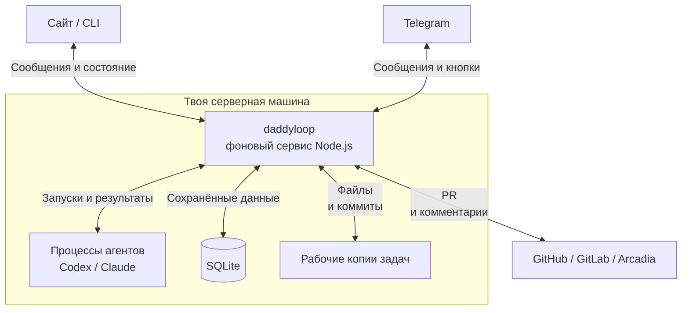
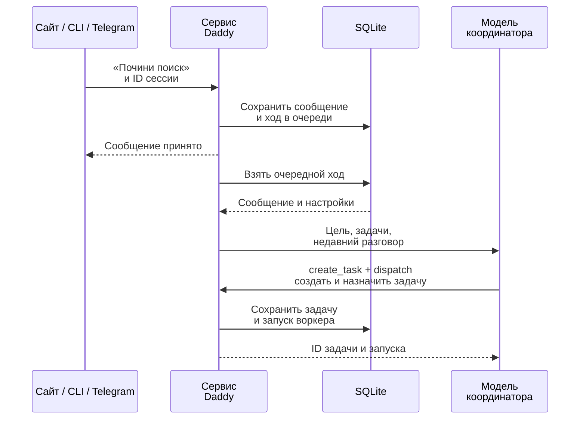
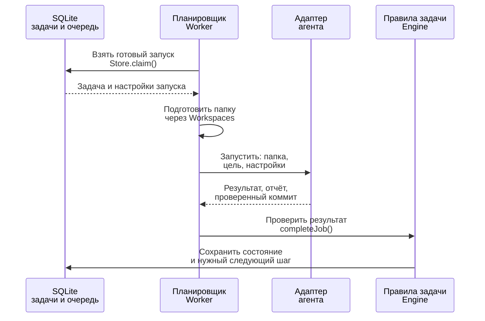
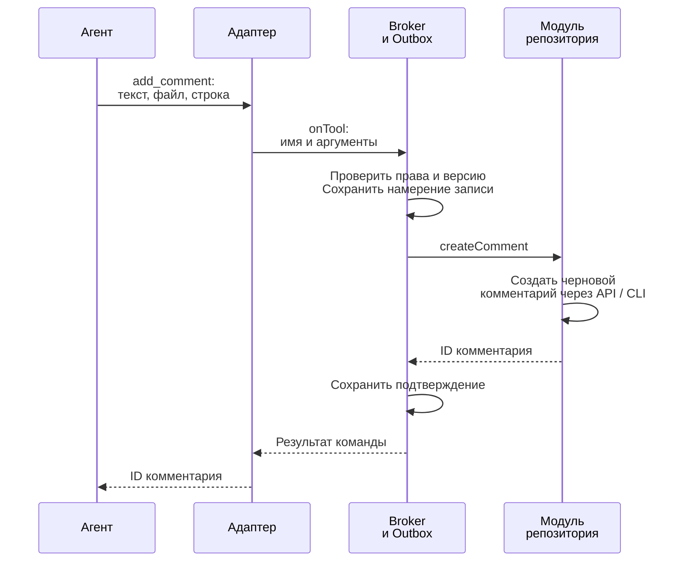
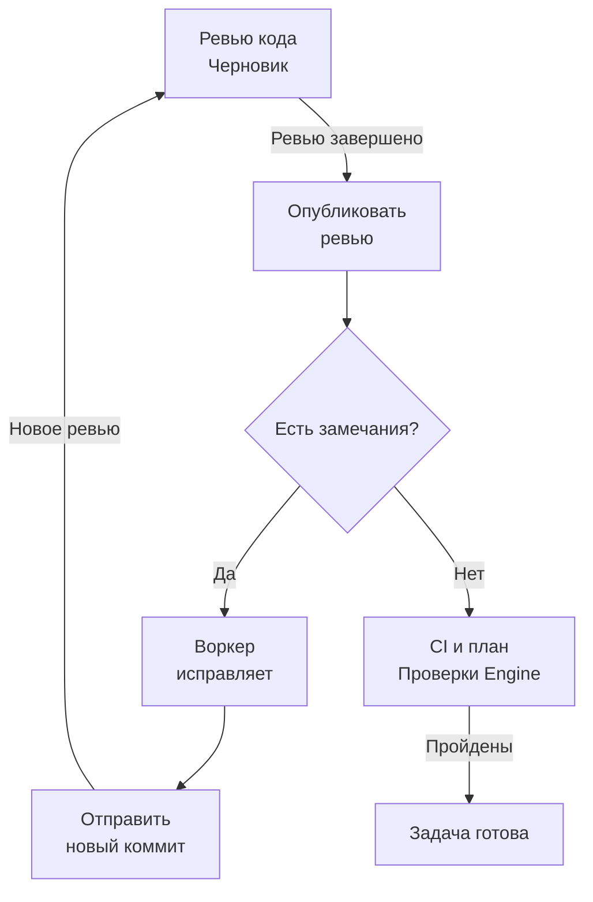
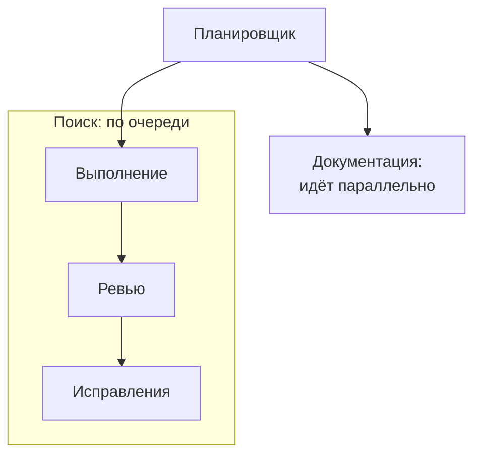
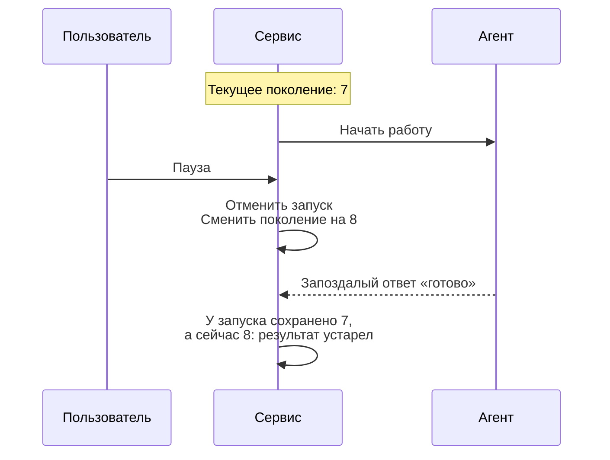

[English](en.md) · [Русский](ru.md) · [Все инструкции](../index/ru.md)

# Как устроен daddyloop

Сначала — общая схема. Дальше разобраны [создание задачи](#1-как-сообщение-превращается-в-задачу), [запуск агента](#2-как-запускается-агент), [инструменты и адаптеры](#3-как-агент-вызывает-инструменты), [цикл ревью](#4-как-замыкается-цикл-ревью), [параллельная работа](#5-какие-запуски-могут-идти-параллельно) и [отмена с восстановлением](#6-как-отмена-защищает-от-старых-результатов).

## Общая картина

Ты ставишь цель. daddy назначает работу воркерам и проверяет результат. Приложение запускает агентов, сохраняет историю и передаёт замечания на исправление.

Например, «Почини поиск» проходит путь: выполнение → ревью → исправления → повторная проверка. Ниже проследим эту задачу от сообщения до результата.



**Сайт, CLI и Telegram управляют одним сервисом на сервере.** Если закрыть ноутбук, сервис и агенты продолжат работу. Способы подключения описаны в [доступе к сайту](../web/ru.md).

Внутри сервиса `Daddy`, `Worker`, `Engine` и остальные компоненты — объекты одного Node.js-процесса. Они вызывают методы друг друга. Codex и Claude запускаются отдельными процессами; их протоколы скрыты в адаптерах.

## 1. Как сообщение превращается в задачу

Сервис сначала сохраняет сообщение. Затем запускает один ход координатора — обработку запроса моделью. Та может ответить тебе или назначить работу.



Сайт и CLI передают текст по HTTP. В случае Telegram сервис получает сообщение через Bot API и вызывает тот же `Daddy.chat()`. Подтверждение «принято» означает, что запрос сохранён. Ответ модели появится позже; веб-клиент забирает обновления примерно раз в две секунды.

Координатор получает цель, список задач и недавние сообщения. Старую переписку и подробности он запрашивает инструментами. Например, `create_task` создаёт «Почини поиск», а `dispatch` назначает выполнение. Перед этим сервис проверяет выбранный воркспейс, принадлежность задачи сессии и её зависимости.

После завершения работы воркера событие снова ставит ход координатора в очередь. Так он узнаёт о результате и может назначить следующую задачу или задать тебе вопрос.

Код: [приём HTTP-запроса](../../src/server/daddy.ts), [Daddy.chat(), tick(), onEvent() и проверка инструментов](../../src/core/daddy.ts), [создание задач из текста и тикетов](../../src/core/ticket-workflow.ts).

## 2. Как запускается агент

**Сессия** — разговор с daddy и все его задачи. **Задача** — отдельный результат, например исправленный поиск. **Запуск** — один этап её выполнения: написать код, проверить его или исправить замечания. У одной задачи таких запусков бывает много.

Планировщик ищет готовый запуск в очереди, проверяет свободные места и ресурсы, затем готовит папку и вызывает агента. В коде этот планировщик называется `Worker`; он запускает модели обеих ролей.



**Папка.** Именованный воркспейс указывает на исходный репозиторий и область работы. `Workspaces` готовит отдельные копии для задачи, `ArcWorkspaces` делает это для Arcadia. В автоматическом режиме модуль репозитория готовит копию сессии до первого вызова модели, затем выделяет отдельные копии воркерам. Воркер меняет свою копию, ревьюер читает закреплённую версию кода. Для координации есть отдельная копия `DaddyWorkspace`. Исходную папку пользователя не переключают, незакоммиченные изменения не стирают.

**Настройки.** Профиль агента и инструкции сохраняются вместе с запуском в очереди. Если после этого поменять модель по умолчанию, ожидающий запуск сохранит прежние настройки. `AgentRegistry` выбирает адаптер по `profile.engine`; имена конкретных моделей не управляют логикой планировщика.

**Результат.** Агент возвращает статус, отчёт и коммит, с которым работал. `Engine` сверяет их с задачей и репозиторием. Сообщения «готово» недостаточно: например, незавершённое ревью оставит задачу открытой.

В базе этим понятиям соответствуют `ReviewGroup` (сессия), `Task` (задача), `Job` (запуск по задаче) и `DaddyJob` (ход координатора).

Код: [Worker](../../src/runtime/worker.ts), [Store](../../src/core/store.ts), [типы данных](../../src/core/types.ts), [Git-копии](../../src/runtime/workspaces.ts), [Arc-копии](../../src/runtime/arc-workspaces.ts), [копия координатора](../../src/runtime/daddy-workspace.ts).

## 3. Как агент вызывает инструменты

Допустим, ревьюер нашёл ошибку и хочет оставить комментарий. Он передаёт приложению команду с текстом и местом в коде. Путь этой команды:



`Broker` проверяет, что запуск ещё действителен, код не изменился и роль имеет право на команду. Воркеру нельзя создавать комментарии ревью или объявлять собственное исправление проверенным. Ответ — ID комментария или ошибка — возвращается агенту по тому же пути. Markdown комментария сохраняется.

`Outbox` нужен на случай потери ответа. **Если площадка создала комментарий, а соединение оборвалось, нельзя сразу создавать второй.** Сервис заранее записывает ID операции и её аргументы, затем ищет уже созданный результат. Если исход выяснить не удалось, он останавливает повтор и просит разобраться.

Адаптер переводит этот общий обмен в протокол конкретного CLI. Для Codex это JSON-запросы и ответы через стандартный ввод и вывод процесса — app-server JSON-RPC. Для Claude используются Agent SDK `query()` и MCP-инструменты. Остальное приложение получает одинаковые вызовы и результаты.

Общий интерфейс запуска из [runtime/agent.ts](../../src/runtime/agent.ts):

```ts
export interface AgentRuntime {
  run(input: AgentInput): Promise<AgentResult>;
}
export interface SessionRuntime {
  runSession(input: SessionInput): Promise<AgentResult>;
}
```

`run()` выполняет этап задачи, `runSession()` — ход координатора. На входе — папка, цель, профиль, инструкции, инструменты и сигнал отмены. На выходе — результат; через обработчики `onTool`, `onEvent` и `onSession` идут команды, ход работы и ID разговора для продолжения.

Модуль репозитория выбирает `RepositoryRegistry`: `ReviewProvider` работает с комментариями, `SubmissionBackend` — с созданием PR. Каталог моделей, лимиты и обновления CLI также принадлежат модулю агента. Полные контракты и пример подключения — в [руководстве по своим модулям](../module-development/ru.md).

Код: [AgentRegistry](../../src/modules/agents/registry.ts), [Broker](../../src/core/broker.ts), [Outbox](../../src/core/outbox.ts), [RepositoryRegistry](../../src/modules/repositories/registry.ts).

## 4. Как замыкается цикл ревью

После выполнения задачи сервис сохраняет коммит и создаёт PR через `TicketWorkflow`. Можно также сразу прикрепить существующий PR. Дальше работает один и тот же цикл:



**От ревью к исправлению.** `Engine.review()` ставит проверку в очередь. Ревьюер читает код и оставляет черновые комментарии. Только после успешного завершения проверки сервис публикует ревью. Если в нём есть замечания, `Engine.reconcile()` создаёт запуск на исправление. Воркер получает опубликованный снимок; приватный черновик ему недоступен.

**От исправления к новому ревью.** Пусть ошибка найдена в коммите H1, а исправление сохранено в H2. После отправки H2 `Engine.completeJob()` делает задачу готовой к проверке. На следующем проходе планировщик запускает ревью заново. Именно этот переход замыкает цикл.

**Условие завершения.** Ревьюер должен учесть прежние замечания: подтвердить исправление либо записать решение снять, отложить или отклонить замечание. Затем нужны пустое опубликованное ревью и проверки, заданные правилами задачи: CI, а для плана — одобрение. Слияние PR остаётся отдельным действием пользователя.

Публикация и отправка изменений автоматические по умолчанию; ручной режим добавляет ожидание. Незавершённая проверка, спор или исчерпанные попытки оставляют задачу открытой. По умолчанию разрешены три раунда ревью. Упавший CI тоже оставляет задачу ждать и сам по себе не запускает починку CI.

Код: [переходы Engine](../../src/core/engine.ts), [планировщик Worker](../../src/runtime/worker.ts), [отправка PR](../../src/core/ticket-workflow.ts). В [тестах цикла](../../tests/worker.test.ts) проверяется путь от ревью до исправления и новой проверки.

## 5. Какие запуски могут идти параллельно

**По одной задаче одновременно работает один запуск агента.** Пока воркер выполняет «Почини поиск», второй запуск по этой задаче ждёт. Другая задача — например, обновление документации — может идти параллельно.



Так два запуска не правят одну рабочую копию одновременно, а ревью начинается после завершения предыдущего этапа. **Задача и запуск — разные вещи:** одна задача может пройти пять запусков за свою жизнь, но в конкретный момент работает только один из них.

Это проверяется в `Store.claim()`: планировщик пропускает задачи, у которых уже есть работающий запуск. Выбор из очереди и отметка «работает» сохраняются вместе. База дополнительно запрещает второй работающий запуск с тем же ID задачи — для этого нужен индекс `one_running_per_task`.

Есть ещё два ограничения. В одной сессии ревью идут по очереди; её координатор и ревьюер также не работают одновременно. У них один профиль модели, но разные истории разговоров. На весь сервер задан предел одновременных запусков по задачам (`worker.maxAgents`, включая ревью); отдельно допускается один ход координатора.

**Уменьшение пула ждёт завершения задач.** Если изменить размер с трёх до одного, текущие задачи сохранят свои места. Они заняты до конца ревью, исправлений и проверок, даже во время паузы. Новые задачи ждут свободного места в уменьшенном пуле. Зависимость «A перед B» тоже задерживает B, но не переносит в неё изменения из ветки A.

Код: [выбор запуска и запрет дублей](../../src/core/store.ts), [пул воркеров](../../src/core/worker-pool.ts), [общий ревьюер](../../src/runtime/worker.ts).

## 6. Как отмена защищает от старых результатов

Отмена может прийти, когда агент уже отправляет ответ. Поэтому одного сигнала «остановись» недостаточно: сервис должен ещё проверить, имеет ли старый запуск право изменить задачу.



**Старый результат не продвигает задачу.** Поколение (`generation`) — счётчик отмен, который сервис сохраняет вместе с запуском. После паузы номера расходятся. `Engine.completeJob()` игнорирует такой результат, а `Broker.call()` запрещает этому запуску менять комментарии. Файлы и история при этом сохраняются.

Проверка версии кода решает похожую проблему: ревью H1 не подтверждает исправление в H2. Сервис сравнивает весь набор версии и базы сравнения (`head`, `base`, `start`, `revisionId`). Изменение кода сбрасывает старое ревью, одобрение плана и ручной пропуск CI. Оставшийся старый черновик требует разбора.

При сбоях действуют те же правила:

- **Перезапуск сервиса:** база хранит задачи, очереди и историю. Прерванная работа сохраняется как прерванная; координатор может разобрать её и продолжить разрешённые шаги.
- **Нехватка памяти или диска:** новые запуски ждут, активные могут быть прерваны с сохранением работы.
- **Запись уже ушла в репозиторий:** пауза не удалит созданный комментарий и не откатит push. Сервис сверяет внешний результат перед продолжением.
- **Перенос бекапа:** данные и рабочие файлы переносятся, незавершённые задачи восстанавливаются на паузе. Разговоры внутри CLI начинаются заново — см. [бекапы](../backups/ru.md).

Удаление сессии сначала отменяет её запуски и ждёт их остановки. Модуль репозитория сохраняет и проверяет архив результатов, затем удаляет свои копии. Ошибка сохранения оставляет копии на месте. См. [жизненный цикл Arcadia](../arcadia/ru.md).

Код: [отмена, смена ревизии и восстановление](../../src/core/engine.ts), [восстановление координатора](../../src/core/daddy.ts), [проверки ресурсов](../../src/core/resources.ts). Сборка всех компонентов начинается в [buildApp()](../../src/server/app.ts).
