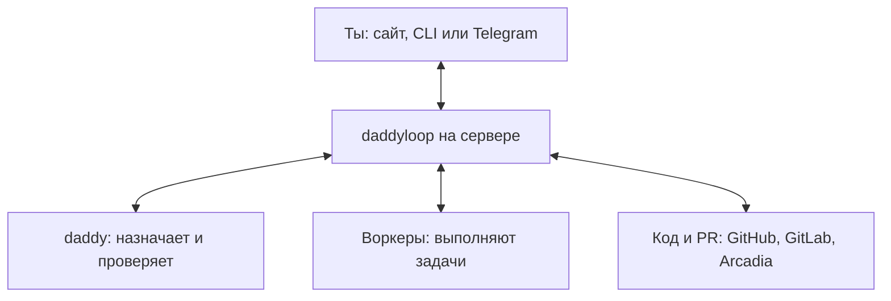

[English](en.md) · [Русский](ru.md) · [Все инструкции](../index/ru.md)

# Как устроен daddyloop

## Общая картина

В daddyloop две роли: **daddy назначает работу и проверяет результат**, а **воркеры выполняют задачи**. Программа на сервере запускает агентов, сохраняет их работу и связывается с репозиториями.

Ты общаешься с daddy через сайт, терминал или Telegram. Можно закрыть ноутбук: программа и агенты продолжат работать на сервере.

## Как одна задача проходит цикл

Например, ты просишь: «Почини поиск».

1. daddy формулирует задачу и назначает воркера.
2. Воркер исправляет код. Программа сохраняет изменения и отправляет их на ревью в PR.
3. daddy проверяет PR и замечает: пустой запрос всё ещё вызывает ошибку.
4. Программа публикует замечание и возвращает его воркеру.
5. Воркер исправляет ошибку, daddy проверяет новую версию.
6. Когда замечания закрыты и обязательные проверки пройдены, задача готова. Решение о merge остаётся за тобой.

**Цикл замыкает программа:** она видит результат шага и ставит следующий в очередь. После правок снова нужна проверка; после опубликованных замечаний — исправления. Тебе не нужно вручную пересылать сообщения между агентами.

По умолчанию отправка изменений и публикация замечаний автоматические. При ручной настройке программа ждёт подтверждения. Если нужны пояснения, проверки не проходят или попытки закончились, задача остаётся открытой.

## Подробнее о частях

Выбери интересующую часть. Названия файлов находятся внутри — по ним можно перейти к реализации.

<strong>daddy: как он управляет работой</strong>

daddy получает новый запрос после сообщения пользователя или результата задачи. Он получает цель, список задач и недавний разговор. Старые сообщения и подробные отчёты можно запросить отдельно.

Daddy управляет работой через разрешённые команды: создать задачу, назначить воркера, прочитать результат, отправить уточнение. Программа проверяет каждую команду.

Для планирования и ревью у daddy разные истории разговора. Это помогает отделить проверку кода от обсуждения работы. У задач одной сессии общий ревьюер; его проверки идут по очереди.

Код: [Daddy](../../src/core/daddy.ts), [команды](../../src/core/daddy-tools.ts).

<strong>Очередь: кто запускает следующий шаг</strong>

Когда нужно что-то выполнить, программа сохраняет задание в очереди. Отдельно ждут ходы daddy и запуски по задачам.

Планировщик примерно раз в секунду ищет работу, для которой есть место и ресурсы. После результата он проверяет условия: начать ревью, передать замечания, дождаться тестов или остановиться. Так и получается цикл.

Сообщение агента «готово» завершает только его текущий шаг. Вся задача заканчивается после ревью и обязательных проверок. Если работы в очереди нет, новые ходы модели не запускаются.

Код: [Worker — планировщик](../../src/runtime/worker.ts), [Engine — правила переходов](../../src/core/engine.ts), [Store — очередь и данные](../../src/core/store.ts).

<strong>Воркеры: сколько их и где они меняют код</strong>

У каждой задачи своя рабочая копия. Исходная папка пользователя остаётся на месте. Независимые задачи могут выполняться одновременно.

Место воркера занято до окончания всей задачи, включая ревью, правки и тесты. При уменьшении пула с трёх до одного текущие задачи спокойно завершаются, а новые ждут освобождения нужных мест. Обычно пул начинается с одного воркера; максимум — восемь, если хватает ресурсов.

Зависимость «сначала A, потом B» задаёт порядок работы. Она не переносит код между ветками. Связанные изменения нужно делать одной задачей или заранее включить результат A в основу B.

Код: [пул](../../src/core/worker-pool.ts), [рабочие копии Git](../../src/runtime/workspaces.ts), [рабочие копии Arcadia](../../src/runtime/arc-workspaces.ts). Выбор папки — в [воркспейсах](../workspaces/ru.md).

<strong>Codex и Claude: как подключаются разные агенты</strong>

Программа передаёт агенту задачу, папку, настройки модели и разрешённые команды. В ответ получает отчёт и результат запуска.

Для Codex и Claude есть свои адаптеры — модули, которые переводят общий запрос в команды конкретного CLI. Codex и Claude можно выбирать отдельно для daddy и воркеров. Модели и уровни усилий берутся из их CLI.

Настройки копируются в задание при постановке в очередь. Последующая смена настроек не переписывает уже ожидающий запуск. Следующий запуск может продолжить сохранённый разговор агента. Если сменить Codex на Claude или наоборот, новый агент начнёт свой разговор заново.

Код: [выбор адаптера](../../src/modules/agents/registry.ts), [общий интерфейс](../../src/modules/contracts.ts), [Codex](../../src/modules/agents/codex/runtime.ts), [Claude](../../src/modules/agents/claude/runtime.ts). Для разработчиков — [как написать модуль](../module-development/ru.md).

<strong>Репозитории и комментарии: кто отправляет изменения</strong>

Воркер готовит код, а программа сохраняет его и создаёт PR. Уже существующий PR можно сразу передать daddy на проверку.

Во время ревью daddy вызывает команду «добавить комментарий». Программа проверяет задачу и версию кода, затем обращается к GitHub, GitLab или Arcadia через соответствующий модуль. Воркер получает опубликованные замечания; черновик ревью ему не передаётся.

Перед отправкой комментария или PR программа запоминает, что отправляет. Если ответ потерялся, она сначала ищет результат на стороне репозитория. Это помогает избежать второго одинакового комментария или PR. Если не видно, сохранился ли результат, программа ждёт решения.

Код: [создание PR](../../src/core/ticket-workflow.ts), [комментарии](../../src/core/broker.ts), [учёт отправок](../../src/core/outbox.ts), [модули репозиториев](../../src/modules/repositories/registry.ts).

<strong>Данные: что сохраняется между запусками</strong>

Программа хранит разговоры, задачи, очередь, настройки и результаты в базе SQLite на сервере. Рабочие файлы лежат отдельно на диске.

Здесь полезно различать три вещи:

- **Сессия** — разговор с daddy и все его задачи.
- **Задача** — одна часть работы со своим результатом.
- **Запуск** — один подход агента к задаче: написать код, проверить или исправить.

У одной задачи может быть много запусков. После завершения запуска его история сохраняется. Следующий получает нужные данные из базы и может продолжить сохранённый разговор агента.

Код: [Store](../../src/core/store.ts), [описания данных](../../src/core/types.ts). Перенос на другую машину — в [бекапах](../backups/ru.md).

<strong>Остановки и ошибки: почему задача может ждать</strong>

Проверка относится к конкретной версии кода. Если код изменился, его нужно проверить заново. После паузы программа перестаёт принимать результаты отменённого запуска.

По умолчанию допускается до трёх раундов ревью. Повторяющиеся замечания или отсутствие продвижения приводят к остановке и запросу решения. Красный CI — то есть неуспешные автоматические проверки — тоже оставляет задачу открытой. Сам по себе он не создаёт новый запуск для починки.

Закрытие клиента не мешает работе. Остановка сервиса прерывает запуски, но сохраняет файлы и историю. После старта daddy может разобрать оставшуюся работу и продолжить разрешённые шаги. Если связь оборвалась при отправке, перед повтором нужно проверить, что успело сохраниться.

При нехватке памяти или диска новые запуски ждут; работающие могут быть остановлены с сохранением изменений. Пауза не удаляет уже отправленные комментарии и изменения.

Код: [переходы и восстановление](../../src/core/engine.ts), [ограничения](../../src/core/types.ts), [ресурсы](../../src/core/resources.ts), [запуск сервиса](../../src/ops/service.ts).

<strong>Сайт, Telegram и остальные функции</strong>

Сайт и терминал отправляют команды серверу и читают сохранённый разговор. Telegram обращается к тем же частям программы; тема группы связана с выбранной сессией. Эти способы общения не запускают отдельные копии daddyloop.

Остальные функции подключены к общей работе:

- [Инструкции и пресеты](../instructions/ru.md) задают текст для daddy и воркеров; каждый запуск получает свою сохранённую копию.
- [Лимиты и обновления CLI](../agents/ru.md) работают через модули агентов.
- [Голосовые](../voice/ru.md) сначала превращаются в текст, затем попадают в разговор.
- [Бекапы](../backups/ru.md) переносят данные и рабочие файлы; разговоры внутри самих CLI начинаются заново.

Код: [общий клиент](../../src/client/daddy.ts), [HTTP-команды](../../src/server/daddy.ts), [Telegram](../../src/integrations/telegram-workspace.ts), [сборка приложения](../../src/server/app.ts).

