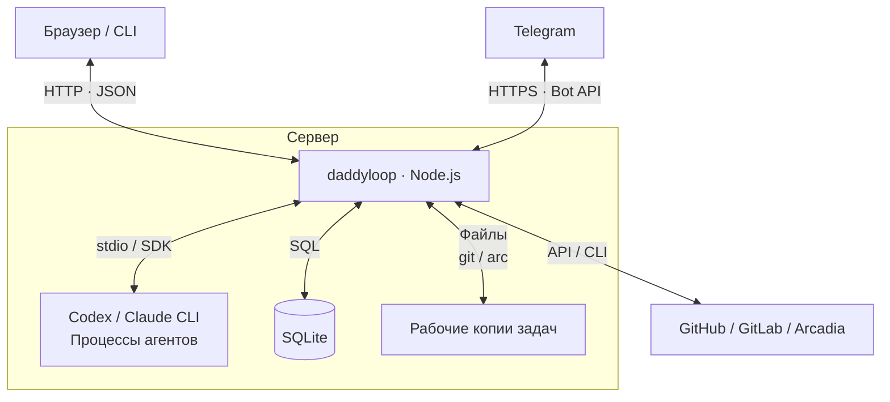

[English](en.md) · [Русский](ru.md) · [Все инструкции](../index/ru.md)

# Как устроен daddyloop

Читай по порядку или переходи к разделу: [связи и компоненты](#связи-и-компоненты), [данные и интерфейсы](#данные-и-интерфейсы), [цикл работы](#как-работает-цикл), [инварианты](#инварианты), [параллельная работа и восстановление](#параллельная-работа-и-восстановление).

## Общая картина

daddyloop — один фоновый сервис на Node.js на твоём сервере. **daddy решает, что делать, и проверяет результат; воркеры выполняют задачи.** Сервис запускает процессы агентов, хранит очередь в SQLite и отправляет изменения в репозитории. Закрытый браузер или ноутбук его не останавливает.

На просьбу «Почини поиск» daddy создаёт задачу, воркер меняет код, а daddy проверяет PR. Опубликованные замечания возвращаются воркеру. Новый код снова проходит ревью; задача заканчивается только после всех обязательных проверок.



Модель выбирает действия через инструменты. **Код приложения проверяет эти действия и решает, разрешён ли следующий шаг.** Сообщение модели «готово» само по себе не может опубликовать незаконченное ревью или завершить всю задачу.

## Связи и компоненты

### Что общается между процессами

| Связь                              | Что по ней передаётся                                                                                                                                          |
| ---------------------------------- | -------------------------------------------------------------------------------------------------------------------------------------------------------------- |
| Браузер или терминал → HTTP-сервер | Команды в JSON, например `POST /api/daddy/sessions/:id/chat`, и запросы сохранённого состояния. Общий клиент опрашивает сервер примерно каждые две секунды.    |
| Telegram ↔ интеграция Telegram     | HTTPS-запросы к Bot API. Интеграция связывает личный чат или тему группы с сессией и вызывает методы `Daddy` внутри сервиса.                                   |
| Сервис ↔ Codex                     | Адаптер Codex использует app-server: JSON-RPC через stdin/stdout. Запускает или продолжает разговор, начинает ход, принимает вызовы инструментов и события.    |
| Сервис ↔ Claude                    | Адаптер Claude вызывает `query()` из Agent SDK; инструменты приложения доступны через MCP-сервер внутри процесса. Запуском Claude CLI управляет SDK.           |
| Сервис ↔ репозитории               | `ReviewProvider` работает с ревью, `SubmissionBackend` — с созданием PR. Адаптеры GitHub/GitLab вызывают их API; Arcadia использует настроенный CLI-мост.      |
| Сервис ↔ диск                      | `Store` читает и пишет SQLite. Компоненты рабочих копий вызывают `git` или `arc` и управляют файлами задач. Файлы разговоров агента остаются у выбранного CLI. |

Внутри Node.js компоненты общаются обычными вызовами методов TypeScript. Очереди — таблицы SQLite. Сохранённые события также вызывают локальные обработчики; отдельного брокера сообщений между компонентами нет.

Доступ из браузера использует привязку устройства, cookie сессии и проверки источника запроса и CSRF. Удалённый браузер подключается к этому же сервису через туннель или настроенный сетевой доступ — см. [доступ к сайту](../web/ru.md).

### За что отвечает каждая часть сервера

Таблица идёт от входящего запроса к запуску работы и хранению данных. Названия ведут в код.

| Компонент                                                                                                            | Ответственность и основные связи                                                                                                                                                                                                                                         |
| -------------------------------------------------------------------------------------------------------------------- | ------------------------------------------------------------------------------------------------------------------------------------------------------------------------------------------------------------------------------------------------------------------------ |
| [HTTP-обработчики](../../src/server/daddy.ts) / [обработчики Telegram](../../src/integrations/telegram-workspace.ts) | Проверяют запрос, находят сессию и вызывают `Daddy.chat()`, изменение настроек или действие над задачей. Сами модели не запускают.                                                                                                                                       |
| [Daddy](../../src/core/daddy.ts)                                                                                     | Сохраняет сообщение и ставит `DaddyJob` в очередь. Его планировщик вызывает `AgentRegistry.runSession()`. Вызовы инструментов вроде `create_task` и `dispatch` проходят проверки в `Daddy`, затем идут в `TicketWorkflow` или `Engine`.                                  |
| [Engine](../../src/core/engine.ts)                                                                                   | Отвечает за переходы задачи между шагами. `review()` ставит ревью в очередь, `completeJob()` проверяет результат агента, `reconcile()` сверяет сохранённое состояние с текущим PR. Пишет через `Store`, работает с ревью через `Broker`.                                 |
| [Worker](../../src/runtime/worker.ts)                                                                                | Планировщик запусков **и воркеров, и ревьюера**. `tick()` вызывает `Store.claim()`, готовит рабочую копию, вызывает `AgentRegistry.run()`, затем передаёт результат в `Engine.completeJob()`.                                                                            |
| [AgentRegistry](../../src/modules/agents/registry.ts)                                                                | Выбирает включённый адаптер по `profile.engine`. Адаптер переводит общий интерфейс запуска в вызовы Codex или Claude и возвращает вызовы инструментов, события и результат заданного формата.                                                                            |
| [TicketWorkflow](../../src/core/ticket-workflow.ts)                                                                  | Импортирует тикет или текст задачи. После выполнения готовит отправку через модуль репозитория, создаёт или находит уже созданный PR, затем вызывает `Engine.linkPR()`.                                                                                                  |
| [Broker](../../src/core/broker.ts) + [Outbox](../../src/core/outbox.ts)                                              | `Broker.call()` проверяет аргументы инструмента ревью, роль и версию кода перед записью в репозиторий. `Outbox.perform()` сохраняет намерение записи и подтверждённый результат. Этот журнал также используют отправка PR и инструменты daddy, которые меняют состояние. |
| [RepositoryRegistry](../../src/modules/repositories/registry.ts)                                                     | Выбирает модуль репозитория. Его `ReviewProvider` читает и меняет ревью; `SubmissionBackend` готовит, создаёт и находит PR.                                                                                                                                              |
| [Workspaces](../../src/runtime/workspaces.ts) / [ArcWorkspaces](../../src/runtime/arc-workspaces.ts)                 | Готовят отдельные копии, сохраняют локальную работу, коммитят и отправляют изменения воркера. Команды VCS выполняет приложение; публикацию не поручают модели.                                                                                                           |
| [Store](../../src/core/store.ts)                                                                                     | Хранит сессии, задачи, обе очереди, сообщения, решения, события и результаты операций. В одной транзакции забирает задание из очереди и занимает место в пуле; обработчики событий вызываются после фиксации транзакции.                                                 |

[buildApp()](../../src/server/app.ts) создаёт эти объекты и соединяет их обработчики. С него удобно начинать чтение кода сборки приложения.

Именованный воркспейс описывает исходный репозиторий и разрешённую область работы. Сессия сохраняет копию этих настроек. Воркеры и ревьюеры получают управляемые копии; [DaddyWorkspace](../../src/runtime/daddy-workspace.ts) готовит отдельную копию только для чтения на время координации.

## Данные и интерфейсы

### Сессия, задача и запуск — разные объекты

| Объект                             | Что хранит                                                                                                                                             |
| ---------------------------------- | ------------------------------------------------------------------------------------------------------------------------------------------------------ |
| `ReviewGroup` — сессия             | Твой разговор с daddy, настройки воркспейса, профили daddy и воркеров, список задач и размер пула.                                                     |
| `Task` — одна задача               | Тикет или PR, рабочие копии, текущую версию кода, ревью, правила, зависимости и состояние.                                                             |
| `Job` — один запуск по задаче      | ID задачи, вид работы (`implement`, `review`, `fix`, `chat`), роль, копию настроек модели и инструкций, номер поколения.                               |
| `DaddyJob` — один ход координатора | ID сессии, сообщение или событие, которое его вызвало, копию настроек и состояние в собственной очереди. Это отдельная очередь от запусков по задачам. |

В коде роль `author` означает воркера, а `reviewer` — daddy на ревью PR. У задачи бывает много запусков. `Job.status = completed` завершает один запуск; `Task.state = complete` означает, что пройдены правила завершения всей задачи.

Два поля не дают принять старую работу за актуальную:

- **Ревизия** — точная версия кода и сравнения: `head`, `base`, `start` и необязательный `revisionId` площадки. Сравнения только последнего коммита недостаточно: могла измениться база, с которой сравнивают код.
- **Поколение, generation** — счётчик отмен. Пауза или сброс устаревшей работы увеличивает его. Задание со старым счётчиком не может продвинуть текущую задачу. У сессии есть свой счётчик для ходов daddy.

SQLite хранит текущее состояние; журнал событий сохраняет историю и будит обработчики. При восстановлении приложение читает сохранённые объекты и снова сверяется с репозиторием. Оно не собирает состояние заново проигрыванием всех событий. См. [типы](../../src/core/types.ts) и [Store](../../src/core/store.ts).

### Общий интерфейс агентов

Планировщик и daddy используют два интерфейса из [runtime/agent.ts](../../src/runtime/agent.ts):

```ts
export interface AgentRuntime {
  run(input: AgentInput): Promise<AgentResult>;
}
export interface SessionRuntime {
  runSession(input: SessionInput): Promise<AgentResult>;
}
```

`run()` получает задачу и задание из очереди. `runSession()` получает запрос к разговору напрямую. Оба передают папку, промпт, сигнал отмены и обработчики:

- `onSession` сохраняет ID разговора внутри CLI, чтобы следующий ход мог его продолжить.
- `onEvent` записывает ход работы; сообщение о прогрессе само по себе не меняет состояние задачи.
- `onTool` возвращает вызов инструмента приложения в `Daddy` или `Broker` для проверки и выполнения.

Адаптер возвращает `AgentResult`: статус (`completed`, `needs_input`, `incomplete`), отчёт, `checkedHead` и ID проверенных или оспоренных замечаний. Для запусков по задачам `Engine` сверяет результат с задачей и живым репозиторием. Для координации `Daddy` проверяет, что сессия и ход ещё активны.

[AgentModule](../../src/modules/contracts.ts) даёт реализацию запуска и каталог моделей, а также необязательные интерфейсы лимитов и обновления CLI. Модуль репозитория даёт интерфейсы чтения тикетов, ревью и отправки PR. Основной цикл выбирает модуль по ID; имена моделей и детали API площадок остаются в адаптерах. Полные контракты и регистрация описаны в [руководстве по своим модулям](../module-development/ru.md).

## Как работает цикл

Связаны два цикла: daddy решает, какие задачи начать; цикл задачи выполняет работу и проверяет её.

### 1. От сообщения к назначенной задаче

`HTTP / Telegram → Daddy.chat() → сообщение + DaddyJob в базе → Daddy.tick() → AgentRegistry.runSession()`

daddy получает цель, список задач и недавний разговор. Старые сообщения и детали задач он может прочитать инструментами. `create_task` или `import_ticket` создаёт задачу; `dispatch` ставит выполнение в очередь с учётом зависимостей.

Планировщик забирает задание и запускает выбранного агента в копии задачи. После успешного выполнения он коммитит файлы. `TicketWorkflow.submit()` отправляет сохранённую работу и привязывает получившийся PR к задаче. Задача переходит в `queued` — ждёт ревью. Прикреплённый готовый PR начинает сразу с этого места.

### 2. От PR через ревью и исправления

Допустим, в версии **H1** осталась ошибка поиска. В таблице показан автоматический путь; ручная публикация или отправка изменений добавляют ожидание на соответствующем шаге.

| Шаг                                  | Вызовы и проверки                                                                                                                                                                                                                     | Что сохраняется                                                                                                                            |
| ------------------------------------ | ------------------------------------------------------------------------------------------------------------------------------------------------------------------------------------------------------------------------------------- | ------------------------------------------------------------------------------------------------------------------------------------------ |
| Начать ревью                         | `Worker.tick()` видит `queued` и вызывает `Engine.review()`. Тот читает живой PR, создаёт или находит его черновик ревью через `Broker.ensureReview()`.                                                                               | Задача → `reviewing`; в очередь попадает `reviewer/review` для H1.                                                                         |
| Провести ревью                       | `Store.claim()` выбирает задание. Адаптер запускает агента в копии кода только для чтения. Вызовы инструментов ревью идут в `Broker.call()` и выбранный `ReviewProvider`.                                                             | Замечания становятся черновыми комментариями на площадке. Воркер их пока не видит.                                                         |
| Принять результат ревью              | `Worker` вызывает `Engine.completeJob()`. Тот проверяет поколение, ревизию, результат и черновик на площадке. Для пустого ревью нужно также учесть прежние замечания.                                                                 | `reviewFinished = true`; задача → `awaiting_publication`.                                                                                  |
| Опубликовать и назначить исправления | `Worker.tick()` вызывает `Engine.publish()`. `Broker` публикует через outbox; `Engine.reconcile()` читает снимок опубликованного ревью.                                                                                               | Есть замечания и не исчерпаны попытки → `fixing` и задание `author/fix` с опубликованным текстом. Нет замечаний → проверки завершения.     |
| Исправить                            | Воркер получает H1 и опубликованные замечания к ней. После успешного результата `Workspaces.submit()` сохраняет изменения и отправляет H2, если это разрешено настройкой. `Engine.completeJob()` принимает результат для исходной H1. | Старое ревью сбрасывается; задача → `queued` для H2. Если нужен ручной push: `awaiting_push`.                                              |
| Проверить H2                         | Следующий проход планировщика начинает новое ревью. daddy проверяет прежние замечания на новом коде.                                                                                                                                  | Остались замечания — повтор. Пустое, завершённое и опубликованное ревью ведёт к CI и, если требуется, одобрению плана; затем к `complete`. |

**Цикл замыкают `Engine` и `Worker`:** опубликованные замечания ставят исправление в очередь; отправленное исправление делает задачу готовой к новому ревью. Модели не нужно самой вспоминать о перезапуске цикла. В [тестах Worker](../../tests/worker.test.ts) этот путь проверяется с автоматической и ручной публикацией.

Прежние замечания не могут просто исчезнуть из чистого ревью. Для каждого старого ID комментария `Engine.completeJob()` требует проверку на текущей ревизии либо записанное решение снять, отложить или отклонить замечание. Иначе пустое ревью оставляет задачу в `needs_input`.

События задач также вызывают `Daddy.onEvent()`. Он может поставить ход координатора в очередь, чтобы тот посмотрел результат, задал тебе вопрос или назначил следующую работу. У координации и ревью один профиль daddy, но разные истории разговоров. В одной сессии они не выполняются одновременно.

## Инварианты

Это правила, которые проверяет приложение. В каждой строке указано место проверки, а не только пожелание в промпте.

| Правило                                                                              | Где проверяется / что происходит при нарушении                                                                                                                                                                                                                                                                       |
| ------------------------------------------------------------------------------------ | -------------------------------------------------------------------------------------------------------------------------------------------------------------------------------------------------------------------------------------------------------------------------------------------------------------------- |
| **У задачи не бывает двух одновременно работающих заданий.**                         | [Store.claim()](../../src/core/store.ts) использует транзакцию и уникальный индекс `one_running_per_task`. Блокировки на задачу в `Engine` выполняют переходы по очереди.                                                                                                                                            |
| **Результаты и действия относятся к текущему поколению и точной ревизии.**           | [Engine](../../src/core/engine.ts) отвергает старые результаты; [Broker](../../src/core/broker.ts) сверяет живую ревизию перед записью ревью. Новый код сбрасывает ревью и одобрения. Устаревший черновик требует разбора. Исправление указывает исходный коммит; отправленный новый коммит проходит своё ревью.     |
| **Незаконченное ревью не попадает воркеру.**                                         | `Engine.publish()` требует `reviewFinished` и отсутствия ожидающих или работающих заданий. `reconcile()` останавливает передачу отсутствующего, частичного, устаревшего или преждевременно опубликованного ревью.                                                                                                    |
| **Воркер видит опубликованные замечания и не подтверждает собственные исправления.** | [Broker](../../src/core/broker.ts) проверяет роли: воркер может прочитать замечания, принять или оспорить их, но не менять комментарии ревью и не отмечать исправления проверенными. [Просмотр задачи у daddy](../../src/core/daddy.ts) тоже скрывает приватное обсуждение ревью. Markdown комментариев сохраняется. |
| **Успешный запуск не равен завершённой задаче.**                                     | `Engine.completeJob()` проверяет результат и прежние замечания; `finish()` требует соблюдения правил CI и одобрения плана. Ручной пропуск CI записывается для этой ревизии. Инструмента слияния PR у daddy нет.                                                                                                      |
| **Работа в очереди сохраняет свои настройки.**                                       | [Store.enqueue()](../../src/core/store.ts) и [Daddy.enqueue()](../../src/core/daddy.ts) копируют профиль и инструкции роли в задание. Изменение дефолтов не меняет молча уже ожидающий запуск.                                                                                                                       |
| **Потерянный ответ на запись не разрешает повторить её вслепую.**                    | [Outbox.perform()](../../src/core/outbox.ts) сохраняет `pending` до записи и `done` после подтверждения. У одного ID операции должны быть те же аргументы. Повтор сначала ищет результат на площадке; неопределённый исход даёт `ambiguous_write`.                                                                   |
| **Рабочие копии сохраняют существующую работу.**                                     | [Workspaces](../../src/runtime/workspaces.ts) не заменяет разрушительно копию с локальными или разошедшимися изменениями и делает обычный push. [ArcWorkspaces](../../src/runtime/arc-workspaces.ts) проверяет владельца копии и защищённые исходные mount. Исходную папку пользователя под агента не переключают.   |
| **Уменьшение пула не прерывает назначенную задачу.**                                 | [worker-pool.ts](../../src/core/worker-pool.ts) сохраняет её место на время ревью, исправлений, проверок и пауз. Планировщик освобождает его только после завершения задачи и всех её ожидающих или работающих заданий.                                                                                              |

Outbox не может объединить запись в удалённый API и SQLite в одну транзакцию. Он сохраняет неопределённый исход и останавливает слепые повторы; гарантии «любой внешний эффект случится ровно один раз» нет. Установленные модули считаются доверенным кодом приложения: эти интерфейсы не служат песочницей для произвольных плагинов.

## Параллельная работа и восстановление

**Есть три ограничения запуска.** Пул сессии ограничивает число назначенных задач, обычно одной. `worker.maxAgents` ограничивает одновременные запуски по задачам на сервере, включая ревью. Текущий планировщик daddy отдельно допускает один ход координатора на весь сервер. Для запусков также должно хватать памяти и диска.

Ревью одной сессии идут по очереди, а `Worker.reserveGroup()` не даёт её координатору и ревьюеру работать одновременно. Независимые воркеры могут работать параллельно. Зависимость «A перед B» задаёт момент старта B; она не вливает ветку A в B.

При уменьшении пула с трёх до одного запрошенный размер сразу становится равен одному. Уже назначенные задачи сохраняют места. Планировщик уменьшает фактический размер по мере их завершения и не берёт новые задачи, пока для них нет места. Даже задача на паузе занимает место в пуле.

| Ситуация                                     | Что делает сервис                                                                                                                                                                                                                                                     |
| -------------------------------------------- | --------------------------------------------------------------------------------------------------------------------------------------------------------------------------------------------------------------------------------------------------------------------- |
| Закрыли браузер, CLI или SSH-соединение      | Продолжает работу в фоне. Время жизни клиента не управляет временем жизни агента.                                                                                                                                                                                     |
| Задача или сессия поставлена на паузу        | Отменяет её работу и перестаёт принимать старые результаты. Файлы и история остаются. Уже отправленная внешняя запись ещё может завершиться; пауза её не откатывает.                                                                                                  |
| Сервис перезапустился во время работы        | [Восстановление Engine](../../src/core/engine.ts) фиксирует прерывание и сохраняет работу. [Восстановление Daddy](../../src/core/daddy.ts) может поставить ход для разбора и продолжения разрешённых шагов. Прерванный запуск не становится успешным молча.           |
| Не хватает памяти, диска или рабочих копий   | [Проверки ресурсов](../../src/core/resources.ts) задерживают новые запуски; нехватка памяти или диска может прервать активные. Временная нехватка рабочих копий возвращает задание в очередь с задержкой.                                                             |
| Ревью повторяется, CI падает или нужен ответ | Задача остаётся открытой. По умолчанию разрешены три раунда ревью, порог повторения замечаний — два. Упавший CI ждёт в `awaiting_checks`; сам по себе он не создаёт запуск для починки CI. daddy также прекращает автоматические ходы, если список задач не меняется. |
| Бекап перенесён на другую машину             | Переносятся данные приложения и управляемые файлы. Восстановление ставит незавершённое на паузу и сбрасывает ID разговоров внутри агентов; живой процесс CLI не переносится. См. [бекапы](../backups/ru.md).                                                          |

Остальные возможности входят в те же цепочки: [воркспейсы](../workspaces/ru.md) задают исходную папку и область работы; [инструкции и пресеты](../instructions/ru.md) дают сохранённые инструкции каждой роли; [голосовые](../voice/ru.md) становятся текстом перед `Daddy.chat()`; [лимиты и обновления](../agents/ru.md) вызывают выбранный модуль агента.
