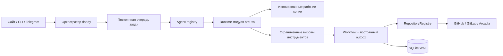

[English](en.md) · [Русский](ru.md) · [Все инструкции](../index/ru.md)

# Архитектура

daddyloop — сервис одного пользователя на одном хосте. Браузер, терминал и Telegram передают цели в сессию daddy. Сервис управляет состоянием и нативными операциями; модели возвращают работу и структурированные результаты.

## Границы компонентов

- `core/daddy.ts` планирует работу, назначает воркеров, получает отчёты и ведёт общий разговор.
- `runtime/worker.ts` планирует ходы задач через общий интерфейс `AgentRuntime`.
- `modules/agents` содержит реализации runtime и каталогов. Выбор идёт по движку профиля; идентификаторы моделей непрозрачны.
- `modules/repositories` содержит разбор ссылок, определение репозитория, импорт тикетов, ревью и отправку изменений. В `providers/` лежат нативные адаптеры ревью.
- `core/engine.ts` и `ticket-workflow.ts` проверяют переходы состояния, блокировки задач, точные ревизии и разделение намерения/результата.
- `runtime/workspaces.ts` и `arc-workspaces.ts` защищают исходные папки и готовят отдельные копии.
- `core/store.ts` сохраняет задачи, разговоры, задания, решения, снимки воркспейсов, места воркеров и квитанции запросов.
- `client/daddy.ts` управляет выбором сессии, отдельными черновиками, переподключением и идемпотентностью запросов сайта и терминала.

Выбор модулей хранится в конфиге. Выключенный модуль репозитория не принимает источник и не создаёт работу; выключенный движок не получает ход агента. Состав модулей собирается в точке запуска, очередь и daddy используют контракты. Точки расширения описаны в [модулях](../modules/ru.md).

## Кто принимает решения

Один профиль daddy использует отдельные контексты управления и нативного ревью. Внутри сессии они выполняются последовательно. Управление видит отчёты воркеров и опубликованные замечания, а не приватные черновики ревью. Воркеры получают опубликованный снимок. Markdown нативных комментариев сохраняется.

Каждое задание фиксирует профиль и поколения задачи/сессии. Подготовка, callbacks и записи инструментов повторно проверяют поколение. Ревью, CI и решения привязаны к точной ревизии. Приостановленная или заменённая сессия не принимает поздний успех. Пустое завершённое ревью отличается от незавершённого.

Ревью использует ограниченные инструменты добавления, правки, удаления, сводки и решений. Источник истины — нативная система. ID ревью GitHub и маркеры GitLab/Arc помогают восстановлению, но не авторизуют пользователя. GitLab публикует только свои заметки и не использует массовую публикацию. Неоднозначные и частичные записи остаются нерешёнными до проверки.

Постоянный outbox отделяет намерение от подтверждённого результата. Перед повтором создания PR ищется исходный результат по владельцу, репозиторию/ветке и маркеру. Push обычный, изменения пользователя сохраняются. Инструмента merge нет. Политика публикации и обязательные проверки по-прежнему ограничивают завершение.

## Пул и изоляция

`workerLimit` — применённый размер, `requestedWorkerLimit` — желаемый, `workerTasks` — сохранённый список занятых мест. Назначение происходит в одной транзакции с выдачей задания. Место сохраняется за задачей на время ходов, ревью, исправлений, CI, пауз и ошибок. Освобождаются только завершённые задачи без активных заданий. Уменьшение применяется по мере завершения; новые задачи не занимают выводимые места.

Воркспейс — запись об исходном репозитории. Сессия фиксирует её дефолты. Разовый выбор папки сохраняется с сообщением и заданием; соседний совместимый ввод может объединяться. У существующих задач остаются их источник и рабочая копия. Распределение Arc исключает исходники воркспейсов/сессий/задач и проверяет владельца lease в общем store.

## Клиенты и восстановление

Отключение клиента не останавливает сервис. Его временем жизни и cgroup управляет systemd. Штатное завершение записывает прерванные ходы; перезапуск не придумывает успешный результат. Идентификаторы сессий привязаны к движкам. При явной смене движка прежние идентификаторы записываются в события, нативный контекст создаётся заново.

Браузер использует HttpOnly-cookie, CSRF-заголовок и проверки Host/Origin. Ссылки привязки одноразовые и ограничены по времени. Telegram проверяет пользователя, группу и тему до обработки ввода. Голос сохраняется в постоянной очереди вместе с последующим текстом; распознавание выполняется в ограниченном локальном процессе, устаревшее назначение отклоняется.

Темы браузера — локальные предпочтения. Чтение usage не меняет задачи; сбросы подтверждаются отдельно и идемпотентны. Текущие форматы — конфиг 3 / SQLite 7, без runtime-миграций и прежних команд-алиасов.

## Перенос данных и usage провайдеров

Модули агентов предоставляют квоты и необязательные сбросы. UI получает независимые показания провайдеров, включая неизвестные и устаревшие. Claude использует Agent SDK, ограниченные MCP-инструменты и обязательную песочницу команд; данные оплаты API не означают квоту подписки. См. [разработку модулей](../module-development/ru.md).

Переносимые бэкапы требуют блокировки сервиса, сохраняют записи workflow в SQLite и рабочие копии, восстанавливаются в новый каталог. Идентичность аккаунтов/устройств исключена. Незавершённая работа ставится на паузу, внутренние ID контекстов очищаются; восстановление не повышает состояние до успешного. См. [бэкапы](../backups/ru.md).
