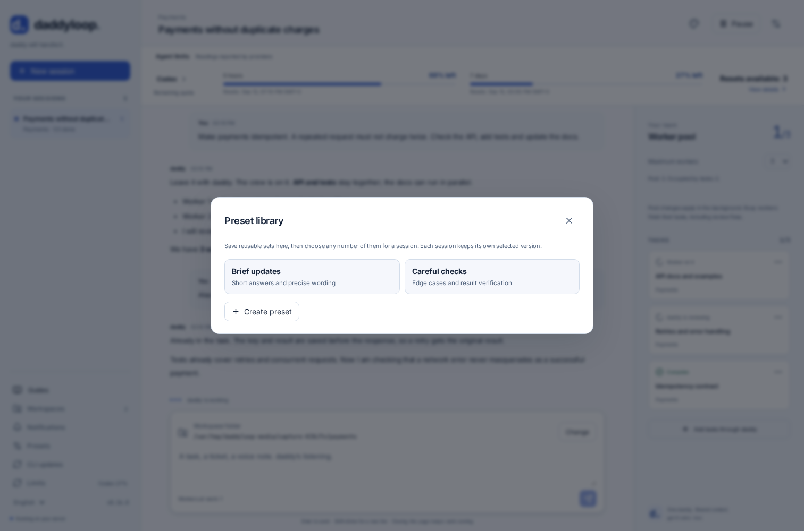
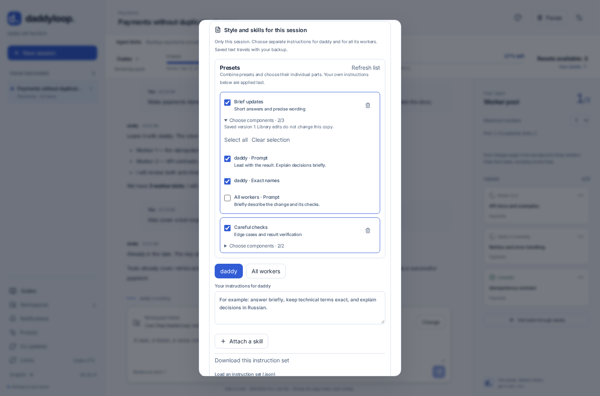
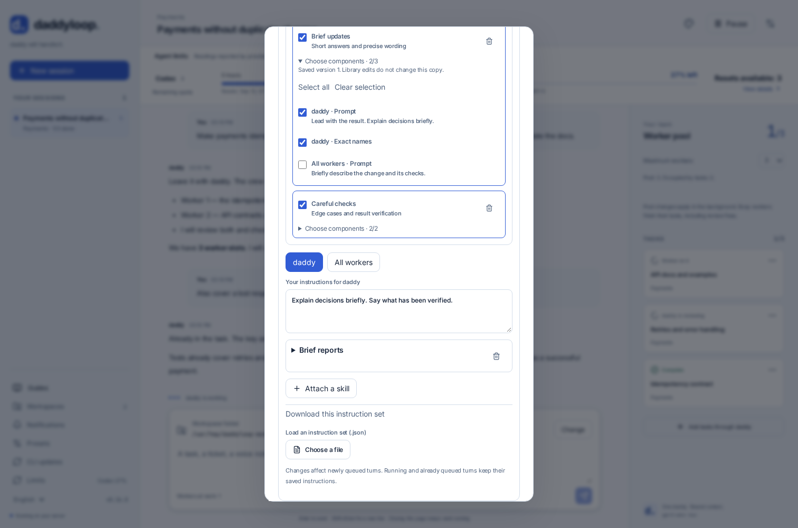
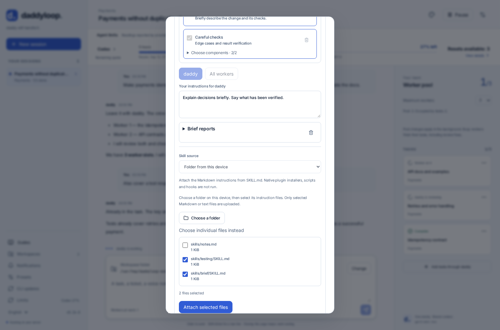

[English](en.md) · [Русский](ru.md) · [All guides](../index/en.md)

# Instructions, skills and presets

Keep reusable instruction sets in this installation’s preset library. Each daddy session chooses its own presets and components, plus separate text and skills for daddy and all its workers. Session choices never change another session, model defaults or your personal Codex/Claude configuration.

In **New session**, open **Style and skills for this session** before starting. In an existing session, open **Session settings**. Choose **daddy** or **All workers**, write your instructions and attach any skills you need. Each role can combine several skills with additional text. The additional text follows the skills and can refine their style, for example “use caveman lite”.

## Reusable presets

Open **Presets** in the sidebar and click **Create preset**. Give the set a name, optionally describe it, and fill its daddy and worker sections. Each role can have a prompt and several skills. **Save preset** makes it available to this installation’s sessions. To reuse a set already configured in the website, download its JSON, create a preset and load that file into the preset contents.



When creating a session or editing its settings, open **Style and skills for this session**. Enable the presets you need. Expand **Choose components** to include or exclude each role’s prompt and each skill separately. Presets are applied in the displayed selection order; your own prompt follows them. Identical skills are included once per role.



Turning a preset off keeps its component choices for later. The trash button removes its copy from this session. Changing or deleting a library entry does not change saved session copies. To take a new version, remove the old session copy, select the preset again and check its component choices.

The library holds up to 50 presets and 4 MiB. A session can keep up to 16 preset copies, including disabled ones, with a total saved instruction-set size of 768 KiB. Combined active instructions still obey the per-role limits below. If a combination is too large, reduce it before saving; text is never silently truncated.

## Attach a skill



| Source                       | How to use it                                                                                                                    |
| ---------------------------- | -------------------------------------------------------------------------------------------------------------------------------- |
| GitHub                       | Paste `JuliusBrussee/caveman`, or a URL to a specific skill folder or Markdown file. Branches and tags are resolved to a commit. |
| Folder or file on the server | Enter `~/.agents/skills/caveman` or a path to `SKILL.md`. A folder must contain `SKILL.md`.                                      |
| File from this device        | Choose a `.md` or `.txt` file on your laptop or phone.                                                                           |
| Paste skill text             | Give the skill a name and paste its instructions.                                                                                |
| Saved instruction set        | Load a JSON file exported with **Download this instruction set**. It includes both roles and the attached text.                  |

The importer attaches the **instruction text**, including its name, source and checksum. It does not install native plugins, hooks or executables, or automatically include supporting files referenced by a skill. Select any additional Markdown instructions explicitly. A skill needing those files or additional tools needs separate setup; a text-only style skill such as [caveman](https://github.com/JuliusBrussee/caveman/tree/main/skills/caveman) can be attached directly. The importer never runs the repository’s installer.

Up to 12 skills per role, 64 KiB per skill and 128 KiB of instructions per role. Public GitHub imports need no account; private repositories use the server’s GitHub credential configured by `daddy auth github`. Explicit URLs help when a repository contains several skills.

## CLI

Configure the first turn when creating the session:

```bash
daddy new --workspace Work \
  --daddy-instructions "Explain decisions briefly in Russian." \
  --daddy-skill JuliusBrussee/caveman \
  --worker-instructions "Verify the change with focused tests." \
  --worker-skill ./skills/testing/SKILL.md \
  "Fix the duplicate requests"
```

Change or inspect one existing session:

```bash
daddy instructions SESSION_ID
daddy instructions SESSION_ID --worker-skill server:~/.agents/skills/testing
daddy instructions SESSION_ID --daddy-instructions "Use caveman lite."
daddy instructions SESSION_ID --clear-instructions worker
daddy instructions SESSION_ID --export task-instructions.json
daddy new --workspace Work --instructions-file task-instructions.json "Next task"
```

Skill flags are repeatable. Ordinary file paths refer to the machine running the CLI; `server:` explicitly reads a file on the service host. Exports create a new file and do not overwrite an existing one. JSON sets have the form `{"daddy":{"prompt":"…","skills":[]},"worker":{"prompt":"…","skills":[]}}`.

## Telegram and interactive CLI

Inside the task’s conversation or Telegram topic:

```text
/instructions
/instructions daddy Explain decisions briefly.
/instructions worker Keep technical details in reports.
/skill daddy JuliusBrussee/caveman
/skill worker https://github.com/owner/repo/tree/main/skills/testing
/instructions daddy --clear
```

Create an empty session with `/new`, configure it, then send the task if the first turn needs these instructions. `/instructions` lists both roles; `--clear` removes that role’s additional text and skills. The website and full CLI also support file imports and exporting sets.

## Changes, engines and backups

Newly queued turns take a snapshot of the selected role. Running and already queued turns keep their snapshot. Changing worker instructions covers subsequent turns of all workers in this session; daddy uses his own instructions both when coordinating and reviewing. Model choices are separate.

The common runtime composes the same instructions for Codex, Claude and modules using `taskSession`. Styles can replace the default voice; they cannot grant file access, change publication policy or bypass workflow checks.

Backups include the actual selected texts and checksums in session/job records. Restoring does not fetch GitHub or read the old skill folder. Source paths remain attribution. Agent contexts are reset as described in [backups](../backups/en.md), but the saved instructions are supplied again when work resumes. Reimport explicitly to take an upstream skill update.

## Choose a folder in the browser

In **Attach a skill**, select **Folder from this device**. Choose the folder, then review the Markdown/text file list and press **Attach selected files**. `SKILL.md` files are preselected when present; other Markdown files can be selected explicitly. Only checked files are read and uploaded, with their relative paths preserved as source information. Cancelling or a failed file leaves the role unchanged.



This is a browser folder picker, supported in current browsers through [webkitdirectory](https://developer.mozilla.org/en-US/docs/Web/API/HTMLInputElement/webkitdirectory). If the browser or device’s file chooser cannot select folders, switch to **Choose individual files instead**. The folder is not mounted into agent workspaces: selected instruction texts are saved, while installers, native plugins and binary assets are not imported.

## Preset commands

```bash
daddy presets
daddy presets save "Brief reports" --from-session SESSION_ID
daddy presets save "Careful checks" --instructions-file task-instructions.json
daddy presets show "Brief reports"
daddy new --workspace Work --preset "Brief reports" --preset "Careful checks" "Investigate the failure"
daddy instructions SESSION_ID --preset "Brief reports"
daddy instructions SESSION_ID --preset-off "Brief reports"
daddy presets delete "Brief reports"
```

`save` updates an existing name or creates a new entry. Conflicting edits are rejected by revision. A preset created from a session contains its active combined instructions. In Telegram and the interactive CLI, `/presets` lists the library and `/preset <name>` enables a preset for the current session. Use the website for individual component switches. Clearing a role through `/instructions worker --clear` or the CLI also disables that role’s selected preset components.

Portable backups include both the complete preset library and each session’s selected versions, component switches and texts. Exporting a session’s JSON set also includes its preset snapshots, so that set can be used on another installation without recreating the library first.
