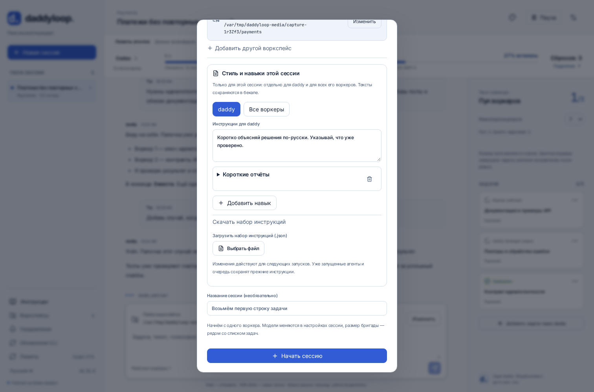

[English](en.md) · [Русский](ru.md) · [Все инструкции](../index/ru.md)

# Инструкции и навыки для одной задачи

Задай папочке стиль, а воркерам — свои рабочие инструкции. Настройки относятся к одной сессии daddy: большой задаче и её пулу воркеров. Другие сессии, общие настройки аккаунта и твои личные конфиги Codex/Claude сохранятся.

При создании сессии открой **Стиль и навыки этой сессии** до запуска. В начатом разговоре этот раздел находится в **Настройках сессии**. Выбери **daddy** или **Все воркеры**, напиши инструкции и добавь нужные навыки. У каждой роли можно сочетать несколько навыков со своим текстом. Свой текст идёт после навыков и может уточнять стиль, например «используй caveman lite».

## Добавить навык



| Источник                  | Как пользоваться                                                                                                                          |
| ------------------------- | ----------------------------------------------------------------------------------------------------------------------------------------- |
| GitHub                    | Вставь `JuliusBrussee/caveman` или ссылку на конкретную папку навыка либо Markdown-файл. Ветка или тег фиксируется на конкретном коммите. |
| Папка или файл на сервере | Укажи `~/.agents/skills/caveman` или путь к `SKILL.md`. В выбранной папке должен быть `SKILL.md`.                                         |
| Файл с этого устройства   | Выбери `.md` или `.txt` на ноутбуке или телефоне.                                                                                         |
| Вставить текст навыка     | Дай навыку название и вставь инструкции.                                                                                                  |
| Готовый набор             | Загрузи JSON, сохранённый кнопкой **Скачать набор инструкций**. В нём обе роли и тексты навыков.                                          |

Импортируется **текст инструкций** вместе с названием, источником и контрольной суммой. Нативные плагины, хуки и исполняемые файлы не устанавливаются; дополнительные файлы, на которые ссылается навык, не копируются. Если навык требует их или новых инструментов, понадобится отдельная настройка. Текстовый стиль вроде [caveman](https://github.com/JuliusBrussee/caveman/tree/main/skills/caveman) можно подключить сразу. Установщик из репозитория не запускается.

До 12 навыков для каждой роли, до 64 КиБ на навык и до 128 КиБ инструкций на роль. Публичный GitHub доступен без аккаунта; для приватных репозиториев используется авторизация сервера через `daddy auth github`. Если навыков в репозитории несколько, удобнее вставить ссылку на конкретную папку.

## CLI

Настрой инструкции до первого запуска:

```bash
daddy new --workspace Work \
  --daddy-instructions "Коротко объясняй решения по-русски." \
  --daddy-skill JuliusBrussee/caveman \
  --worker-instructions "Проверяй изменения подходящими тестами." \
  --worker-skill ./skills/testing/SKILL.md \
  "Почини повторные запросы"
```

Посмотреть или изменить одну существующую сессию:

```bash
daddy instructions SESSION_ID
daddy instructions SESSION_ID --worker-skill server:~/.agents/skills/testing
daddy instructions SESSION_ID --daddy-instructions "Используй caveman lite."
daddy instructions SESSION_ID --clear-instructions worker
daddy instructions SESSION_ID --export task-instructions.json
daddy new --workspace Work --instructions-file task-instructions.json "Следующая задача"
```

Флаги навыков можно повторять. Обычный путь читается на машине, где запущен CLI; `server:` явно указывает на файл сервера. Экспорт создаёт новый файл и не перезаписывает существующий. Формат набора: `{"daddy":{"prompt":"…","skills":[]},"worker":{"prompt":"…","skills":[]}}`.

## Telegram и интерактивный CLI

В разговоре с нужным daddy или в теме задачи:

```text
/instructions
/instructions daddy Коротко объясняй решения.
/instructions worker Сохраняй технические подробности в отчётах.
/skill daddy JuliusBrussee/caveman
/skill worker https://github.com/owner/repo/tree/main/skills/testing
/instructions daddy --clear
```

Если инструкции нужны с первого запуска, создай пустую сессию через `/new`, настрой её, а потом отправь задачу. `/instructions` показывает обе роли; `--clear` убирает дополнительный текст и навыки выбранной роли. Импорт файлов и экспорт наборов доступны на сайте и через полный CLI.

## Изменения, модели и бекапы

Каждый новый запуск в очереди получает снимок инструкций своей роли. Работающие агенты и уже поставленная очередь сохраняют прежний снимок. Изменение инструкций воркеров действует на следующие запуски всех воркеров этой сессии; daddy использует свой набор и для координации, и для ревью. Модели выбираются отдельно.

Общий runtime собирает одинаковые инструкции для Codex, Claude и модулей, использующих `taskSession`. Стиль может заменить стандартный голос, но не выдаёт доступ к файлам, не меняет правила публикации и не отменяет проверки workflow.

В бекап попадают сами тексты и контрольные суммы из записей сессии и запусков. Восстановлению не нужны GitHub и прежняя папка навыка. Старые пути остаются указанием источника. Контексты агентов сбрасываются, как описано в [бекапах](../backups/ru.md), но сохранённые инструкции снова передаются при продолжении работы. Обновление навыка из источника нужно импортировать явно.
