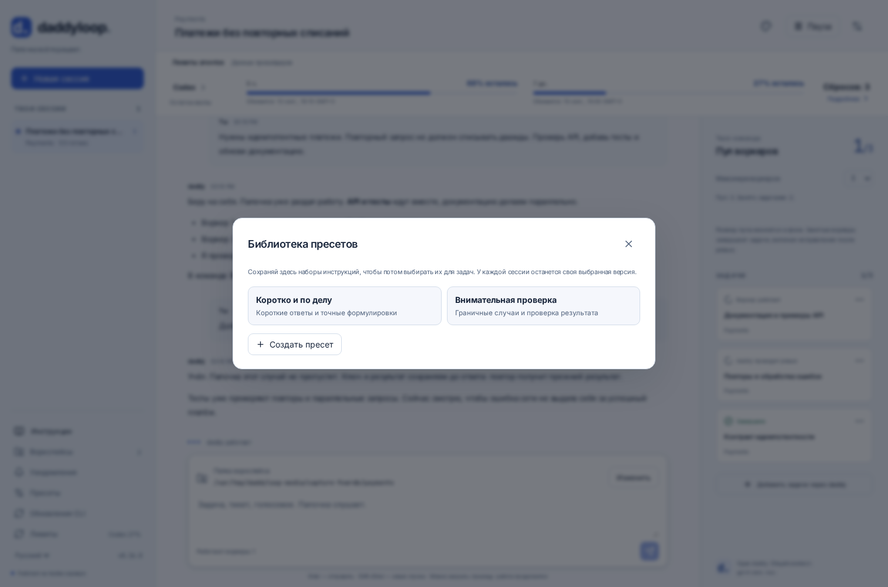
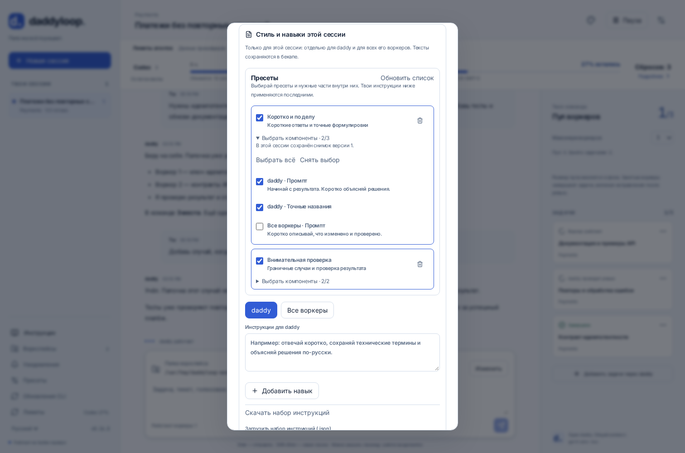
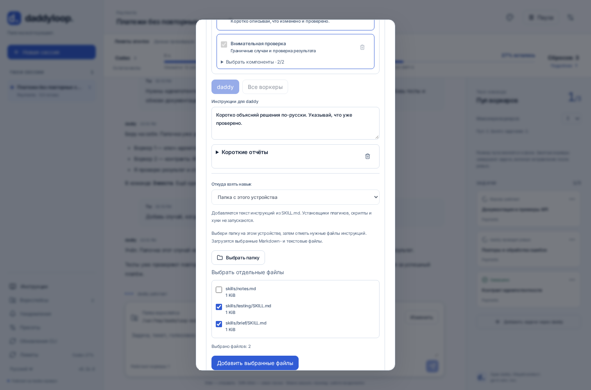

[English](en.md) · [Русский](ru.md) · [Все инструкции](../index/ru.md)

# Инструкции, навыки и пресеты

Сохраняй удобные наборы инструкций в общей библиотеке этой установки daddy. Каждая сессия выбирает свои пресеты и компоненты, а также отдельный текст и навыки для daddy и всех его воркеров. Другие сессии, дефолтные модели и личные конфиги Codex/Claude сохраняются.

При создании сессии открой **Стиль и навыки этой сессии** до запуска. В начатом разговоре этот раздел находится в **Настройках сессии**. Выбери **daddy** или **Все воркеры**, напиши инструкции и добавь нужные навыки. У каждой роли можно сочетать несколько навыков со своим текстом. Свой текст идёт после навыков и может уточнять стиль, например «используй caveman lite».

## Общие пресеты

Открой **Пресеты** в боковом меню и нажми **Создать пресет**. Дай набору название, при желании добавь описание и заполни секции daddy и воркеров. У каждой роли есть свой промпт и несколько навыков. **Сохранить пресет** добавит набор в библиотеку этой установки. Чтобы сохранить уже настроенный на сайте набор, скачай его JSON, создай пресет и загрузи этот файл в содержимое пресета.



При создании сессии или в её настройках открой **Стиль и навыки этой сессии**. Включи нужные пресеты. В разделе **Выбрать компоненты** можно отдельно включить или выключить промпт каждой роли и каждый навык. Пресеты применяются в показанном порядке выбора, а твой собственный промпт — после них. Одинаковый навык попадёт к роли один раз.



Если выключить пресет, его галочки сохранятся для повторного включения. Корзина удаляет копию из этой сессии. Изменение или удаление записи библиотеки не меняет уже сохранённые сессии. Чтобы взять новую версию, убери старую копию из сессии, выбери пресет заново и проверь галочки.

В библиотеке — до 50 пресетов и 4 МиБ. В сессии — до 16 копий пресетов, включая выключенные, и до 768 КиБ сохранённого набора инструкций. Для объединённых активных инструкций действуют лимиты на роль, указанные ниже. Слишком большой набор нужно уменьшить перед сохранением; текст не обрезается молча.

## Добавить навык


| Источник                  | Как пользоваться                                                                                                                          |
| ------------------------- | ----------------------------------------------------------------------------------------------------------------------------------------- |
| GitHub                    | Вставь `JuliusBrussee/caveman` или ссылку на конкретную папку навыка либо Markdown-файл. Ветка или тег фиксируется на конкретном коммите. |
| Папка или файл на сервере | Укажи `~/.agents/skills/caveman` или путь к `SKILL.md`. В выбранной папке должен быть `SKILL.md`.                                         |
| Файл с этого устройства   | Выбери `.md` или `.txt` на ноутбуке или телефоне.                                                                                         |
| Вставить текст навыка     | Дай навыку название и вставь инструкции.                                                                                                  |
| Готовый набор             | Загрузи JSON, сохранённый кнопкой **Скачать набор инструкций**. В нём обе роли и тексты навыков.                                          |

Импортируется **текст инструкций** вместе с названием, источником и контрольной суммой. Нативные плагины, хуки и исполняемые файлы не устанавливаются; дополнительные файлы, на которые ссылается навык, не подключаются автоматически. Нужные дополнительные Markdown-инструкции выбери явно. Если навык требует их или новых инструментов, понадобится отдельная настройка. Текстовый стиль вроде [caveman](https://github.com/JuliusBrussee/caveman/tree/main/skills/caveman) можно подключить сразу. Установщик из репозитория не запускается.

До 12 навыков для каждой роли, до 64 КиБ на навык и до 128 КиБ инструкций на роль. Публичный GitHub доступен без аккаунта; для приватных репозиториев используется авторизация сервера через `daddy auth github`. Если навыков в репозитории несколько, удобнее вставить ссылку на конкретную папку.

## CLI

Настрой инструкции до первого запуска:

```bash
daddy new --workspace Work \
  --daddy-instructions "Коротко объясняй решения по-русски." \
  --daddy-skill JuliusBrussee/caveman \
  --worker-instructions "Проверяй изменения подходящими тестами." \
  --worker-skill ./skills/testing/SKILL.md \
  "Почини повторные запросы"
```

Посмотреть или изменить одну существующую сессию:

```bash
daddy instructions SESSION_ID
daddy instructions SESSION_ID --worker-skill server:~/.agents/skills/testing
daddy instructions SESSION_ID --daddy-instructions "Используй caveman lite."
daddy instructions SESSION_ID --clear-instructions worker
daddy instructions SESSION_ID --export task-instructions.json
daddy new --workspace Work --instructions-file task-instructions.json "Следующая задача"
```

Флаги навыков можно повторять. Обычный путь читается на машине, где запущен CLI; `server:` явно указывает на файл сервера. Экспорт создаёт новый файл и не перезаписывает существующий. Формат набора: `{"daddy":{"prompt":"…","skills":[]},"worker":{"prompt":"…","skills":[]}}`.

## Telegram и интерактивный CLI

В разговоре с нужным daddy или в теме задачи:

```text
/instructions
/instructions daddy Коротко объясняй решения.
/instructions worker Сохраняй технические подробности в отчётах.
/skill daddy JuliusBrussee/caveman
/skill worker https://github.com/owner/repo/tree/main/skills/testing
/instructions daddy --clear
```

Если инструкции нужны с первого запуска, создай пустую сессию через `/new`, настрой её, а потом отправь задачу. `/instructions` показывает обе роли; `--clear` убирает дополнительный текст и навыки выбранной роли. Импорт файлов и экспорт наборов доступны на сайте и через полный CLI.

## Изменения, модели и бекапы

Каждый новый запуск в очереди получает снимок инструкций своей роли. Работающие агенты и уже поставленная очередь сохраняют прежний снимок. Изменение инструкций воркеров действует на следующие запуски всех воркеров этой сессии; daddy использует свой набор и для координации, и для ревью. Модели выбираются отдельно.

Общий runtime собирает одинаковые инструкции для Codex, Claude и модулей, использующих `taskSession`. Стиль может заменить стандартный голос, но не выдаёт доступ к файлам, не меняет правила публикации и не отменяет проверки workflow.

В бекап попадают сами тексты и контрольные суммы из записей сессии и запусков. Восстановлению не нужны GitHub и прежняя папка навыка. Старые пути остаются указанием источника. Контексты агентов сбрасываются, как описано в [бекапах](../backups/ru.md), но сохранённые инструкции снова передаются при продолжении работы. Обновление навыка из источника нужно импортировать явно.

## Выбрать папку в браузере

В **Добавить навык** выбери **Папка с этого устройства**. Укажи папку, отметь нужные Markdown- и текстовые файлы и нажми **Добавить выбранные файлы**. Если найдены `SKILL.md`, они отмечаются заранее; остальные Markdown-файлы можно выбрать вручную. Читаются и загружаются только отмеченные файлы. Относительные пути сохраняются как указание источника. При отмене или ошибке одного файла набор роли остаётся прежним.



Это обычный выбор папки браузером; современные браузеры поддерживают его через [webkitdirectory](https://developer.mozilla.org/en-US/docs/Web/API/HTMLInputElement/webkitdirectory). Если браузер или системный выборщик устройства не предлагает папки, нажми **Выбрать отдельные файлы**. Папка не монтируется в рабочие копии агентов: сохраняются выбранные тексты инструкций, а установщики, нативные плагины и бинарные файлы не импортируются.

## Команды пресетов

```bash
daddy presets
daddy presets save "Короткие отчёты" --from-session SESSION_ID
daddy presets save "Внимательная проверка" --instructions-file task-instructions.json
daddy presets show "Короткие отчёты"
daddy new --workspace Work --preset "Короткие отчёты" --preset "Внимательная проверка" "Разберись с ошибкой"
daddy instructions SESSION_ID --preset "Короткие отчёты"
daddy instructions SESSION_ID --preset-off "Короткие отчёты"
daddy presets delete "Короткие отчёты"
```

`save` обновляет существующее название или создаёт новую запись. Конфликтующие изменения отклоняются по версии. При создании пресета из сессии сохраняются её активные объединённые инструкции. В Telegram и интерактивном CLI `/presets` показывает библиотеку, а `/preset <название>` включает пресет в текущей сессии. Отдельные компоненты выбираются на сайте. Очистка роли через `/instructions worker --clear` или CLI также выключает компоненты этой роли в выбранных пресетах.

В переносимый бекап входят вся библиотека пресетов и выбранные версии, галочки и тексты каждой сессии. JSON-экспорт сессии тоже содержит копии её пресетов: его можно загрузить на другой установке без предварительного создания библиотеки.
