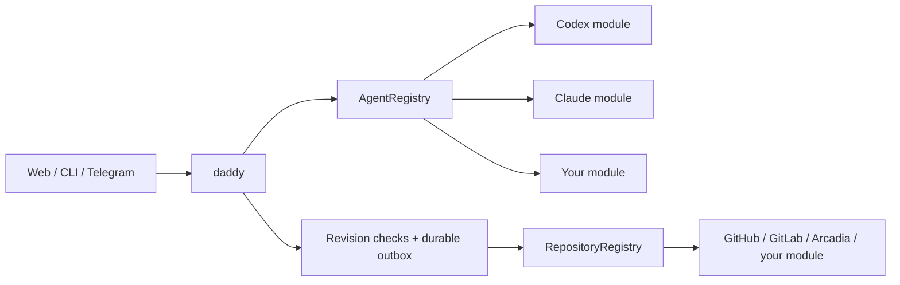

[English](en.md) · [Русский](ru.md) · [All guides](../index/en.md)

# Write a module

Modules are trusted TypeScript code shipped with the application. Start with [`src/modules/contracts.ts`](../../src/modules/contracts.ts); that is the source of truth. There is no need to teach daddy a model name or add an engine branch to the scheduler.



## Agent module

Implement `AgentModule`:

```ts
interface AgentModule {
  id: string;
  name: string;
  runtime: AgentRuntime & SessionRuntime;
  catalogue: AgentCatalogue;
  usage?: AgentUsage;
}
```

Use [`claude/index.ts`](../../src/modules/agents/claude/index.ts) for a small composition example and [`claude/runtime.ts`](../../src/modules/agents/claude/runtime.ts) for a complete runtime. Codex demonstrates an app-server JSON-RPC transport; Claude demonstrates an SDK plus in-process MCP tools.

1. **Translate the request.** `run(AgentInput)` can use the shared `taskSession(input)` role policy, then call `runSession(SessionInput)`. Honor `cwd`, `readOnly`, the profile and `AbortSignal`.
2. **Route tools.** Expose only `input.tools` and call `input.onTool(name, args, callId)` for workflow tools. Keep stable call IDs where the protocol supplies them. Do not bypass the broker with a direct provider write.
3. **Preserve native context.** Call `onSession(nativeId, turnId?)` when known. The registry adds the engine namespace; your adapter receives only the native ID on resume. Never create its own worker pool.
4. **Report events and a result.** Use `onEvent` for progress. Validate structured output with `resultSchema`. Return `AgentResult`; invalid output, cancellation, missing completion or transport failure must not become `completed`.
5. **Discover models.** `catalogue.list(refresh, signal)` returns engine-tagged `ModelOption[]`; `validate(profile)` rejects unsupported model/effort combinations. Query the engine's public discovery mechanism. Do not infer its identity from a model prefix or promise account entitlement merely because a model is listed.

The adapter must enforce the task's file and tool boundaries in its transport or sandbox. Instructions alone are not an implementation of read-only mode. Keep account/provider credentials out of agent shell environments and redact diagnostics.

## Usage is a capability of the agent

[`AgentUsage`](../../src/core/usage.ts) separates provider facts from presentation:

```ts
interface AgentUsage {
  read(refresh?: boolean): Promise<AgentUsageView>;
  reset?: {
    prepare(owner: string): Promise<ResetPlan>;
    consume(
      id: string,
      owner: string,
    ): Promise<{
      plan: ResetPlan;
      usage: AgentUsageView;
    }>;
  };
}
```

Return every provider-reported bucket and window. Names, duration, reset time, plan and credits come from the provider. `remainingPercent: null` means unknown; a missing window must not be synthesized. Include source, timestamp and stale/unavailable states. Event-only providers must label old readings stale rather than pretending a refresh fetched new data.

Only expose `reset` if the provider supports it. `prepare` must not consume anything. A confirmation must bind the owner, account, selected runtime and expiry; a retry must reuse the same durable idempotency key. [`codex/usage.ts`](../../src/modules/agents/codex/usage.ts) implements those fences. `ModuleUsage` combines provider readings and routes reset confirmations without interpreting subscription tiers.

## Repository module

Implement `RepositoryModule` with a stable ID and VCS type. It owns repository matching, PR/MR parsing, the native `ReviewProvider`, ticket import when applicable, and `SubmissionBackend` (`owner`, `prepare`, `create`, `find`). See [`github.ts`](../../src/modules/repositories/github.ts) and [`arcadia.ts`](../../src/modules/repositories/arcadia.ts).

Preserve native Markdown and comment identity. `find` must reconcile an ambiguous submission using the marker, actor, repository and branch. The shared workflow retains exact-revision/generation checks and the durable outbox; the adapter must never auto-merge around it.

An external working-copy implementation may expose `backupWorkspace(task, sink)`. The sink accepts files/text and recovery warnings. Verify task ownership before reading a mount, export actual work and describe restore limitations. Arcadia's [exporter](../../src/modules/repositories/arcadia-backup.ts) saves patches and changed files instead of copying a virtual monorepo or its lease.

## Register and package it

- Register agent factories in `src/modules/agents/index.ts`, repository modules in `src/modules/repositories/index.ts`.
- Add selection/authentication metadata to `src/modules/catalogue.ts`. A module with an API key can declare `apiKeyFile`; one with a native login uses `login` and `browserLogin`.
- If it needs a CLI, build a separate component in `scripts/build-release.mjs`. Include its version/license, test its actual binary on x64 and ARM64, and publish checksums. The installer downloads only selected components. Extra host sandbox dependencies belong to that module's installation checks.
- Add paired documentation and update both topic indexes.

## Prove the contract

Run `npm run check` and the relevant browser/installer tests. Good starting points:

- [`tests/modules.test.ts`](../../tests/modules.test.ts): two engines with the same model name, opaque context handles, disabled modules and partial catalogue failures.
- [`tests/claude.test.ts`](../../tests/claude.test.ts): real MCP tool dispatch, read-only/path boundaries, cancellation and malformed results.
- [`tests/usage.test.ts`](../../tests/usage.test.ts): weekly-only plans, extra model buckets, reset ownership and lost responses.
- [`tests/backup.test.ts`](../../tests/backup.test.ts): move real Git working copies without losing local changes.

Ordinary tests must stay offline and use isolated state. Put paid model calls in an explicit smoke script; do not make a PR or change account limits during a unit test.

`workspaceRoot` and `readPaths` grant read access to the managed repository and shared VCS metadata. Writes remain limited to `cwd`; adapters must not turn a metadata read grant into a write grant.

Task instructions are part of the common runtime contract: use `taskSession(input)` for task jobs and pass `SessionInput.instructions` intact to the engine. The helper includes the frozen job instructions and workflow policy. The coordinator has already composed its session instructions. Do not reread local/global skills or replace these instructions based on the engine.
