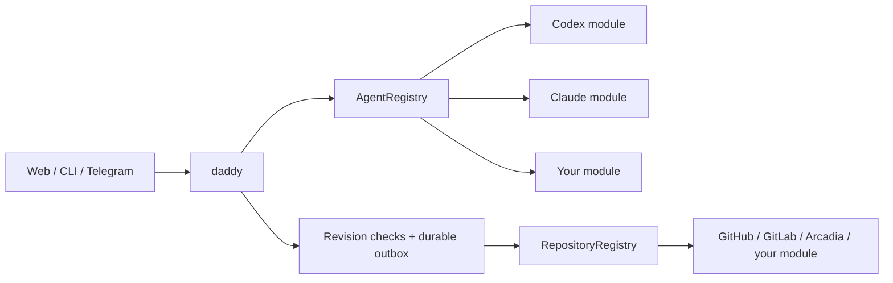

[English](en.md) · [Русский](ru.md) · [All guides](../index/en.md)

# Write a module

Modules are trusted TypeScript code shipped with the application. Start with [`src/modules/contracts.ts`](../../src/modules/contracts.ts); that is the source of truth. There is no need to teach daddy a model name or add an engine branch to the scheduler.



## Agent module

Implement `AgentModule`:

```ts
interface AgentModule {
  id: string;
  name: string;
  runtime: AgentRuntime & SessionRuntime;
  catalogue: AgentCatalogue;
  usage?: AgentUsage;
  cli?: AgentCli;
}
```

Use [`claude/index.ts`](../../src/modules/agents/claude/index.ts) for a small composition example and [`claude/runtime.ts`](../../src/modules/agents/claude/runtime.ts) for a complete runtime. Codex demonstrates an app-server JSON-RPC transport; Claude demonstrates an SDK plus in-process MCP tools.

1. **Translate the request.** `run(AgentInput)` can use the shared `taskSession(input)` role policy, then call `runSession(SessionInput)`. Honor `cwd`, `readOnly`, the profile and `AbortSignal`.
2. **Route tools.** Expose only `input.tools` and call `input.onTool(name, args, callId)` for workflow tools. Keep stable call IDs where the protocol supplies them. Do not bypass the broker with a direct provider write.
3. **Preserve native context.** Call `onSession(nativeId, turnId?)` when known. The registry adds the engine namespace; your adapter receives only the native ID on resume. Never create its own worker pool.
4. **Report events and a result.** Use `onEvent` for progress. Validate structured output with `resultSchema`. Return `AgentResult`; invalid output, cancellation, missing completion or transport failure must not become `completed`.
5. **Discover models.** `catalogue.list(refresh, signal)` returns engine-tagged `ModelOption[]`; `validate(profile)` rejects unsupported model/effort combinations. Query the engine's public discovery mechanism. Do not infer its identity from a model prefix or promise account entitlement merely because a model is listed.

Honor `SessionInput.execution` / `AgentInput.execution` for every launch and resume. `host` is the default: use the service user's normal environment and network without CLI approvals. `sandbox` is explicit and must enforce its filesystem/network policy. In host mode, `readOnly` describes the role rather than an OS guarantee. Preserve service-side tool authorization, revision checks and generation fences in both modes. Never print credentials in diagnostics.

Apply `executionInstructions(input)` to both new and resumed conversations. Host instructions allow task-specific use of existing local credentials without exposing their values. Updating a launch option alone is insufficient if a CLI retains older developer messages: the Codex adapter appends the current developer policy through [thread/inject_items](https://developers.openai.com/codex/app-server#inject-items-into-a-thread) before a resumed turn. It preserves conversation history and refuses to start the turn if that update fails. Claude receives the current policy in its SDK system prompt on each query.

**Process ownership.** Forward every `input.processScope.env` entry to the CLI and its shell-command environment. `AgentRegistry` creates the scope, records its owner before launch and closes it after completion, cancellation or failure. The marker follows detached descendants; `RunProcesses` stops only matching processes of the same user and host boot, checking process start times before signalling. Adapters must preserve these variables even in an explicit sandbox. Do not replace this with a sweep by executable name or working directory.

`DADDYLOOP_RUN_CACHE` is a private location for reproducible downloads and temporary caches. Keep source changes, unique results and review artifacts in persistent task storage. After the run, resource recovery can delete this cache once owned processes have stopped; redirected paths and active mounts are preserved. Backups omit process ownership records and these disposable caches.

## Usage is a capability of the agent

[`AgentUsage`](../../src/core/usage.ts) separates provider facts from presentation:

```ts
interface AgentUsage {
  read(refresh?: boolean): Promise<AgentUsageView>;
  reset?: {
    prepare(owner: string): Promise<ResetPlan>;
    consume(
      id: string,
      owner: string,
    ): Promise<{
      plan: ResetPlan;
      usage: AgentUsageView;
    }>;
  };
}
```

Return every provider-reported bucket and window. Names, duration, reset time, plan and credits come from the provider. `remainingPercent: null` means unknown; a missing window must not be synthesized. Include source, timestamp and stale/unavailable states. Event-only providers must label old readings stale rather than pretending a refresh fetched new data.

Only expose `reset` if the provider supports it. `prepare` must not consume anything. A confirmation must bind the owner, account, selected runtime and expiry; a retry must reuse the same durable idempotency key. [`codex/usage.ts`](../../src/modules/agents/codex/usage.ts) implements those fences. `ModuleUsage` combines provider readings and routes reset confirmations without interpreting subscription tiers.

## CLI lifecycle is a capability of the adapter

Optional `AgentModule.cli: AgentCli` owns the executable resolver, display name, release URL, `probe`, `latestVersion`, `validate`, optional `diagnose`, and optional managed `updates.latest` / `updates.install`. Keep package URLs, platform layouts, authentication probes and native handshakes inside the adapter. Return `unavailableReason` for unsupported installer platforms. An adapter without `cli` still runs through the registry; one without `updates` gets no install/rollback action.

The server enumerates `AgentRegistry.all()`. `RuntimeUpdaters` maintains separate audience-bound confirmations and operation/rollback records per engine. Activation compares the selected executable and configuration before switching, and validates the saved profiles for that engine. New turns resolve the selection dynamically and capture it once. `UpdateMonitor`, browser, CLI and Telegram use the same capability data; they must not contain provider-specific fallbacks. API routes are `/api/runtimes` and `/api/runtimes/:engine/update[/prepare|/confirm]`.

Factories can declare `privatePaths()` for native credentials outside the shared token folder; backups exclude these even for disabled modules. Installed CLI versions are packaging pins, while models and effort values come from the live catalogue. Never derive module identity from a model name. See the [third-engine update/recovery tests](../../tests/runtime-updater.test.ts) and [notification tests](../../tests/updates.test.ts).

## Repository module

Implement `RepositoryModule` with a stable ID and VCS type. It owns repository matching, PR/MR parsing, the native `ReviewProvider`, ticket import when applicable, and `SubmissionBackend` (`owner`, `prepare`, `create`, `find`). See [`github.ts`](../../src/modules/repositories/github.ts) and [`arcadia.ts`](../../src/modules/repositories/arcadia.ts).

Preserve native Markdown and comment identity. `find` must reconcile an ambiguous submission using the marker, actor, repository and branch. The shared workflow retains exact-revision/generation checks and the durable outbox; the adapter must never auto-merge around it.

An external working-copy implementation may expose `backupWorkspace(task, sink)`. The sink accepts files/text and recovery warnings. Verify task ownership before reading a mount, export actual work and describe restore limitations. Arcadia's [exporter](../../src/modules/repositories/arcadia-backup.ts) saves patches and changed files instead of copying a virtual monorepo or its lease.

## Register and package it

- Register agent factories in `src/modules/agents/index.ts`, repository modules in `src/modules/repositories/index.ts`.
- Add selection/authentication metadata to `src/modules/catalogue.ts`. A module with an API key can declare `apiKeyFile`; one with a native login uses `login` and `browserLogin`.
- If it needs a CLI, build a separate component in `scripts/build-release.mjs`. Include its version/license, test its actual binary on x64 and ARM64, and publish checksums. The installer downloads only selected components. Extra host sandbox dependencies belong to that module's installation checks.
- Add paired documentation and update both topic indexes.

## Prove the contract

Run `npm run check` and the relevant browser/installer tests. Good starting points:

- [`tests/modules.test.ts`](../../tests/modules.test.ts): two engines with the same model name, opaque context handles, disabled modules and partial catalogue failures.
- [`tests/claude.test.ts`](../../tests/claude.test.ts): real MCP tool dispatch, read-only/path boundaries, cancellation and malformed results.
- [`tests/usage.test.ts`](../../tests/usage.test.ts): weekly-only plans, extra model buckets, reset ownership and lost responses.
- [`tests/backup.test.ts`](../../tests/backup.test.ts): move real Git working copies without losing local changes.

Ordinary tests must stay offline and use isolated state. Put paid model calls in an explicit smoke script; do not make a PR or change account limits during a unit test.

`workspaceRoot` and `readPaths` describe the managed repository and VCS metadata. In sandbox mode, writes remain limited to `cwd`; metadata read access must not grant writes. Host mode uses normal OS permissions.

Task instructions are part of the common runtime contract: use `taskSession(input)` for task jobs and pass `SessionInput.instructions` intact to the engine. The helper includes the frozen job instructions and workflow policy. The coordinator has already composed its session instructions. Do not reread local/global skills or replace these instructions based on the engine.

A repository module can provide `sessionWorkspace(context): SessionWorkspaceBackend`. `prepare(group, signal)` allocates a session copy without invoking a model; `remove(group)` exports results and removes only verified owned copies. The host cancels and waits for the session runs before removal. Use [the Arcadia implementation](../../src/modules/repositories/arcadia-sessions.ts) as an example. Backup sinks receive the source `dataDir` so adapters can resolve their own journals.

Git hosting modules expose `git: GitRepositoryTransport`: `parse(address)` validates a repository URL and returns its host, repository and transport; `environment(source)` provides authentication for the Git process. GitHub and GitLab supply their own repository naming rules and token usernames through [git-source.ts](../../src/modules/repositories/git-source.ts). `Workspaces` calls this contract for fetch and push; it does not infer a host from a model or a fallback provider. SSH URLs keep their transport. Use [GitSessionWorkspace](../../src/modules/repositories/git-sessions.ts) for the shared Git allocation/export/removal lifecycle. Its archives contain complete task Git data; the host must stop and wait for all session runs before calling `remove`.

`SessionInput.onAssistantMessage({ id, text })` is the optional public conversation callback. Emit completed assistant text blocks during a turn with stable native item IDs. Exclude tool calls/results, stderr, reasoning and the structured `AgentResult`; the host publishes its validated final summary separately. The coordinator persists this text for all clients and rejects callbacks from cancelled or completed runs. Worker runtimes receive no conversation callback. Codex emits commentary items; Claude emits assistant text blocks.

A repository session backend may implement `reclaim(group, signal, collectCache)` for resource recovery. Verify ownership and active jobs again before each operation. Arcadia uses ordinary `arc gc` and parks idle owned mounts without forgetting their stores. Never truncate a store, delete worker changes or reclaim a source/human mount.
