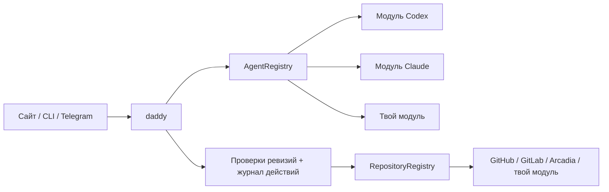

[English](en.md) · [Русский](ru.md) · [Все инструкции](../index/ru.md)

# Написать свой модуль

Модули — доверенный TypeScript-код, который поставляется вместе с приложением. Начни с [`src/modules/contracts.ts`](../../src/modules/contracts.ts): это актуальный контракт. Учить папочку названию модели или добавлять условие по движку в планировщик не нужно.



## Модуль агента

Реализуй `AgentModule`:

```ts
interface AgentModule {
  id: string;
  name: string;
  runtime: AgentRuntime & SessionRuntime;
  catalogue: AgentCatalogue;
  usage?: AgentUsage;
}
```

Короткий пример сборки модуля — [`claude/index.ts`](../../src/modules/agents/claude/index.ts), полная реализация выполнения — [`claude/runtime.ts`](../../src/modules/agents/claude/runtime.ts). Codex показывает транспорт app-server JSON-RPC, Claude — SDK и MCP-инструменты внутри процесса.

1. **Переведи запрос.** `run(AgentInput)` может использовать общую политику роли `taskSession(input)`, затем вызвать `runSession(SessionInput)`. Соблюдай `cwd`, `readOnly`, профиль и `AbortSignal`.
2. **Подключи инструменты.** Предоставляй только `input.tools` и вызывай `input.onTool(name, args, callId)` для действий workflow. Сохраняй стабильный ID вызова, если он есть в протоколе. Не обходи broker прямой записью к провайдеру.
3. **Сохрани внутренний контекст.** Вызывай `onSession(nativeId, turnId?)`, когда ID известен. Реестр добавит префикс движка; при возобновлении адаптер получит только нативный ID. Собственный пул воркеров модулю не нужен.
4. **Верни события и результат.** Прогресс передавай через `onEvent`. Проверяй структурированный ответ через `resultSchema`, возвращай `AgentResult`. Ошибка транспорта, отмена, отсутствие завершения или неверный ответ не должны превращаться в `completed`.
5. **Запроси модели.** `catalogue.list(refresh, signal)` возвращает `ModelOption[]` с движком, `validate(profile)` отвергает неподдерживаемую пару модели и effort. Используй публичный механизм discovery движка. Не определяй движок по префиксу модели и не считай наличие в каталоге гарантией доступа аккаунта.

Файловые границы и разрешения должны обеспечиваться транспортом или песочницей. Одних инструкций в промпте для режима чтения недостаточно. Убирай аккаунтные ключи из окружения команд и скрывай секреты в диагностике.

## Usage — возможность адаптера агента

[`AgentUsage`](../../src/core/usage.ts) отделяет данные провайдера от отображения:

```ts
interface AgentUsage {
  read(refresh?: boolean): Promise<AgentUsageView>;
  reset?: {
    prepare(owner: string): Promise<ResetPlan>;
    consume(
      id: string,
      owner: string,
    ): Promise<{
      plan: ResetPlan;
      usage: AgentUsageView;
    }>;
  };
}
```

Возвращай все квоты и окна, которые сообщил провайдер. Названия, длительность, время сброса, план и кредиты берутся из ответа. `remainingPercent: null` означает неизвестный остаток; отсутствующее окно не нужно выдумывать. Передавай источник, время и признаки устаревших/недоступных данных. Если есть только события, старые показания должны оставаться устаревшими после Refresh без нового события.

Предоставляй `reset` только при поддержке провайдером. `prepare` ничего не расходует. Подтверждение связывает пользователя, аккаунт, выбранный runtime и срок действия; повтор использует тот же записанный ключ идемпотентности. Эти проверки реализованы в [`codex/usage.ts`](../../src/modules/agents/codex/usage.ts). `ModuleUsage` объединяет показания и направляет подтверждения сброса, не разбираясь в тарифах.

## Модуль репозитория

Реализуй `RepositoryModule` со стабильным ID и типом VCS. Он отвечает за распознавание репозитория, разбор PR/MR, нативный `ReviewProvider`, импорт тикетов при поддержке и `SubmissionBackend` (`owner`, `prepare`, `create`, `find`). Примеры: [`github.ts`](../../src/modules/repositories/github.ts), [`arcadia.ts`](../../src/modules/repositories/arcadia.ts).

Сохраняй нативный Markdown и ID комментариев. `find` сверяет неоднозначную отправку по маркеру, пользователю, репозиторию и ветке. Общий workflow сохраняет проверки точной ревизии/поколения и журнал действий; модуль не должен обходить его автоматическим merge.

Для внешней рабочей копии можно предоставить `backupWorkspace(task, sink)`. Sink принимает файлы, текст и предупреждения о восстановлении. Перед чтением маунта проверяй владение задачей, экспортируй реальную работу и описывай ограничения переноса. [Экспортёр Arcadia](../../src/modules/repositories/arcadia-backup.ts) сохраняет патчи и изменённые файлы, не копируя виртуальный монорепозиторий или аренду маунта.

## Зарегистрируй и упакуй

- Фабрики агентов добавляются в `src/modules/agents/index.ts`, модули репозиториев — в `src/modules/repositories/index.ts`.
- Метаданные выбора и авторизации — в `src/modules/catalogue.ts`. Для API-ключа можно объявить `apiKeyFile`; для входа через CLI — `login` и `browserLogin`.
- Если нужен CLI, собирай отдельный компонент в `scripts/build-release.mjs`. Укажи версию и лицензию, проверь реальный бинарь на x64 и ARM64, опубликуй контрольные суммы. Установщик скачивает только выбранные компоненты. Дополнительные зависимости песочницы проверяются при установке этого модуля.
- Добавь документацию на обоих языках и обнови оба оглавления.

## Проверь контракт

Запусти `npm run check` и относящиеся к изменению тесты браузера/установщика. Полезные примеры:

- [`tests/modules.test.ts`](../../tests/modules.test.ts): два движка с одинаковым названием модели, непрозрачные ID контекстов, отключённые модули и частичная недоступность каталогов.
- [`tests/claude.test.ts`](../../tests/claude.test.ts): настоящий вызов MCP-инструмента, границы чтения/путей, отмена и некорректные результаты.
- [`tests/usage.test.ts`](../../tests/usage.test.ts): только недельная квота, дополнительные квоты моделей, владелец сброса и потерянные ответы.
- [`tests/backup.test.ts`](../../tests/backup.test.ts): перенос настоящих Git-копий без потери локальных изменений.

Обычные тесты работают офлайн и в изолированном состоянии. Платные запросы моделей выноси в отдельный smoke-скрипт с явным запуском; unit-тест не должен создавать PR или менять лимиты аккаунта.

`workspaceRoot` и `readPaths` разрешают чтение управляемого репозитория и общих метаданных VCS. Запись остаётся ограниченной `cwd`; разрешение читать метаданные не разрешает их менять.
