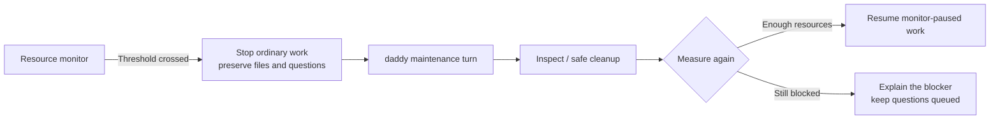

[English](en.md) · [Русский](ru.md) · [All guides](../index/en.md)

# Operate the service

```bash
daddy service status
daddy service logs --follow
daddy up
daddy down
daddy restart
```

The Linux systemd service runs as your user. On unified cgroups it uses the lingering user manager; on other supported hosts it uses a system unit with an explicit user/group. A separate Tailscale service provides permanent private networking. The app does not depend on tmux, a laptop browser or an SSH session.

Graceful stop interrupts agent turns and records recoverable incomplete work. Crash recovery also fences interrupted generations. Inspect the task report and resume through daddy; neither restart nor resume silently treats unfinished review as complete. A lost native write is reconciled before it is repeated.

## Files and accounts

- Config: `~/.config/daddyloop/config.json`; override with `DADDYLOOP_CONFIG`.
- Data: configured `dataDir`, default `~/.local/share/daddyloop/data`.
- Database: `daddyloop.sqlite`, WAL enabled. Current schema: **7**; config format: **3**.
- Releases: `~/.local/share/daddyloop/releases/`; `current` selects an immutable installation variant.
- Provider tokens: `~/.tokens/github`, `~/.tokens/gitlab`, `~/.tokens/tracker`, or the corresponding provider environment settings. Token contents never belong in Git.
- Agent executable overrides: `executables.<module-id>` in config. The Codex module also accepts `DADDYLOOP_CODEX_BIN`.

Root browser access uses the local `access-token`. HTTPS pairing creates separately revocable browser credentials. `daddy devices` lists them; `daddy revoke-device ID` revokes one. `daddy phone` creates a fresh one-use link. See [web access](../web/en.md).

In host mode, daddy and workers may use existing credentials for their task. They check the filenames under `~/.tokens` and the tool's instructions before reporting missing authentication. Tools can read the appropriate file locally; if a tool requires an environment variable, a local script can pass it directly to that child process. Secret values must stay out of chat, model prompts, command output and repository files. There is no need to copy all tokens into the service environment.

## Resources and cleanup

By default the service and its builds can use host RAM: `memoryMax: "infinity"`. daddyloop also adds no process/thread count cap. Resource checks still reserve 2 GiB of available RAM and 10 GiB of disk, and stop ordinary work at 90% disk usage. A container or parent systemd unit can impose its own limits; the monitor reports the effective available memory.

To set an explicit cap, use a value such as `memoryMax: "24G"` in the config. Existing installations retain their configured value: replace an old `"8G"` with `"infinity"` to use host RAM. Apply service configuration with `daddy up` after active work has finished. Removing a service cap does not remove the disk and free-memory reserves.

```bash
daddy cache status
daddy cache prune          # dry run
daddy cache prune --apply  # remove verified eligible entries
daddy cache auto on
```

Cleanup only considers owned temporary downloads and old, clean managed reviewer copies. Active, dirty, unpushed, unknown and worker-owned work stays protected. Safe automatic cleanup is enabled by default; an explicit `cache.auto: false` disables automatic removal. Restart the service after changing its policy. It does not delete a large cache just because it is large.

Before disk-heavy work inspect `df -h /home` and available RAM. Arcadia stores/mounts require ownership checks; never truncate a store as a routine cleanup step. `daddy cache arcadia-gc` is an explicit ordinary GC operation, not a blanket removal of user work.

### Recovery instead of a silent queue



The monitor checks disk and RAM even when no agent is running. It queues one maintenance turn, using the session's daddy model in a separate directory and conversation. Its tools inspect resources, prune verified application caches and ask repository modules to reclaim idle owned resources. Arcadia may run ordinary `arc gc` and unmount idle service-owned copies while preserving their stores and edits. Other users' copies are not candidates.

The guard still blocks ordinary work. Maintenance needs at least 1 GiB of free disk and 0.5 GiB of available RAM; below that floor the bot explains why it cannot start. Unsuccessful recovery is retried no more often than once per five minutes. Questions stay saved. Work resumes only after measured resources are healthy, and only for tasks paused by this monitor whose generation has not changed. A manual pause is preserved.

Each agent run owns its commands, including detached background children. The service ends them when the run completes, fails or is cancelled: SIGTERM first, then SIGKILL after a short grace period if needed. It records run ownership and checks the user, host boot and process start time; it never kills a process merely because its name is `bash`, `rsync` or a compiler. Agents must wait for required builds/tests before finishing a turn.

Recovery stops verified leftover processes **before asking a model what to do**. If that restores resources, no maintenance model call is needed. Otherwise the tools can retry stopping leftovers and remove finished runs' disposable caches under `dataDir/run-cache`. Active runs, unrelated processes, working copies and unique results stay protected. Ownership survives a service restart; backups omit live process identities. Late cleanup reports are checked against current resources so a resolved blocker does not become a new request for manual cleanup.

## Updates and removal

Finish or pause active work and back up the config/database before replacing an application release. Run the pinned installer with the required module selection. Earlier config/database formats need an explicit conversion; runtime code does not guess or migrate them. Backups are separate from executable compatibility.

`daddy service uninstall` removes the app service while preserving data and credentials. The separately installed network service remains separate. Service changes may require sudo in system mode. Agent CLI updates can preserve active turns; see [agents](../agents/en.md).

For a portable snapshot, see [Back up and restore](../backups/en.md). Stop the service before `daddy backup create`; restore only into a new directory.
