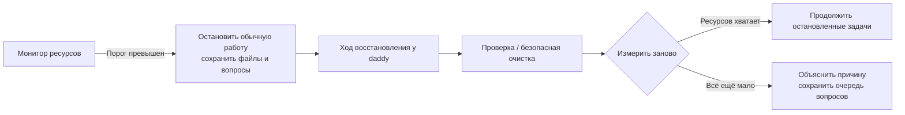

[English](en.md) · [Русский](ru.md) · [Все инструкции](../index/ru.md)

# Эксплуатация сервиса

```bash
daddy service status
daddy service logs --follow
daddy up
daddy down
daddy restart
```

Linux-сервис systemd работает от твоего пользователя. На unified cgroups используется пользовательский manager с lingering, на других поддерживаемых хостах — системный unit с явными user/group. Постоянную приватную сеть обеспечивает отдельный сервис Tailscale. Приложение не зависит от tmux, браузера ноутбука или SSH-сессии.

Штатная остановка прерывает ходы агентов и записывает незавершённую работу для восстановления. После сбоя также отсекаются прерванные поколения. Посмотри отчёт задачи и продолжи через daddy: перезапуск не превращает незавершённое ревью в успешное. Потерянный ответ нативной операции сначала восстанавливается, затем разрешается повтор.

## Файлы и аккаунты

- Конфиг: `~/.config/daddyloop/config.json`; переопределяется через `DADDYLOOP_CONFIG`.
- Данные: настроенный `dataDir`, по умолчанию `~/.local/share/daddyloop/data`.
- База: `daddyloop.sqlite`, включён WAL. Текущая схема — **7**, формат конфига — **3**.
- Релизы: `~/.local/share/daddyloop/releases/`; `current` выбирает неизменяемый вариант установки.
- Токены: `~/.tokens/github`, `~/.tokens/gitlab`, `~/.tokens/tracker` или соответствующие переменные окружения провайдера. Содержимому токенов не место в Git.
- Пути CLI: `executables.<id-модуля>` в конфиге. Модуль Codex также принимает `DADDYLOOP_CODEX_BIN`.

Основной вход в браузер использует локальный `access-token`. HTTPS-привязка создаёт отдельные отзываемые учётные данные браузера. `daddy devices` показывает устройства, `daddy revoke-device ID` отзывает одно, `daddy phone` создаёт новую одноразовую ссылку. См. [доступ к сайту](../web/ru.md).

В режиме host daddy и воркеры могут использовать существующие токены для своей задачи. Прежде чем сообщать об отсутствии авторизации, они проверяют имена файлов в `~/.tokens` и инструкцию нужного инструмента. Инструмент читает подходящий файл локально; если ему нужна переменная окружения, локальный скрипт передаёт её дочернему процессу. Секреты не должны попадать в чат, промпты модели, вывод команд или файлы репозитория. Копировать все токены в окружение службы не требуется.

## Ресурсы и очистка

По умолчанию служба и её сборки могут использовать память хоста: `memoryMax: "infinity"`. daddyloop также не ограничивает число процессов и потоков. Монитор по-прежнему сохраняет запас 2 ГиБ доступной ОЗУ и 10 ГиБ диска, останавливает обычную работу при 90% занятого диска. Контейнер или родительский unit systemd могут задавать свои ограничения; монитор показывает реально доступную память.

Явный лимит можно задать в конфиге, например `memoryMax: "24G"`. При обновлении сохраняется существующая настройка: замени старое `"8G"` на `"infinity"`, чтобы использовать память хоста. После завершения активной работы примени настройки службы командой `daddy up`. Снятие лимита службы сохраняет проверки свободного места и запаса ОЗУ.

```bash
daddy cache status
daddy cache prune          # только посмотреть
daddy cache prune --apply  # удалить проверенные подходящие записи
daddy cache auto on
```

Очистка рассматривает только собственные временные загрузки и старые чистые управляемые копии для ревью. Активная, изменённая, неотправленная, неизвестная работа и копии воркеров защищены. Безопасная автоочистка по умолчанию включена; явное `cache.auto: false` запрещает автоматическое удаление. После изменения политики перезапусти сервис. Большой размер сам по себе не разрешает удаление кеша.

Перед тяжёлой работой проверяй `df -h /home` и доступную ОЗУ. Для Arcadia store/mount сначала проверяется владелец; обычная очистка не должна обрезать store. `daddy cache arcadia-gc` — явный обычный GC, а не удаление чужой работы.

### Восстановление вместо молчащей очереди



Монитор проверяет диск и RAM даже без работающих агентов. Он назначает один ход восстановления модели daddy из этой сессии, в отдельной папке и разговоре. Доступны проверка ресурсов, очистка проверенного кеша приложения и освобождение простаивающих ресурсов через модули репозиториев. Arcadia может выполнить обычный `arc gc` и отключить собственные простаивающие копии, сохранив store и изменения. Чужие копии в очистку не входят.

Обычная работа по-прежнему ждёт ресурсов. Для восстановления нужны хотя бы 1 ГиБ диска и 0,5 ГиБ доступной RAM; ниже этого порога бот объясняет, почему не может стартовать. Неудачное восстановление повторяется не чаще раза в пять минут. Вопросы сохраняются. После повторного измерения продолжаются только задачи, остановленные монитором, если их поколение не изменилось. Ручная пауза сохраняется.

## Обновление и удаление

Перед заменой версии приложения заверши или приостанови работу и сохрани конфиг с базой. Запусти установщик нужного релиза с полным списком модулей. Прежние форматы конфига и базы требуют явного преобразования: runtime их не угадывает и не мигрирует. Резервная копия не является слоем совместимости.

`daddy service uninstall` удаляет сервис приложения, сохраняя данные и токены. Отдельно установленная сеть остаётся отдельным сервисом. В системном режиме изменение сервисов может требовать sudo. Обновления CLI агентов сохраняют работающие ходы — см. [агенты](../agents/ru.md).

Переносимый снимок описан в [бэкапах и восстановлении](../backups/ru.md). Перед `daddy backup create` останови сервис; восстанавливай только в новый каталог.
