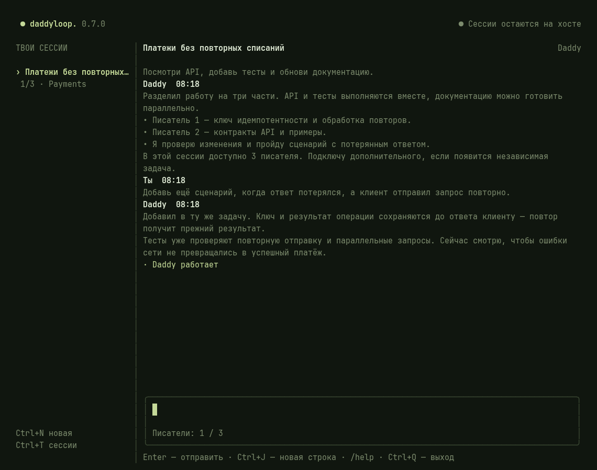
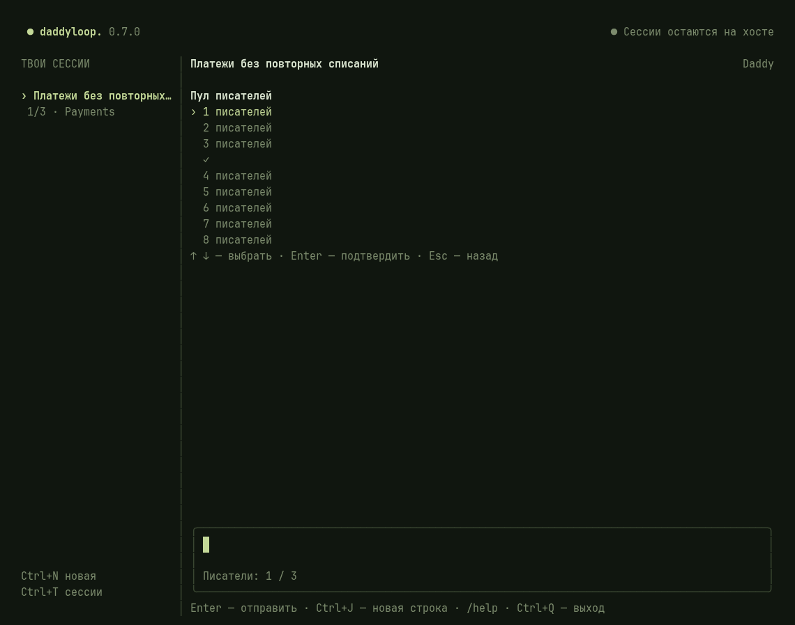

# Daddyloop CLI

Run `daddy` for the full-screen terminal client. `daddyloop` and `reviewctl` are executable aliases. The terminal has one Daddy conversation, session selection, a task board, project selection and writer/model settings.

```bash
daddy projects add ~/projects/app --name App
daddy
```

Use `/new` to select a project and start a session. Send a goal or ticket link as ordinary text. Add more tickets in the same conversation to use the same Daddy and writer pool.

| Command                         | Purpose                                       |
| ------------------------------- | --------------------------------------------- |
| `/new`                          | Choose a project and create a session         |
| `/sessions`                     | Select an existing session                    |
| `/projects`                     | Select or discover registered server projects |
| `/pool` / `/pool 3`             | Set the maximum simultaneous writers          |
| `/models`                       | Choose Daddy/new-writer models and effort     |
| `/tasks` / `/chat`              | Switch task board and conversation            |
| `/notifications`                | Choose Telegram notification preferences      |
| `/updates`                      | Check CLI versions                            |
| `/language en` / `/language ru` | Change interface language                     |
| `/pause` / `/resume`            | Pause or continue the whole session           |
| `/quit`                         | Close the client while the service continues  |

`Ctrl+N` opens project selection, `Ctrl+T` opens sessions, `Tab` switches chat/tasks or completes a command, and `PgUp/PgDn` scroll. Use `Ctrl+J` or supported Shift+Enter for a newline. Pasted multiline text is treated as content, not as a terminal control command. Drafts are separate between sessions.





Non-interactive equivalents:

```bash
daddy new --project App "Implement the feature"
daddy sessions
daddy talk SESSION_ID "https://github.com/acme/app/issues/42"
daddy pool SESSION_ID 3
daddy console SESSION_ID
```

`--theme light` and `--language en` configure a client invocation. `--plain` uses a basic line-oriented client. Closing the console, Ctrl+Q or losing SSH does not cancel server work. Use `/pause` explicitly to pause a session.

For a remote client, configure the service connection with `daddy connect <https-url>`. Projects always refer to directories on the service host, not on the laptop.

Legacy task-level APIs and commands remain for compatibility where applicable, but direct writer chat is rejected. Use `daddy talk` or the Daddy conversation for instructions.
