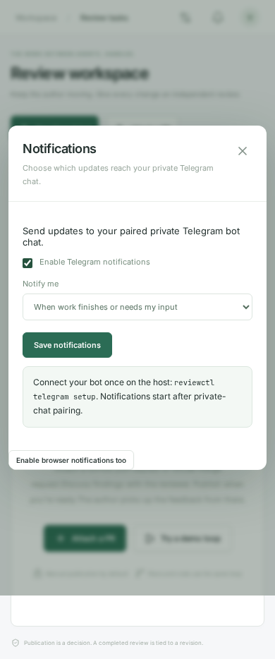

# От тикета до PR

Начни с `reviewctl`, введи `/defaults` и выбери автора и ревьюера. Например, GPT-5.6-Sol / max для автора и GPT-6-Astra / max для ревьюера. Каталог берётся из аккаунта на сервере; недоступные модели и reasoning effort отклоняются до запуска. Поддерживаемый движок сейчас — Codex. Claude runtime пока не реализован.

## Первая задача

В TUI введи `/new`: ссылка на GitHub issue или ключ Tracker, затем путь к рабочему репозиторию **на сервере**. На сайте нажми **New from ticket**.

```bash
reviewctl start https://github.com/your-team/project/issues/42 \
  --repo /home/you/projects/project
reviewctl console <task-id> --role author
```

Описание и комментарии сохраняются как снимок источника. Тикет не изменяется; повторный импорт того же активного тикета отклоняется. Автор читает репозиторий и предлагает решение в отдельном чате, пока без записи файлов. Обсуди детали, затем введи `/implement` или `reviewctl implement <task-id>`.

Сервис создаёт изолированную рабочую копию от локально доступной базовой ветки, сохраняет реализацию коммитом, делает обычный push и создаёт draft PR в GitHub либо PR в Arcanum. GitHub-репозиторий назначения определяется remote исходной рабочей копии (origin, github, затем первый доступный); требуется право push в него. Отдельное создание fork не автоматизировано. Обнови нужную базовую ветку перед запуском или укажи `--base main`.

После создания PR ревьюер проверяет точную ревизию и публикует готовые замечания. Автор исправляет опубликованные комментарии, цикл повторяется. CI, неполный результат и спорные замечания остаются проверками перед завершением; merge не выполняется. Если нужны ручные этапы, укажи `--manual-publish` и/или `--no-auto-push`; затем используй `publish` и `submit`. Уже созданный PR можно подключить через `reviewctl link-pr <task-id> <url>`.

## Большой тикет и отдельные авторы

Импортируй большой тикет, затем выбери его и введи `/child`. У ребёнка собственная модель автора, чат и рабочая копия. Общий ревьюер наследуется от группы: одна модель, одна постоянная сессия, очередь проверок.

```bash
reviewctl child <parent-task-id> \
  https://github.com/your-team/project/issues/43 \
  --author-model gpt-5.6-sol --author-effort max
reviewctl child <parent-task-id> \
  https://github.com/your-team/project/issues/44 \
  --author-model gpt-5.6-sol --author-effort medium
reviewctl groups
reviewctl agents defaults --max-agents 2
```

Добавление детей явное: сервис не превращает ссылки из описания большого тикета в автоматически запущенные задания. У каждого ребёнка отдельно начинается обсуждение и реализация. Авторы получают требования большой задачи и свой тикет, не приватные чаты соседей. Модель ревьюера меняется для всей группы, когда его очередь пуста. Работающие и поставленные в очередь задания сохраняют записанный профиль.

Группа показывает состояния и ссылки детей. Она не объединяет их ветки и не делает общий merge: зависимые изменения нужно последовательно включать в базовую ветку и создавать следующий тикет от нужной базы.

## Tracker и Arcadia

```bash
reviewctl arcadia setup --workspace ~/arcadia2
reviewctl start QUEUE-123 --repo ~/arcadia2
reviewctl child <parent-task-id> QUEUE-124
```

Нужны корпоративные Arc/Arcanum CLI, CA, аренды свободных mounts и доступ к Tracker. Токен читается из `TRACKER_OAUTH_TOKEN`, `TRACKER_TOKEN`, `~/.tokens/tracker` или `~/.tracker-token`. Он не передаётся агентским процессам. Источником может быть и `https://st.yandex-team.ru/QUEUE-123`.

Исходный mount пользователя сохраняется. Для одновременно работающих авторов нужны отдельные свободные mounts; чистый mount ревьюера освобождается после проверки. Нативное создание Arc PR выполняется без auto-merge и с обычным push. Чтение реального Tracker проверено; запись Arc PR и commit/push проверены на fixtures и по справке установленного CLI, без публикации в рабочие тикеты.

## Получить результат в Telegram

```bash
reviewctl telegram setup
reviewctl notifications on --events attention
```

Привяжи личный чат по ссылке. Режим `attention` сообщает о завершении, необходимых решениях, неуспешных/отсутствующих проверках и ручных этапах. `all` добавляет ответы агентов. Выключение: `reviewctl notifications off`. В TUI есть `/notifications`, на сайте — колокольчик, в боте — `/notifications on`, `/notifications all`, `/notifications off`.



Бот работает с сервера через long polling, ноутбук не нужен. Для сайта на телефоне отдельно настрой постоянный HTTPS-доступ: [инструкция](getting-started.md#сайт-и-телефон).
