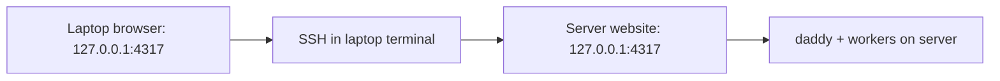

[English](en.md) · [Русский](ru.md) · [All guides](../index/en.md)

# Open the site on a computer or phone

The website runs **on the service host**, at `http://127.0.0.1:4317`. Your browser needs a route to that host. Installing a CLI on the laptop is optional.

## Which machine does what?

| Location                       | What to do here                                                    |
| ------------------------------ | ------------------------------------------------------------------ |
| Linux server running daddyloop | Install modules, run `daddy up`, connect provider accounts         |
| Your laptop's local terminal   | Start an SSH tunnel to the server                                  |
| Your laptop's browser          | Open the local end of the tunnel and sign in                       |
| Your phone                     | Connect directly through Tailscale/HTTPS; Telegram needs no tunnel |



If your terminal prompt already shows the remote machine, you are inside SSH. Open a **new local terminal tab** on the laptop for the tunnel command. `127.0.0.1` means “this machine”, so opening it on the laptop without a tunnel does not reach the server.

## Computer: the quickest connection over SSH

1. Start the service on the server: `daddy up`.
2. In a terminal **on your laptop**, run the following command. Replace `user@server` with the same SSH destination you normally use:

   ```bash
   ssh -N -o ExitOnForwardFailure=yes -o ServerAliveInterval=30 -L 4317:127.0.0.1:4317 user@server
   ```

3. After authentication the SSH command may stay silent. That is expected: `-N` holds a tunnel without opening a shell. Keep that terminal open. In the **laptop browser**, open [http://127.0.0.1:4317](http://127.0.0.1:4317).
4. Run `daddy token` **on the server** and paste the token into the website's login form. Keep the token private.

`127.0.0.1` in your browser means your laptop; the tunnel forwards that port to the service host. If local port 4317 is occupied, replace the first `4317` with a free port and use it in the browser URL.

Closing SSH disconnects this browser route. **The service, daddy and workers continue on the server.** Reopen the same tunnel to reconnect. This method does not give the phone a permanent route.

### If the laptop port is busy

```bash
ssh -N -o ExitOnForwardFailure=yes -L 14317:127.0.0.1:4317 user@server
```

Open **http://127.0.0.1:14317** in your browser. `14317` belongs to the laptop; the last `4317` is daddyloop's port on the server. If you changed the service port, put it in the last field. You do not need to bind daddyloop to `0.0.0.0` or expose its port to the internet.

### Check the connection

In another server terminal, run `curl -fsS http://127.0.0.1:4317/api/health`. Run the same command in a local laptop terminal while the tunnel is open (or use port `14317`). Both responses should contain `"ok":true` and the same service version. Only the server request works: inspect SSH/tunnel setup. Both work but sign-in fails: check the token and browser address.

## Browser on the service host itself

Open [http://127.0.0.1:4317](http://127.0.0.1:4317) or run `daddy open` on that machine. Log in with `daddy token`. Running `daddy open` in a remote SSH shell tries to open a browser on the server, not on your laptop.

## Computer and phone: permanent private access

On the server:

```bash
daddy web tailscale
```

Complete the account login it prints. Install Tailscale on your laptop/phone and join the same network. The command runs Tailscale Serve as a persistent service and saves the HTTPS address. Read it with:

```bash
daddy web status
daddy phone
```

`daddy phone` creates a one-use browser login link valid for five minutes. It works on a computer too. Open it on the target device while connected to the private network. The phone reaches the server directly; the laptop and its SSH session can be off.

## Your own HTTPS domain

Point your domain and HTTPS reverse proxy at the host. Forward to `127.0.0.1:4317`, preserve Host, and keep event streams unbuffered. Then run on the server:

```bash
daddy web origin https://daddy.example.com
daddy restart
daddy phone
```

A Caddy configuration can be:

```caddyfile
daddy.example.com {
    reverse_proxy 127.0.0.1:4317 {
        flush_interval -1
    }
}
```

The application itself stays on loopback. The public origin must exactly match the browser origin. Your proxy and network control who can reach it.

## If the page does not open

- `daddy service status` on the server: the service must be active.
- SSH connection: verify the tunnel is still open and the local port is free.
- Tailscale connection: both devices must be in the same network; finish server login first.
- `daddy web status`: check the configured URL. `localhost` on a phone means that phone.
- After changing the HTTPS origin, restart daddyloop. Old one-use links may already be consumed or expired; create a new one.

See [appearance and usage](../appearance/en.md) for themes and the persistent usage panel, and [operations](../operations/en.md) for service logs and device revocation.
