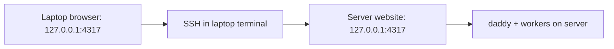

[English](en.md) · [Русский](ru.md) · [All guides](../index/en.md)

# Open the site on a computer or phone

The website runs **on the service host**, at `http://127.0.0.1:4317`. Your browser needs a route to that host. Installing a CLI on the laptop is optional.

## Which machine does what?

| Location                       | What to do here                                                    |
| ------------------------------ | ------------------------------------------------------------------ |
| Linux server running daddyloop | Install modules, run `daddy up`, connect provider accounts         |
| Your laptop's local terminal   | Start an SSH tunnel to the server                                  |
| Your laptop's browser          | Open the local end of the tunnel and sign in                       |
| Your phone                     | Connect directly through Tailscale/HTTPS; Telegram needs no tunnel |



If your terminal prompt already shows the remote machine, you are inside SSH. Open a **new local terminal tab** on the laptop for the tunnel command. `127.0.0.1` means “this machine”, so opening it on the laptop without a tunnel does not reach the server.

## Computer: the quickest connection over SSH

1. On the server, run `daddy up`, then `daddy web`.
2. Copy the SSH command printed by `daddy web` into a **new local terminal on the laptop**. It already contains this server’s username, hostname, HTTP port and detected SSH port.
3. Open the browser URL printed beside it. Keep the tunnel terminal open.
4. Run `daddy token` on the server and use the token in the browser login form.

If daddy is installed on the laptop, the server also prints a shorter command using `daddy web --ssh` with the actual destination. That command starts the tunnel, waits for the site and opens the local browser when available. Press Ctrl+C to close only the tunnel. SSH uses your normal keys, agent and SSH configuration.

A server cannot start a process on a disconnected laptop. Run the printed command on the laptop; `daddy open` inside SSH now shows the same connection instructions instead of trying to launch a server browser. `daddy up` also prints them after starting the service.

### Another address or a busy laptop port

On the server, `daddy web --host work-host --port 14317` prints commands using your SSH alias and port 14317 on the laptop. The remote service port stays unchanged. When using the laptop CLI directly, `--remote-port` sets the service port and `--ssh-port` sets a non-default SSH port.

The tunnel binds only to the laptop’s loopback address. Closing it disconnects the browser route; **daddy and workers continue on the server**. Reopen the same tunnel to reconnect. For a phone or permanent address, use the private HTTPS setup below.

### Check the connection

In another server terminal, run `curl -fsS http://127.0.0.1:4317/api/health`. Run the same command in a local laptop terminal while the tunnel is open (or use port `14317`). Both responses should contain `"ok":true` and the same service version. Only the server request works: inspect SSH/tunnel setup. Both work but sign-in fails: check the token and browser address.

## Browser on the service host itself

Open [http://127.0.0.1:4317](http://127.0.0.1:4317) or run `daddy open` on that machine. Log in with `daddy token`. Inside SSH, `daddy open` prints connection instructions for the laptop.

## Computer and phone: permanent private access

On the server:

```bash
daddy web tailscale
```

Complete the account login it prints. Install Tailscale on your laptop/phone and join the same network. The command runs Tailscale Serve as a persistent service and saves the HTTPS address. Read it with:

```bash
daddy web status
daddy phone
```

`daddy phone` creates a one-use browser login link valid for five minutes. It works on a computer too. Open it on the target device while connected to the private network. The phone reaches the server directly; the laptop and its SSH session can be off.

## Your own HTTPS domain

Point your domain and HTTPS reverse proxy at the host. Forward to `127.0.0.1:4317`, preserve Host, and keep event streams unbuffered. Then run on the server:

```bash
daddy web origin https://daddy.example.com
daddy restart
daddy phone
```

A Caddy configuration can be:

```caddyfile
daddy.example.com {
    reverse_proxy 127.0.0.1:4317 {
        flush_interval -1
    }
}
```

The application itself stays on loopback. The public origin must exactly match the browser origin. Your proxy and network control who can reach it.

## If the page does not open

- `daddy service status` on the server: the service must be active.
- SSH connection: verify the tunnel is still open and the local port is free.
- Tailscale connection: both devices must be in the same network; finish server login first.
- `daddy web status`: check the configured URL. `localhost` on a phone means that phone.
- After changing the HTTPS origin, restart daddyloop. Old one-use links may already be consumed or expired; create a new one.

See [appearance and usage](../appearance/en.md) for themes and the persistent usage panel, and [operations](../operations/en.md) for service logs and device revocation.
