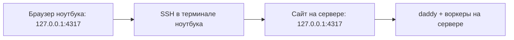

[English](en.md) · [Русский](ru.md) · [Все инструкции](../index/ru.md)

# Как открыть сайт на компьютере или телефоне

Сайт работает **на машине с сервисом**, по адресу `http://127.0.0.1:4317`. Браузеру нужен путь к этой машине. Ставить CLI на ноутбук необязательно.

## Где что находится

| Место                       | Что здесь делать                                                                     |
| --------------------------- | ------------------------------------------------------------------------------------ |
| Linux-сервер с daddyloop    | Установить модули, выполнить `daddy up`, подключить аккаунты                         |
| Локальный терминал ноутбука | Запустить SSH-туннель к серверу                                                      |
| Браузер ноутбука            | Открыть адрес локального конца туннеля и войти                                       |
| Телефон                     | Подключиться напрямую к серверу через Tailscale/HTTPS; для Telegram туннель не нужен |



Если приглашение терминала уже показывает удалённую машину, ты внутри SSH. Для команды туннеля открой **новую локальную вкладку терминала** на ноутбуке. `127.0.0.1` означает «эта машина», поэтому открыть его на ноутбуке без туннеля недостаточно.

## Компьютер: быстрый доступ через SSH

1. На сервере запусти сервис: `daddy up`.
2. В терминале **на ноутбуке** выполни команду ниже. Вместо `user@server` подставь тот же адрес, которым обычно пользуешься для SSH:

   ```bash
   ssh -N -o ExitOnForwardFailure=yes -o ServerAliveInterval=30 -L 4317:127.0.0.1:4317 user@server
   ```

3. После входа SSH команда может просто молчать — так и должно быть: `-N` держит туннель без командной оболочки. Оставь этот терминал открытым. В **браузере ноутбука** открой [http://127.0.0.1:4317](http://127.0.0.1:4317).
4. Выполни `daddy token` **на сервере** и вставь токен в форму входа. Не публикуй токен.

`127.0.0.1` в браузере — это ноутбук. Туннель перенаправляет его порт на машину с сервисом. Если локальный порт 4317 занят, замени первое `4317` на свободный порт и укажи его в адресе браузера.

При закрытии SSH этот путь к сайту пропадёт. **Сервис, daddy и воркеры продолжат работу на сервере.** Чтобы подключиться снова, открой такой же туннель. Для постоянного доступа с телефона этот способ не подходит.

### Если порт ноутбука занят

```bash
ssh -N -o ExitOnForwardFailure=yes -L 14317:127.0.0.1:4317 user@server
```

Теперь адрес в браузере — **http://127.0.0.1:14317**. `14317` принадлежит ноутбуку, последнее `4317` — daddyloop на сервере. Если изменил порт сервиса, подставь его в последнее поле. Сервис не нужно открывать на `0.0.0.0` и выставлять его порт в интернет.

### Быстро проверить соединение

В отдельном терминале сервера: `curl -fsS http://127.0.0.1:4317/api/health`. В локальном терминале ноутбука при открытом туннеле — та же команда (или порт `14317`). Оба ответа должны содержать `"ok":true` и одну версию сервиса. Первый работает, второй нет — проблема в SSH/туннеле. Оба работают, но вход не удаётся — проверь токен и адрес браузера.

## Браузер на самой машине с сервисом

Открой [http://127.0.0.1:4317](http://127.0.0.1:4317) или выполни `daddy open` на этой машине. Для входа нужен `daddy token`. Команда `daddy open` в удалённой SSH-сессии пытается открыть браузер на сервере, а не на ноутбуке.

## Компьютер и телефон: постоянный приватный доступ

На сервере:

```bash
daddy web tailscale
```

Пройди вход в аккаунт по выданной ссылке. Установи Tailscale на ноутбук или телефон и подключись к той же сети. Команда запускает Tailscale Serve как постоянный сервис и сохраняет HTTPS-адрес. Посмотреть адрес и получить вход:

```bash
daddy web status
daddy phone
```

`daddy phone` выдаёт одноразовую ссылку входа в браузер на пять минут. На компьютере она тоже работает. Открой её на нужном устройстве, подключённом к приватной сети. Телефон ходит прямо на сервер: ноутбук и SSH-сессия могут быть выключены.

## Собственный HTTPS-домен

Настрой домен и HTTPS-прокси на сервер. Проксируй на `127.0.0.1:4317`, сохраняй Host и отключи буферизацию потока событий. Затем на сервере:

```bash
daddy web origin https://daddy.example.com
daddy restart
daddy phone
```

Пример для Caddy:

```caddyfile
daddy.example.com {
    reverse_proxy 127.0.0.1:4317 {
        flush_interval -1
    }
}
```

Само приложение продолжает слушать loopback. Настроенный public origin должен точно совпадать с адресом браузера. Доступность извне определяется прокси и сетью.

## Если страница не открывается

- `daddy service status` на сервере: сервис должен быть активен.
- Для SSH проверь, что туннель открыт и локальный порт свободен.
- Для Tailscale оба устройства должны быть в одной сети; сначала заверши вход на сервере.
- Посмотри URL через `daddy web status`. `localhost` на телефоне означает сам телефон.
- После смены HTTPS-адреса перезапусти daddyloop. Одноразовая ссылка могла истечь или уже использоваться — выпусти новую.

Темы и постоянная панель usage описаны во [внешнем виде](../appearance/ru.md), логи и отзыв доступа устройств — в [эксплуатации](../operations/ru.md).
