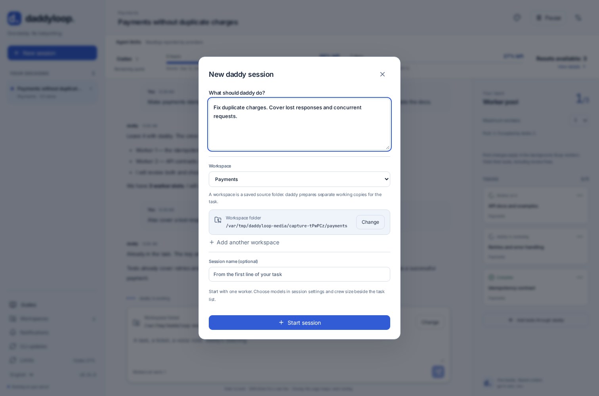
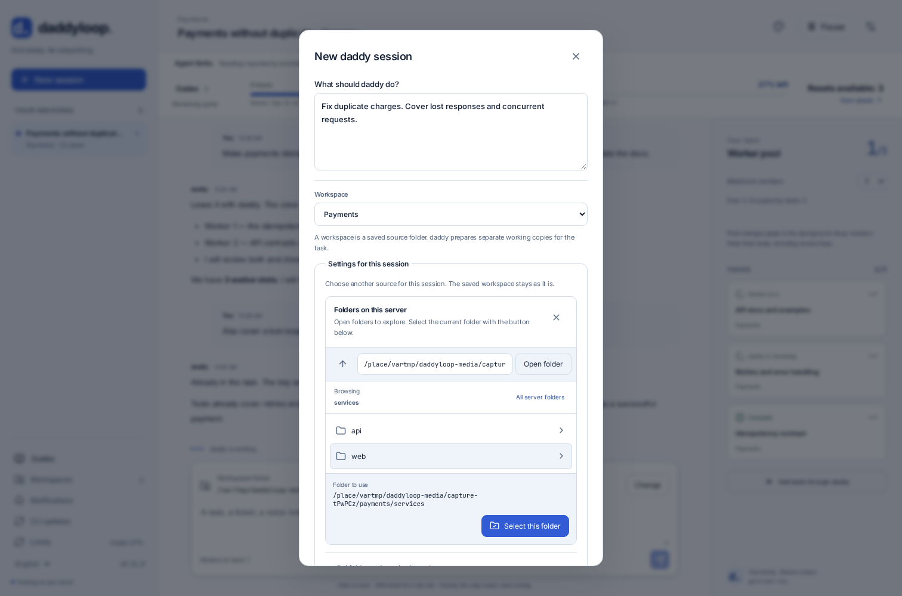
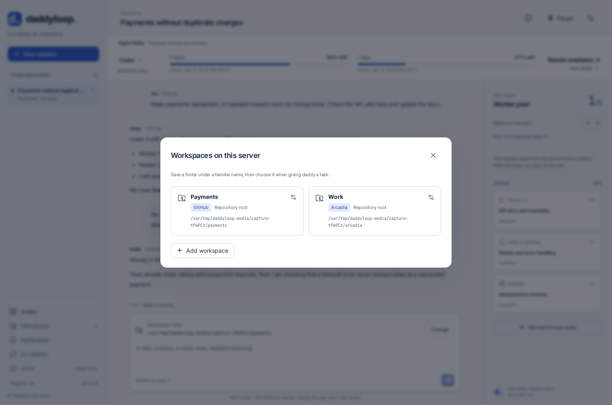

[English](en.md) · [Русский](ru.md) · [All guides](../index/en.md)

# Workspaces, sessions and working copies

| Name      | Meaning                                                                                |
| --------- | -------------------------------------------------------------------------------------- |
| Workspace | A named source repository on this server: path, optional subdirectory and base branch. |
| Session   | One conversation with daddy, its tasks and worker pool.                                |
| Task      | One work item assigned to a worker.                                                    |

`Work` can mean `~/arcadia2` on one server and `~/arcadia` on another. These defaults belong to the host. Create as many sessions and tasks as needed within a workspace.

```bash
daddy workspaces add ~/work/app --name App
daddy workspaces add ~/arcadia2 --name Work --base trunk
daddy workspaces set Work ~/arcadia --base trunk
daddy workspaces discover
daddy workspaces browse
```

For a self-hosted Git service, select its module explicitly if necessary:

```bash
daddy workspaces add ~/work/app --name App --provider gitlab
```

The corresponding repository module must be enabled. Arcadia also needs [its host setup](../arcadia/en.md).

## Change the directory for one session or task

A session saves a snapshot of the workspace defaults. Editing the workspace later affects new sessions only.

```bash
# Override the whole new session, preserving Work's defaults.
daddy new --workspace Work --repo ~/arcadia2 --scope alice "Investigate the search issue"

# Override this next message only; existing tasks keep their own copies.
daddy talk SESSION_ID "Take the next ticket" --repo ~/arcadia --scope alice
```

On the website, describe the task first, then choose a workspace. Its saved folder appears below the selector. **Change** opens settings for this session only; the subfolder and branch are under **Subfolder and starting branch**. Click **Apply settings** to validate the folder before starting. **Cancel** keeps the previous selection.



In an existing conversation, **Change** beside the folder applies to the next message only. After sending, the session folder is selected again. Sending is paused while you edit folder settings: apply or cancel them first.

The server folder picker works like this:

1. **Open folder** or a named row navigates inside to show its contents.
2. **Parent folder** moves up; **All server folders** returns to the server's allowed roots.
3. **Select this folder** puts the displayed path into the form. Then use **Apply settings** or **Save workspace**.



In **Workspaces**, names, repository types and paths are separate. A card opens its saved defaults; **Add workspace** creates another entry. Coming here from a new task preserves its draft and selects the newly saved workspace when you return.



In Telegram and the interactive CLI, use `/repo /absolute/server/path`; `/repo default` cancels it. The Telegram selection expires after ten minutes. An expired selection is rejected rather than silently sending work to another directory.

## What happens to the source repository?

Git workers get managed working copies; Arcadia workers get leased mounts. The source branch and local changes remain in place. Uncommitted source edits are not copied into the worker's new checkout. A relative scope selects the starting directory inside the managed copy, not a second repository.

The source repository needs an appropriate remote and a committed base revision. A workspace name is not permission to use an unrelated directory. Repository roots and scope boundaries are checked on the server.
