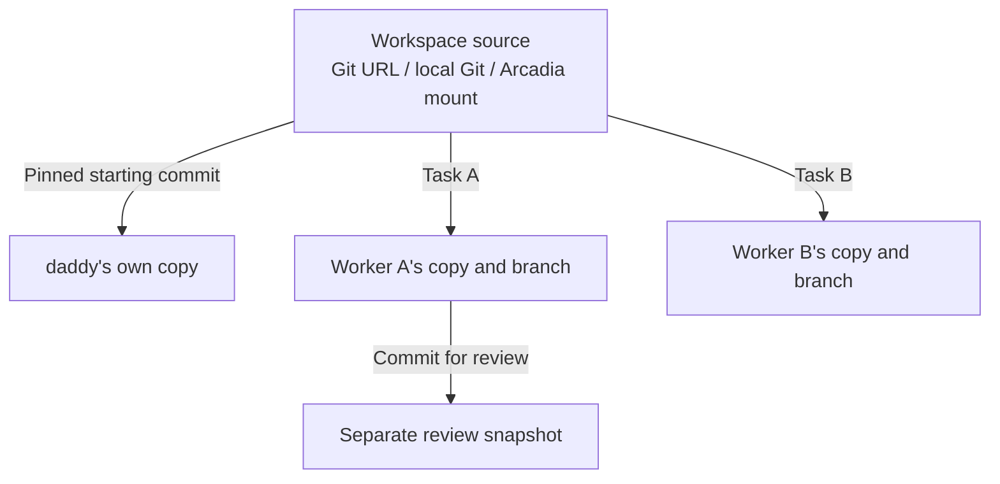

[English](en.md) · [Русский](ru.md) · [All guides](../index/en.md)

# Workspaces, sessions and working copies

| Name      | Meaning                                                                                     |
| --------- | ------------------------------------------------------------------------------------------- |
| Workspace | A named repository source: Git URL or server folder, optional subdirectory and base branch. |
| Session   | One conversation with daddy, its tasks and worker pool.                                     |
| Task      | One work item assigned to a worker.                                                         |

`Work` can mean `~/arcadia2` on one server and `~/arcadia` on another. These defaults belong to the host. Create as many sessions and tasks as needed within a workspace.

```bash
daddy workspaces add https://github.com/acme/app --name App
daddy workspaces add git@gitlab.com:team/service.git --name Service --provider gitlab
daddy workspaces add ~/work/local-app --name Local
daddy workspaces add ~/arcadia2 --name Work --base trunk
daddy workspaces set Work ~/arcadia --base trunk
daddy workspaces discover
daddy workspaces browse
```

For a company GitLab, choose the module explicitly:

```bash
daddy workspaces add https://code.example.com/team/app --name Company --provider gitlab
```

The corresponding repository module must be enabled. Arcadia also needs [its host setup](../arcadia/en.md).

## One source, separate workers

No manual clone is needed for a URL workspace. Save the address in **Workspaces → Add workspace → Repository URL or server folder**. In Telegram: **Workspaces → Add workspace**, choose the service, send the address, then the name.



Before the first model turn, the service prepares daddy's copy. Each assigned task gets its own worker copy; retries and fixes reuse it. Two workers never share a writable folder. A task created later resolves the starting branch again; an existing task keeps its pinned commit.

For Git URLs, the service reads the remote's default branch, fetches its commit into a private Git database for the task, and creates a worktree. This gives each task an independent checkout without cloning every branch. HTTPS uses the hosting module's token when configured, or the server's Git credentials; SSH uses the server's SSH setup and preserves SSH for pushes. Public repositories need no token for cloning. PRs and reviews still need the service's GitHub/GitLab API credentials. Tokens are never part of the URL.

For Arcadia, register one existing mount, such as `~/arcadia`. The service creates separate mounts sharing the configured object store; it does not switch the source mount's branch. [Arcadia setup](../arcadia/en.md).

## Change the directory for one session or task

A session saves a snapshot of the workspace defaults. Editing the workspace later affects new sessions only.

```bash
# Override the whole new session, preserving Work's defaults.
daddy new --workspace Work --repo ~/arcadia2 --scope alice "Investigate the search issue"

# Override this next message only; existing tasks keep their own copies.
daddy talk SESSION_ID "Take the next ticket" --repo ~/arcadia --scope alice
```

On the website, describe the task first, then choose a workspace. Its saved folder appears below the selector. **Change** opens settings for this session only; the subfolder and branch are under **Subfolder and starting branch**. Click **Apply settings** to validate the folder before starting. **Cancel** keeps the previous selection.


In an existing conversation, **Change** beside the folder applies to the next message only. After sending, the session folder is selected again. Sending is paused while you edit folder settings: apply or cancel them first.

The server folder picker works like this:

1. **Open folder** or a named row navigates inside to show its contents.
2. **Parent folder** moves up; **All server folders** returns to the server's allowed roots.
3. **Select this folder** puts the displayed path into the form. Then use **Apply settings** or **Save workspace**.


In **Workspaces**, names, repository types and paths are separate. A card opens its saved defaults; **Add workspace** creates another entry. Coming here from a new task preserves its draft and selects the newly saved workspace when you return.


In Telegram and the interactive CLI, use `/repo https://github.com/acme/app` or `/repo /absolute/server/path`; `/repo default` cancels it. The Telegram selection expires after ten minutes. An expired selection is rejected rather than silently sending work to another directory.

## Automatic Arcadia copies

Arc workspaces use automatic session copies by default. The source can stay at `~/arcadia`: the service prepares its own copies and removes them after you delete the session. The new-session form and Telegram offer the mode; `daddy workspaces set Work ~/arcadia --copies session` changes the default. [Allocation, deletion and archives](../arcadia/en.md).

## What happens to the source repository?

Git workers get managed working copies; Arcadia workers get leased mounts. The source branch and local changes remain in place. Uncommitted source edits are not copied into the worker's new checkout. A relative scope selects the starting directory inside the managed copy, not a second repository.

A local Git source needs an appropriate remote and a committed base revision. Its base is read locally; the service does not fetch into your checkout. URL sources fetch from the server. A workspace name is not permission to use an unrelated directory. Repository roots and scope boundaries are checked on the server.

## Deleting a Git session

Use **Delete session** or `daddy delete SESSION_ID --yes`. The service stops and waits for that session's runs, saves and verifies an archive, then removes its copies. Other sessions and source folders stay in place.

The archive is under `<dataDir>/session-archives/<session>/git-<module>/g<generation>/`. It contains the conversation, task results, Git databases, indexes and working files, including untracked files and unpushed commits. The archive stays on disk and is included in backups. Automatic export is limited to 2 GiB per module and checks free disk space. If export fails, ownership changes or files change during export, deletion stops and the remaining copies are preserved.
