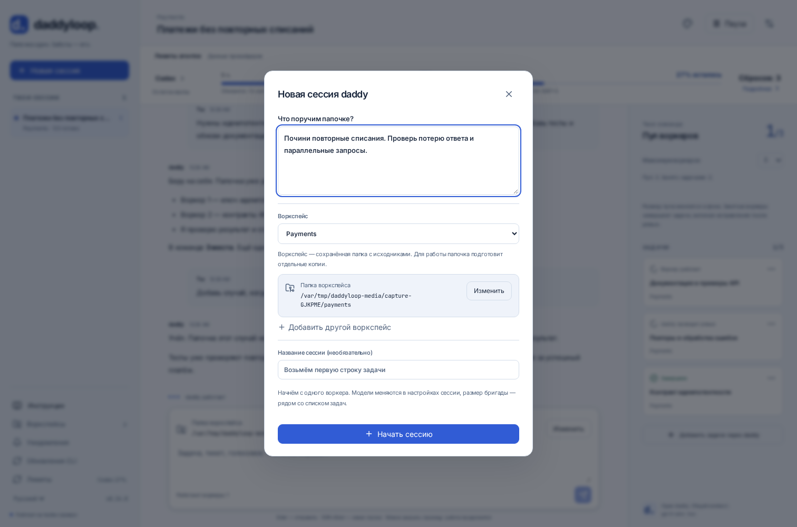
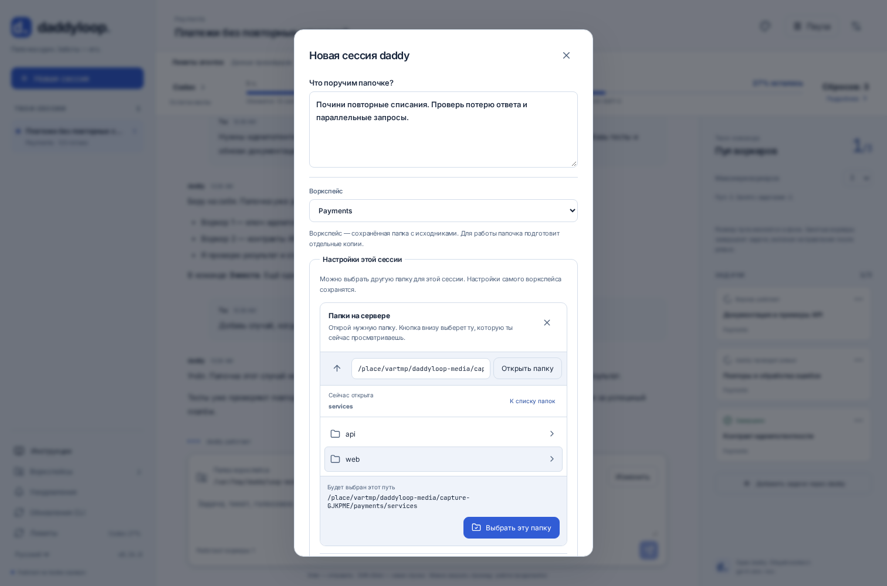
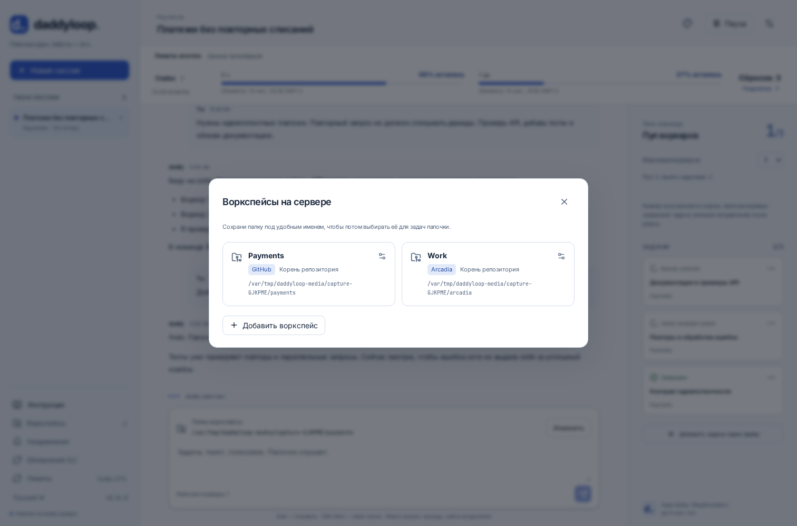

[English](en.md) · [Русский](ru.md) · [Все инструкции](../index/ru.md)

# Воркспейсы, сессии и рабочие копии

| Название  | Значение                                                                                    |
| --------- | ------------------------------------------------------------------------------------------- |
| Воркспейс | Именованный исходный репозиторий на сервере: путь, необязательная подпапка и базовая ветка. |
| Сессия    | Один разговор с daddy, его задачи и пул воркеров.                                           |
| Задача    | Отдельная работа, назначенная воркеру.                                                      |

На одной машине `Work` может указывать на `~/arcadia2`, на другой — на `~/arcadia`. Дефолты принадлежат серверу. В одном воркспейсе можно создавать разные сессии и задачи.

```bash
daddy workspaces add ~/work/app --name App
daddy workspaces add ~/arcadia2 --name Work --base trunk
daddy workspaces set Work ~/arcadia --base trunk
daddy workspaces discover
daddy workspaces browse
```

Для Git-сервиса на собственном домене при необходимости укажи модуль явно:

```bash
daddy workspaces add ~/work/app --name App --provider gitlab
```

Модуль репозитория должен быть включён. Для Arcadia нужна ещё [настройка хоста](../arcadia/ru.md).

## Другая папка для сессии или задачи

Сессия сохраняет снимок дефолтов воркспейса. Последующее изменение воркспейса применяется только к новым сессиям.

```bash
# Другая папка для всей новой сессии. Дефолт Work сохраняется.
daddy new --workspace Work --repo ~/arcadia2 --scope alice "Разберись с поиском"

# Другая папка только для этого сообщения. Старые задачи остаются в своих копиях.
daddy talk SESSION_ID "Возьми следующий тикет" --repo ~/arcadia --scope alice
```

На сайте сначала опиши задачу, затем выбери воркспейс. Под ним видна сохранённая папка. Кнопка **Изменить** открывает настройки только этой сессии; подпапка и ветка скрыты в разделе **Подпапка и начальная ветка**. После редактирования нажми **Применить настройки**: папка проверяется до начала работы. **Отмена** сохраняет прежний выбор.



В уже начатом разговоре **Изменить** рядом с папкой относится только к следующему сообщению. После отправки снова используется папка сессии. Пока настройки редактируются, отправка приостановлена: сначала примени или отмени изменения.

Выбор папки на сервере устроен так:

1. **Открыть папку** или строка с названием — перейти внутрь и посмотреть содержимое.
2. **Родительская папка** — подняться на уровень выше; **К списку папок** — вернуться к доступным корневым папкам сервера.
3. **Выбрать эту папку** — перенести показанный путь в форму. После этого нажми **Применить настройки** или **Сохранить воркспейс**.



В разделе **Воркспейсы** имя, тип репозитория и путь показаны отдельно. Нажатие на карточку открывает редактирование дефолтов; **Добавить воркспейс** создаёт отдельную запись. Если перешёл сюда из формы новой задачи, её текст сохранится, а новый воркспейс подставится после сохранения.



В Telegram и интерактивном CLI: `/repo /полный/путь/на/сервере`, отмена — `/repo default`. Выбор в Telegram действует десять минут. Просроченный выбор отклоняется: задача не уедет молча в другую папку.

## Что происходит с исходным репозиторием?

Git-воркеры получают управляемые рабочие копии, Arcadia-воркеры — отдельные mount'ы с lease. Ветка и локальные изменения исходной папки сохраняются. Незакоммиченные изменения из неё не переносятся в новую копию воркера. Относительная подпапка задаёт стартовый каталог внутри рабочей копии, а не другой репозиторий.

Нужны подходящий remote и закоммиченная базовая ревизия. Название воркспейса не разрешает использовать произвольную чужую папку. Границы репозитория и подпапки проверяются на сервере.
