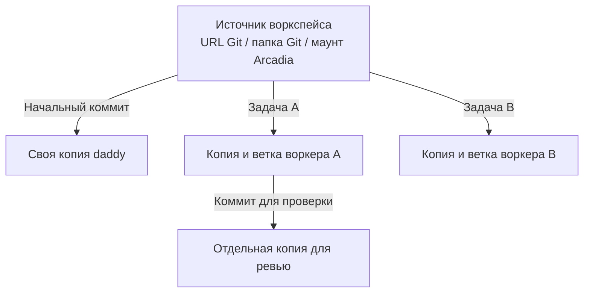

[English](en.md) · [Русский](ru.md) · [Все инструкции](../index/ru.md)

# Воркспейсы, сессии и рабочие копии

| Название  | Значение                                                                                    |
| --------- | ------------------------------------------------------------------------------------------- |
| Воркспейс | Именованный источник: URL Git или папка сервера, необязательная подпапка и начальная ветка. |
| Сессия    | Один разговор с daddy, его задачи и пул воркеров.                                           |
| Задача    | Отдельная работа, назначенная воркеру.                                                      |

На одной машине `Work` может указывать на `~/arcadia2`, на другой — на `~/arcadia`. Дефолты принадлежат серверу. В одном воркспейсе можно создавать разные сессии и задачи.

```bash
daddy workspaces add https://github.com/acme/app --name App
daddy workspaces add git@gitlab.com:team/service.git --name Service --provider gitlab
daddy workspaces add ~/work/local-app --name Local
daddy workspaces add ~/arcadia2 --name Work --base trunk
daddy workspaces set Work ~/arcadia --base trunk
daddy workspaces discover
daddy workspaces browse
```

Для корпоративного GitLab укажи модуль явно:

```bash
daddy workspaces add https://code.example.com/team/app --name Company --provider gitlab
```

Модуль репозитория должен быть включён. Для Arcadia нужна ещё [настройка хоста](../arcadia/ru.md).

## Один источник, отдельные воркеры

Для URL не нужно вручную делать clone. На сайте: **Воркспейсы → Добавить воркспейс → URL репозитория или папка на сервере**. В Telegram: **Воркспейсы → Добавить воркспейс**, выбери сервис, пришли адрес, затем имя.



До первого вызова модели сервис готовит копию daddy. Каждой назначенной задаче выдаёт собственную копию воркера; повторные запуски и исправления продолжают работу в ней. Два воркера не пишут в одну папку. Новая задача снова узнаёт начальный коммит выбранной ветки; существующая сохраняет свой коммит.

Для URL Git сервис узнаёт основную ветку, забирает её коммит в отдельную Git-базу задачи и создаёт worktree. Получается независимая копия без клонирования всех веток. HTTPS использует токен модуля или настройки Git на сервере; SSH — SSH-настройки сервера, в том числе при push. Публичный репозиторий можно скачать без токена. Для PR и ревью нужны API-учётные данные GitHub/GitLab. Токен в URL вставлять не нужно.

Для Arcadia укажи один существующий маунт, например `~/arcadia`. Сервис создаст отдельные маунты с общим хранилищем объектов; ветку исходного маунта не переключит. [Настройка Arcadia](../arcadia/ru.md).

## Другая папка для сессии или задачи

Сессия сохраняет снимок дефолтов воркспейса. Последующее изменение воркспейса применяется только к новым сессиям.

```bash
# Другая папка для всей новой сессии. Дефолт Work сохраняется.
daddy new --workspace Work --repo ~/arcadia2 --scope alice "Разберись с поиском"

# Другая папка только для этого сообщения. Старые задачи остаются в своих копиях.
daddy talk SESSION_ID "Возьми следующий тикет" --repo ~/arcadia --scope alice
```

На сайте сначала опиши задачу, затем выбери воркспейс. Под ним видна сохранённая папка. Кнопка **Изменить** открывает настройки только этой сессии; подпапка и ветка скрыты в разделе **Подпапка и начальная ветка**. После редактирования нажми **Применить настройки**: папка проверяется до начала работы. **Отмена** сохраняет прежний выбор.


В уже начатом разговоре **Изменить** рядом с папкой относится только к следующему сообщению. После отправки снова используется папка сессии. Пока настройки редактируются, отправка приостановлена: сначала примени или отмени изменения.

Выбор папки на сервере устроен так:

1. **Открыть папку** или строка с названием — перейти внутрь и посмотреть содержимое.
2. **Родительская папка** — подняться на уровень выше; **К списку папок** — вернуться к доступным корневым папкам сервера.
3. **Выбрать эту папку** — перенести показанный путь в форму. После этого нажми **Применить настройки** или **Сохранить воркспейс**.


В разделе **Воркспейсы** имя, тип репозитория и путь показаны отдельно. Нажатие на карточку открывает редактирование дефолтов; **Добавить воркспейс** создаёт отдельную запись. Если перешёл сюда из формы новой задачи, её текст сохранится, а новый воркспейс подставится после сохранения.


В Telegram и интерактивном CLI: `/repo https://github.com/acme/app` или `/repo /полный/путь/на/сервере`, отмена — `/repo default`. Выбор в Telegram действует десять минут. Просроченный выбор отклоняется: задача не уедет молча в другую папку.

## Автоматические копии Arcadia

Для Arcadia по умолчанию включены свои копии сессии. Источник может оставаться в `~/arcadia`: сервис подготовит копии сам и уберёт их при удалении сессии. Режим можно выбрать в форме новой сессии и в Telegram; `daddy workspaces set Work ~/arcadia --copies session` меняет дефолт. [Выделение копий, удаление и архивы](../arcadia/ru.md).

## Что происходит с исходным репозиторием?

Git-воркеры получают управляемые рабочие копии, Arcadia-воркеры — отдельные mount'ы с lease. Ветка и локальные изменения исходной папки сохраняются. Незакоммиченные изменения из неё не переносятся в новую копию воркера. Относительная подпапка задаёт стартовый каталог внутри рабочей копии, а не другой репозиторий.

Для локального Git нужны remote и начальный коммит. Начальная версия берётся локально: сервис не делает fetch в твою папку. Источники по URL скачиваются с сервера. Название воркспейса не разрешает использовать произвольную чужую папку. Границы репозитория и подпапки проверяются на сервере.

## Удаление Git-сессии

Нажми **Удалить сессию** или выполни `daddy delete SESSION_ID --yes`. Сервис остановит и дождётся запусков этой сессии, сохранит и проверит архив, затем уберёт её копии. Другие сессии и исходные папки остаются на месте.

Архив лежит в `<dataDir>/session-archives/<session>/git-<module>/g<generation>/`. В нём переписка, результаты задач, Git-базы, индексы и рабочие файлы, включая новые файлы и незапушенные коммиты. Архив остаётся на диске и входит в бекапы. Автоматический экспорт ограничен 2 ГиБ на модуль и проверяет свободное место. Если экспорт не удался, изменилось владение копией или её файлы, удаление остановится и оставшиеся копии сохранятся.
